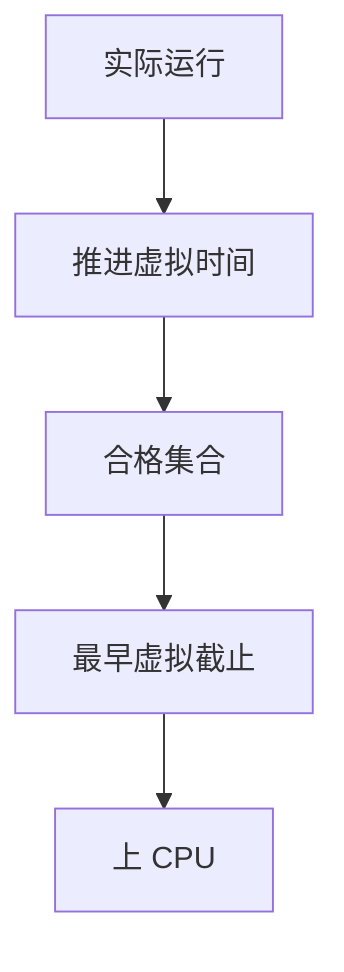

# EEVDF

EEVDF 用合格时延选出「最该跑」的任务：虚拟时间仍在，但决策看的是谁最落后于自己的截止，而不只是最小 vruntime。

<footer>—— 据 Stoica and Abdel-Wahab, EEVDF；Linux CFS 之后对 EEVDF 的合并说明；[vruntime](/cs/cfs-vruntime) 为先修</footer>

[上一课](/cs/asan-mechanism)收口内存工具。调度主干停在 [CFS vruntime](/cs/cfs-vruntime)。Linux 用 **EEVDF** 换掉「总跑最饿的」在延迟上的钝感。缺口是合格时延，不是再定义公平份额。

## 问题

CFS 选最小 vruntime，交互任务仍可能排在长 CPU 作业后面等到一个时间片。EEVDF：每个任务有请求的延迟参数，算出虚拟截止时间，选「已合格且截止最早」者。缺口：与 nice 权重如何同时成立；sleep 醒来如何放置以免作弊。本课不把补丁里的每个启发式写成 changelog。

「合格」意味着虚拟时间已到该任务该得的份额。latency nice 是用户旋钮。对象仍是公平类，不是 FIFO 实时。

## 方法

记账：跑则推进虚拟时间。选择：在合格集合里取最早截止。对照 CFS 红黑树：树键从 vruntime 换成 deadline。对照 [blk BFQ](/cs/blk-schedulers)：都是份额+延迟，介质一个 CPU 一个块设备。对照 [套接字](/cs/socket-buffers)：与网络无关。

## 机制

EEVDF 把「公平」从「追平已吃时间」细化成「尊重延迟请求的公平」，使桌面与容器尾延迟更好，而不回到固定优先级。不要写成实时 EDF 保证——过载时仍是尽力。与 [memcg](/cs/memcg) 无关直接，但回收会让任务睡眠，虚拟时间规则仍适用。

默认参数必须保守，否则每个任务都要低延迟会退化成 CFS。

实现上：latency-nice 让任务要更早的截止，但权重仍约束份额，否则人人最低延迟。实现用红黑树或类似结构按 deadline 排序。过载时合格集合变大，行为接近 CFS。 读法上只引用[上一课](/cs/asan-mechanism)的结论，不把对象换成训练推理或限价簿。

本课在操作系统进阶的「调度进阶 / 公平、实时与能耗」课序里，对象是 **EEVDF**。

- 先修只引用，不重导：上一课的结论当公理，本课只补差。
- 五栏不吞并：不把本课写成大模型训练/推理，也不写成限价簿或权重量化。
- 文献用 OSTEP、McKusick、内核文档与具名会议论文；不发明 arXiv 编号。

## 边界

本课不保证某主线版本字段名。不引入 SCHED_FIFO 的优先级。下一课多核：调度域与拓扑。

版本字段会变，课序钉的是机制对象「EEVDF」，不是某一主线内核的结构体名。
后课默认：公平类可用合格时延选任务。CPU 拓扑如何限制迁移，下一课调度域。

## 小结

- EEVDF 在合格任务中选最早截止。
- 仍是公平份额，不是硬实时。
- 调度域是下一课。
- 出处：Stoica EEVDF；Linux scheduler；CFS 先修。
