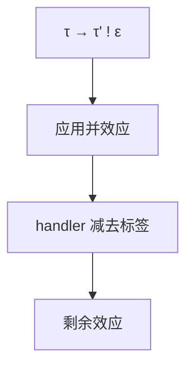

# 效应系统

类型回答「值是什么」；效应回答「计算还做了什么」：抛异常、分配、IO、不确定。函数类型可带效应行，组合时取并。

<footer>—— 据 Lucassen and Gifford, Polymorphic Effect Systems, 1988；Pierce TAPL 对效应的讨论；Leijen 行多态效应整理</footer>

上一课[生命周期](/cs/lifetimes-regions)跟踪指针活多久。缺口是**计算的额外通道**：`e : τ ! ε`。纯 STLC 的效应为空；`throw`、`print`、`alloc` 写入 ε。本课钉效应在类型上的位置，不把代数效应的全套 handler 语义写完。也不重写线性——线性管资源次数，效应管做了哪些动作。

## 问题

HM 的 `a -> a` 看不出会不会抛。Java 的 checked exception 是效应的粗粒度；ML 的 effect 系统（区域+读/写）服务优化与安全。缺口是**函数类型上的 ε**，以及子效应（少效应的函数可用在允许多效应的坑里——协变于效应集）。

行多态：`∀ρ. τ → τ ! {io | ρ}` 允许尚未点名的其它效应。这与[类型类](/cs/typeclass-dictionary)的约束不同：效应常自动收集，不必实例搜索。

### 效应不是「副作用」的散文同义词

未定义行为、数据竞争可以不在 ε 里。内存模型后课。本课的 ε 是语言声明的代数。

Lucassen–Gifford 1988。Talpin–Jouvelot。Koka / Eff / Frank 的代数效应是后继。Pierce 有短讨论。本课不把 Haskell `IO` 单子当唯一编码，尽管单子也能排效应序。

## 方法

规则：应用时合并两端效应；handler / `try` 从 ε 里减去已处理的标签。推断：与 W 同游，合一变成行合一（需处理 ρ）。优化：若 ε 空则可乱序或消除死代码（须健全）——中端课再用。

与区域：分配效应可指到区域，Tofte 系统把二者绑在一起。点名对照。

## 机制

子类型：`ε ⊆ ε'` 则带 ε 的计算可用在期望 ε' 处。多态效应避免「所有函数都标 IO」。不要把 Java `throws Exception` 当行多态。

代数效应的续延实现接到运行时 CPS 课；本课只要类型。

## 边界

本课不写 handler 的深度语义。后课默认：函数类型可带效应行。下一课渐进类型：静态与动态的边界，效应与 tag 会相遇。

也不把「纯函数式编程」当已实现的效应系统。

## 小结

- 效应标注计算除结果外的动作；应用取并。
- 行多态避免把世界写成固定集合。
- 与线性、区域正交，可组合。
- 出处：Lucassen and Gifford, 1988；对照 Pierce；Leijen 行效应。
