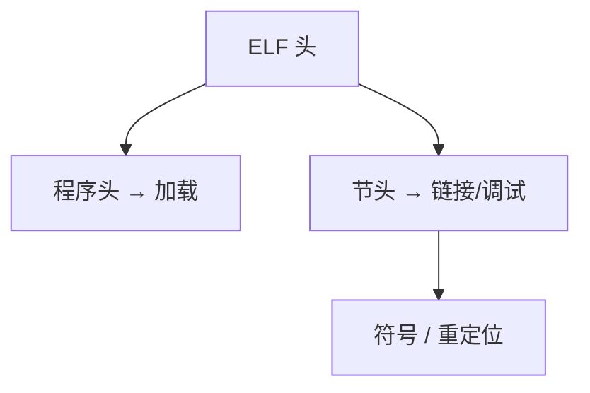

# ELF 格式

ELF 是 Unix 上可重定位、可执行与共享对象的容器：ELF 头、程序头、节头、符号与重定位表按约定排布。

<footer>—— 据 System V ABI 与 ELF 规范；Levine；主干目标文件讨论整理</footer>

上一课[ICF](/cs/icf-identical-code-folding) 在节上操作。缺口是**文件格式本身**：`Elf64_Ehdr`、`Phdr`、`Shdr`、节名 `.text`。本课钉结构，加载下一课。不把 PE/Mach-O 写完，只点名对照。

## 问题

汇编器/编译器写 `ET_REL`；链接器写 `ET_EXEC`/`ET_DYN`。谁看程序头：内核与 `ld.so`。谁看节头：链接器、调试器、`objdump`。缺口是**两套表**，不是 ICF 算法。

符号表：`.symtab` 完整，`.dynsym` 动态子集。字符串表伴随。

### 节头可被 strip

加载不依赖节头。strip 后调试困难，程序仍可跑。不要认为「没有节就不能执行」。

ELF 规范。`readelf -a`。本课 64 位小端为例。不进 Windows PE 细节。

## 方法

读 `e_ident` 魔数、类、端序。跟 `e_phoff`/`e_shoff`。解析动态节 `DT_*`。工具：`readelf`、`objdump -d`。

与链接脚本：脚本输出的节最终填进这些表。

## 机制

对齐：`p_align`。INTERP：`PT_INTERP` 指向动态加载器路径。没有 INTERP 的静态可执行直接进内核入口。

不要手改 ELF 当「优化」而不懂校验。构建系统应调链接器。

## 边界

本课不写内核 `load_elf_binary` 全文。后课默认：Unix 工具链目标是 ELF。下一课 ELF 加载：内核如何 `mmap` 段。

也不把 ELF 当 DWARF 的别名（DWARF 住在 ELF 节里）。

## 小结

- ELF：头 + 程序头（加载）+ 节头（链接/调试）。
- REL/EXEC/DYN 三种。
- 动态信息在 `PT_DYNAMIC`。
- 出处：ELF / SysV ABI；Levine。
