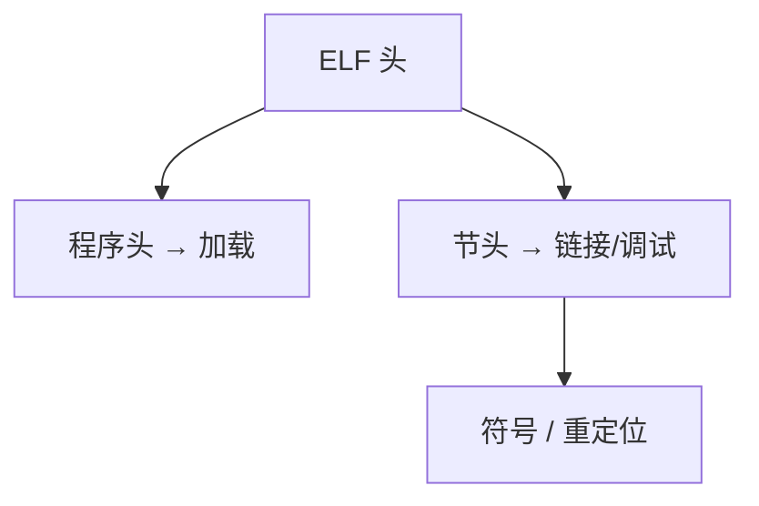
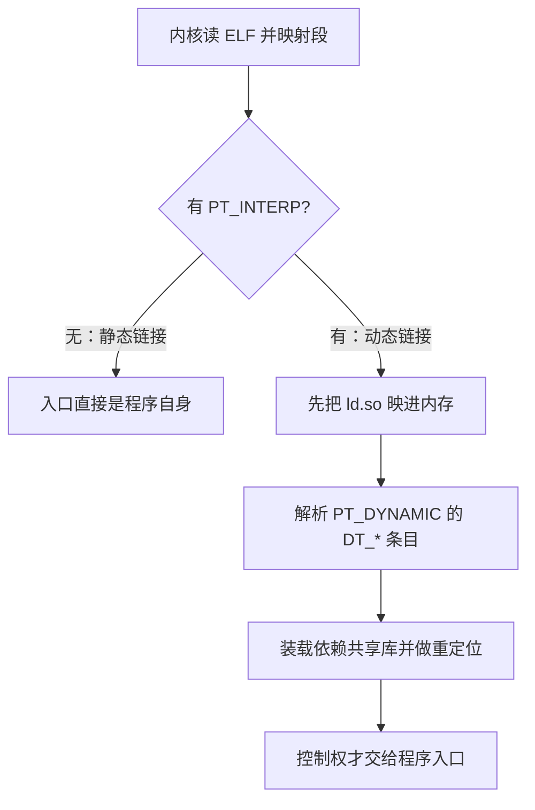

# ELF 格式

ELF 是 Unix 上可重定位、可执行与共享对象的容器：ELF 头、程序头、节头、符号与重定位表按约定排布。

<footer>—— 据 System V ABI 与 ELF 规范；Levine；主干目标文件讨论整理</footer>

上一课[ICF](/cs/icf-identical-code-folding)在节上操作，但「节」在文件里长什么样还没钉死。缺口是**文件格式本身**：`Elf64_Ehdr`、`Phdr`、`Shdr`、节名 `.text`。本课钉结构，加载下一课。不把 PE/Mach-O 写完，只点名对照。

## 问题

产物链各有各的类型：汇编器/编译器写可重定位的 `ET_REL`，链接器写 `ET_EXEC`/`ET_DYN`。关键设计是两套表服务两类读者：程序头给内核与 `ld.so`，它们只关心哪段加载到哪、什么权限；节头给链接器、调试器、`objdump`，它们关心符号与重定位。两套表同住一个文件却互不依赖——这就是缺口的形状，不是 ICF 算法。

术语翻译：程序头表回答「运行时怎么装」——哪段加载到哪个虚拟地址、可读可写还是可执行；节头表回答「链接和调试怎么用」——`.text`、`.data`、符号、重定位各在哪。同一个文件两套目录，各服务一类读者，互不依赖。

符号表成对：`.symtab` 完整，`.dynsym` 动态子集，各自伴随字符串表存名字。

### 节头可被 strip

加载不依赖节头：strip 之后程序照常运行，只是调试与符号化困难。反过来才要小心——节存在不代表会被加载，`.comment`、`.symtab` 都不进内存。不要认为「没有节就不能执行」。

数字实例：ELF 魔数是文件开头 4 个字节 `0x7F 'E' 'L' 'F'`，内核读 ELF 文件的第一件事就是核对它，不对直接拒绝执行。所谓「约定排布」，就是从这 4 个字节开始，每个字段的偏移与含义都写死在规范里，解析器照单取数。

ELF 规范。`readelf -a`。本课 64 位小端为例。不进 Windows PE 细节。

## 方法

解析次序固定：读 `e_ident` 校验魔数、类、端序，再沿 `e_phoff`/`e_shoff` 跳到两张表，动态可执行再进 `PT_DYNAMIC` 解析 `DT_*` 条目拿依赖与重定位。工具：`readelf` 看结构、`objdump -d` 看反汇编。与链接脚本是上下游：脚本输出的节最终填进这些表。

```mermaid
flowchart TD
  EHDR["ELF 头"] --> PHDR["程序头 → 加载"]
  EHDR --> SHDR["节头 → 链接/调试"]
  SHDR --> SYM["符号 / 重定位"]
```

与链接脚本：脚本输出的节最终填进这些表。

## 机制

段对齐由 `p_align` 声明，错一页就无法整页映射与共享；`PT_INTERP` 指向动态加载器路径，内核先把 `ld.so` 映进来再交控制权，静态可执行没有 INTERP，入口直接是程序自身。这些约定彼此咬合，所以不要手改 ELF 字段当「优化」——校验散在内核与加载器各处，改错要么拒载、要么运行期才炸。构建系统应调链接器，不做后处理。

为什么重要：`p_align` 错一页，内核就无法把同一份共享库的代码页在多个进程间共享映射，每个进程都得各占一份物理内存。这类错还往往「能跑」，只是悄悄变慢变肥——所以格式校验失败当场拒载的程序，反而是幸运的。

内核把控制权交给程序入口之前，静态与动态可执行各走哪条路？

```mermaid
flowchart TD
  K["内核读 ELF 并映射段"] --> Q{"有 PT_INTERP?"}
  Q -->|"无：静态链接"| S["入口直接是程序自身"]
  Q -->|"有：动态链接"| I["先把 ld.so 映进内存"]
  I --> DY["解析 PT_DYNAMIC 的 DT_* 条目"]
  DY --> DEP["装载依赖共享库并做重定位"]
  DEP --> J["控制权才交给程序入口"]
```

## 边界

本课不写内核 `load_elf_binary` 全文，细节归下一课。后课默认：Unix 工具链目标是 ELF。也不把 ELF 当 DWARF 的别名——DWARF 调试信息住在 ELF 节里，是住户不是房子。下一课 ELF 加载：内核如何 `mmap` 段。

## 小结

- ELF：头 + 程序头（加载）+ 节头（链接/调试）。
- REL/EXEC/DYN 三种。
- 动态信息在 `PT_DYNAMIC`。
- 出处：ELF / SysV ABI；Levine。
