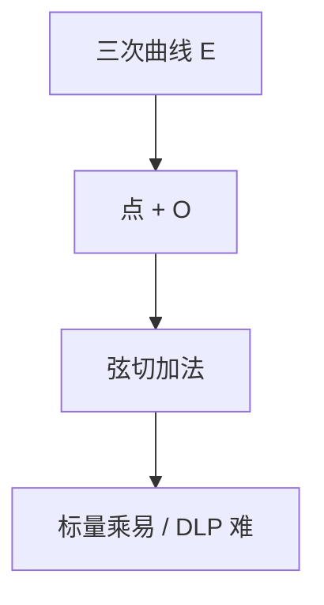

# 椭圆曲线群

域上非奇异三次曲线的点，加上无穷远点，用割线–切线定义加法，构成 Abel 群；DLP 在此群上目前比 $\mathbb{F}_p$ 更硬，故密钥更短。

<footer>—— 据 Silverman, The Arithmetic of Elliptic Curves；Hankerson, Menezes and Vanstone 整理</footer>

上一课[素数生成](/cs/prime-generation) 给出 $\mathbb{F}_p$。缺口是 **ECC 群**：点集 $E(\mathbb{F}_q)$，$\mathcal{O}$ 为单位，弦切法为加。本课直觉与阶，不写 TLS 曲线清单。主干 DH 的报文形状可原样搬到 $P\mapsto [k]P$。

## 问题

仿射方程 $y^2=x^3+Ax+B$（特征 $\ne 2,3$），判别式非零。两点连线交第三点，再对 $x$ 轴反射，定义为和。切线处理倍点。$\mathcal{O}$ 是竖直线的「无穷」。结合律不显然，本课承认。Hasse：$|\#E-(q+1)|\le 2\sqrt q$。选阶为大素，或大素子群，防 Pohlig–Hellman。

标量乘 $[k]P$ 用倍加，对标快速幂。DLP：已知 $P,[k]P$ 求 $k$。无通用指标演算，故 256 比特曲线对标 3072 比特有限域（NIST 量级，点名）。

### 不是圆锥曲线插值

「椭圆」来自椭圆积分，不是椭圆形状。与率失真、编码无关。

Silverman 算术。HMV 密码学椭圆曲线。Miller 的 pairing 点名不写。扭曲线、异常曲线是不安全族，选曲线要避开，本课不列 CVE。

## 方法

在小素域上画几个点，演示 $P+(-P)=\mathcal{O}$。对照 $\mathbb{F}_p^\times$：运算换成点加，困难问题仍是 DLP。指出：生成元是基点 $G$，公开参数含曲线与 $G$、阶 $n$。

## 机制

ECC 把 DH、ECDSA 的群换掉，不改协议逻辑。量子 Shor 对 ECC DLP 同样有效（BQP 课）。后量子不在这条曲线上找，下一课格。本课是经典公钥群的最后一站。

实现：常数时间标量乘、点压缩，属工程，点名。

点加公式：斜率 $\lambda=(y_2-y_1)/(x_2-x_1)$ 或切线 $(3x^2+A)/2y$，再 $x_3=\lambda^2-x_1-x_2$。无穷远是单位。扭曲、小判别式、非素阶会掉进 Pohlig–Hellman 或 MOV 转移，选曲线要按标准。Shor 对 $[k]P$ 同样多项式，后量子不在 ECC 上续命。

## 边界

本课不证结合律，不引入除子、Weil 对。不选具体 NIST/Curve25519 当定义。后课默认：ECC 群是弦切 Abel 群，DLP 假设更强于大素数域。下一课格与 LWE。

弦切法给出 Abel 群，标量乘是快速幂。Hasse 管点数，阶要有大素因子。协议形状与 DH 相同，密钥更短。Shor 同样适用，故后量子不在这条曲线上找。

上一课留下的缺口在本课收口；「椭圆曲线群」进入后课词汇表后只引用。文献用来钉对象与边界，不把本课写成该主题的独立综述。

## 小结

- $E(\mathbb{F}_q)$ 弦切成 Abel 群；标量乘 = 快速幂。
- Hasse 管点数；阶要有大素因子。
- 同形 DH，更短密钥；Shor 仍威胁。
- 出处：Silverman；Hankerson, Menezes and Vanstone。
