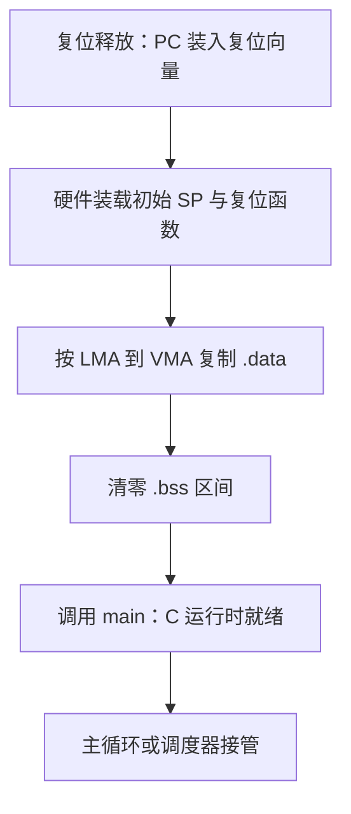
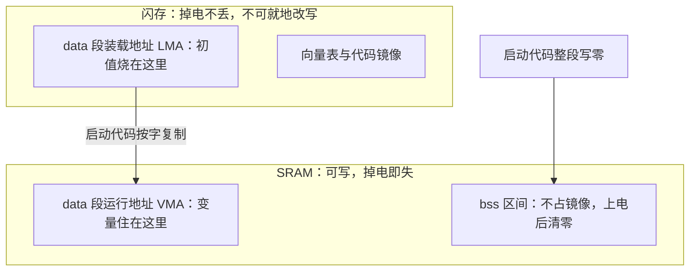

# 裸机启动

复位释放的那一刻，处理器只知道一件事：到固定的地址取第一条指令。其余的一切——栈、已初始化的全局量、清零的内存——都是启动代码在进入 main 之前替你补上的约定。

<footer>—— 据 ARMv7-M Architecture Reference Manual；Harris and Harris, Digital Design and Computer Architecture 整理</footer>

[上一课](/cs/orch-case-map)给「容器编排」收束：声明、循环、预算三件套贯穿全课程，判据三问——这负载吃哪些机制的重、哪些是纯税、不满足时错在哪层——把四个案例各归其位；编排不解决安全边界、可观测性与容量规划，越界的期待都会变成事故。编排的栈再高，底下仍是通用计算机的台子：主干课的[固件：BIOS 与 UEFI](/cs/bios-uefi)讲过，上电之后 BIOS/UEFI 先训练 DRAM、枚举设备，再把内核装进内存，软件从头到尾站在固件搭好的台子上。本课是「嵌入式系统」的第一课，问的正是这个台子被抽掉之后还剩什么：在一颗微控制器上，没有另一个程序先你而启动，复位向量指向的代码就是你自己写的。后课的中断、外设、RTOS 与功耗，都默认你已经能让 main 跑起来，不再从「上电发生了什么」讲起。

## 问题

上电复位只保证处理器状态确定：寄存器清零、PC 装入复位向量。C 程序却预设了一整套运行时约定：函数调用要有栈指针，未初始化的全局量读出来是零，带初值的全局量一上电就是那个初值。固件不在场时，这些约定没有人为你兑现。缺口因此不是「写个 main」，而是**复位到 main 之间那段没有名字的代码**：栈从哪里拿、`.data` 从哪里搬到哪里、`.bss` 由谁清零。任何一步缺席，程序不是编译不过，而是在板上以更糟的方式失败——栈没设就调 C 函数，第一次压栈就写进未知内存。

常见误区：以为写完 main 就万事俱备。桌面程序上电前有 BIOS/UEFI 和内核替你把栈、全局量、堆安排妥当；裸机上没人代劳——复位后第一秒的世界里只有你的启动代码和一张向量表，所有「语言约定」都要从零亲手兑现。

### 链接脚本决定一切的位置

启动的前提是**地址空间布局**先被声明：哪段是闪存、哪段是 SRAM、各多大、起于哪个地址。这延续了[总线与 MMIO](/cs/bus-mmio) 的译码视角——CPU 发出的地址由各从设备认领，只是对象换成了片上存储。链接脚本的 `MEMORY` 与 `SECTIONS` 把每个段钉到具体地址；钉错了，代码下载到不存在的地址，处理器从向量表取到的第一条指令就是总线错误。

数字实例：Cortex-M 复位时，硬件从地址 0x0000_0000 取第 0 个字装进主栈指针 SP，取第 1 个字装进 PC 作复位处理函数——向量表头两项是纯硬件行为。表放错位置，PC 装进的就是垃圾值，第一条「指令」都不知道是什么。

## 方法

启动代码（习惯叫 crt0 或 startup 文件）按固定次序做四件事。第一，从向量表取出初始栈指针装入 SP——在 Cortex-M 上，向量表第 0 个字就是主栈指针初值，第 1 个字才是复位处理函数地址，硬件复位时自动装载这两项。第二，把 `.data` 从它在闪存里的装载地址（LMA）复制到运行地址（VMA）：初值必须烧进掉电不丢的闪存，但变量必须住在可写的 SRAM，两个地址由链接脚本分别指定。第三，把 `.bss` 区间整段清零，兑现「未初始化即零」的语言约定。第四，调用 main。次序不可换：SP 必须最先，否则任何函数调用都是踩空；`.bss` 清零必须在 main 之前，否则全局状态从垃圾值起跑。

一颗典型 MCU 的账：64 KB 闪存映射在 0x0800_0000，20 KB SRAM 映射在 0x2000_0000，向量表占闪存开头几百字节。`.data` 段 200 字节，启动时就要从闪存复制 200 字节到 SRAM——LMA 与 VMA 分离正是为此。

## 机制

为什么必须区分 LMA 与 VMA？因为「存放在哪」和「在哪儿被访问」是两个约束：闪存掉电不丢但不可就地改写，SRAM 可写但掉电即失。链接器允许一段有两个地址，把「搬运」留给启动代码，这是软件与存储介质特性的和解。同理，`.bss` 不占镜像空间——清零段只需记起点和长度，省下的闪存正是一名嵌入式工程师盯得最紧的预算。

直觉类比：LMA 像家具在仓库里的存放位，VMA 是它在房间里的使用位——桌子不能一直住在快递箱里。`.data` 的初值「存」在闪存、「用」在 SRAM，启动代码就是那段搬家动作；`.bss` 连箱子都不用，搬进去时统一发一套空的。

同一份全局数据，为什么在闪存和 SRAM 里各有一个地址？

为什么向量表必须在固定偏移？复位逻辑是纯硬件状态机，它不读文件系统也不解析格式，只按芯片手册钉死的地址取头两项。芯片的 ROM 引导加载器能从 UART 或 USB 把镜像搬进闪存，调试器下载看似绕过这一套，但复位一次，该走的路径一步不少。后课的中断实践正是接在向量表上：表里除复位项外，其余每项都是一类异常或中断的入口。

## 边界

本课只写微控制器的裸机启动，不写应用处理器：DRAM 训练、多核拉起、安全启动度量是[固件与安全启动链](/cs/secure-boot-chain)那一层的工程，与几百字节的 crt0 不是一个物种。也不写操作系统的接管——引导加载器装核、内核建页表再挂根的那条路，在[早期启动](/cs/early-boot)讲过，本课停在 main 为止。变体只点名不展开：有的芯片要求把代码从片外闪存复制进 RAM 再执行，带缓存的核还要处理取指与数据的一致性。最后一条纪律：启动代码里禁止调用任何假设运行时就绪的库函数——printf 在 `.bss` 清零之前是未定义行为，不是「碰巧能跑」。

## 小结

- 复位只给确定状态；栈、`.data`、`.bss` 三件事是 main 之前的隐形契约。
- 链接脚本先声明地址布局，启动代码再兑现语言约定，次序不可换。
- LMA 与 VMA 分离是闪存与 SRAM 特性互补的结果，`.bss` 清零段不占镜像。
- 向量表的固定偏移是硬件状态机的约定，ROM 引导与调试下载都回到它。
- 出处：ARMv7-M Architecture Reference Manual；Harris and Harris, *Digital Design and Computer Architecture*；据本栏 bus-mmio、bios-uefi 两课的地址译码与固件口径整理。
