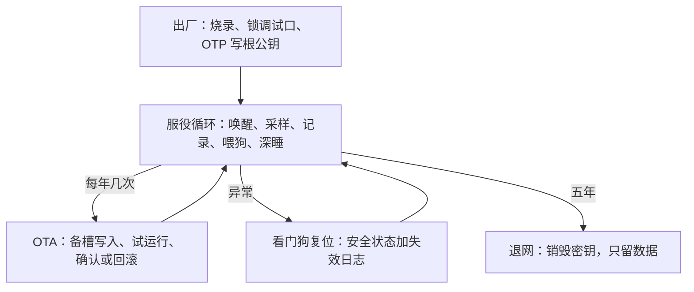
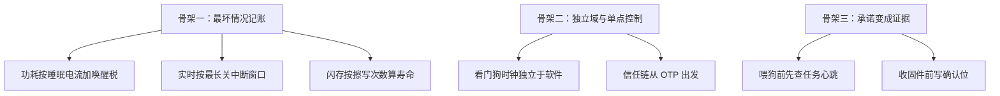

# 嵌入式案例与收束

读完一门课该带走的不是寄存器名，而是几张跨芯片成立的骨架：所有预算按最坏情况记账，所有信任从独立域出发，所有承诺都要留下可核查的证据。

<footer>—— 据Barry, Mastering the FreeRTOS Real Time Kernel；NIST SP 800-193；本课程九课口径整理</footer>

[上一课](/cs/emb-testing-simulation)给了把整个体系钉在质量上的测试分层。本课程到此收束：本课把九课拼回一张图——一台电池供电的冷链温度记录仪从上电、服役五年到退网的完整生命周期——并把这层实践沉淀出的共同原理收在三条骨架上，给主干课的通用原理补上「落在一颗 MCU 上是什么样」。

## 问题

收束要回答的是：换一颗芯片、换一个 RTOS、换一条总线时，哪些知识跟着版本走、哪些不跟。不这么做会错在哪：把 STM32 的寄存器名与厂商库函数当知识带走，换到 RISC-V 平台全部作废；把「能跑」当「做完了」，忽略这台设备要无人值守五年——五年里的每一次断电、每一块电池衰减、每一次固件升级，都是设计时就要还的账。收束把九课的对象各归一条时间线，看它们在生命周期里何时出场、向谁要证据。

直觉类比：收束像毕业答辩——不考「背出哪个寄存器」，而考「换一台风没见过的机器你还会什么」。寄存器名是各家的方言，预算、信任、证据这三件事是普通话：方言到了新平台作废，普通话照用。

## 方法

案例按生命周期走。出厂前：[裸机启动](/cs/emb-bare-metal-boot)的向量表与段搬运烧进闪存；调试口上锁、根公钥写入 OTP，信任链封顶（[嵌入式安全](/cs/emb-security)）。服役期每三十秒一个循环：定时器唤醒（[功耗管理](/cs/emb-power-management)的占空比账，平均电流压在 25 µA 内）；[I2C 与 SPI](/cs/emb-i2c-spi) 上读传感器、写记录；[实时操作系统](/cs/emb-rtos)里三个任务按周期域调度，采样任务最短周期优先级最高；每轮循环末核对任务心跳再喂狗（[看门狗与失效安全](/cs/emb-watchdog-failsafe)）。每年几次：OTA 下发新固件写备槽，试运行确认后才转正（[OTA 更新](/cs/emb-ota-updates)）。整个研发生命周期：单元测试、仿真回归、HIL 故障注入、现场遥测四层接力（[测试与仿真](/cs/emb-testing-simulation)）。中断与事件是这条线的纵轴——每一次唤醒都走[中断实践](/cs/emb-interrupt-practice)立下的纪律。

这台记录仪的五年账本：220 mAh 电池按 25 µA 平均电流算余量；闪存按每日几十次记录加每年一两次 OTA 算擦写次数，五年约几千次，低于一万次的器件上限但余量不足一倍——预算不做满，是收束阶段最常补的一课。

数字实例：220 mAh ÷ 25 µA ≈ 8800 小时，只够一年。要撑五年，平均电流得再压到 5 µA 上下，或者换更大的电池——这就是「占空比账」的严苛之处：睡眠电流再小，唤醒太频繁，平均电流照样超支。

## 机制

九课拼起来后，三条骨架浮出来。第一，**最坏情况记账**：功耗按睡眠电流与唤醒税算平均，实时按最长关中断窗口算延迟，闪存按擦写次数算寿命，失效按最长恢复路径算可用性——没有一个预算用平均值交卷。第二，**独立域与单点控制**：看门狗的时钟域独立于软件死活，启动裁决由引导加载器单点执掌，信任链从不可改写的 OTP 出发——凡是「最后说了算」的东西，都必须住在别的东西碰不到的地方。第三，**承诺要变成证据**：喂狗前查心跳，接受固件前写确认位，出厂前故障注入踩一遍失效梯子——没有证据的承诺，等于没有承诺。这三条不随芯片换、不随 RTOS 换，是本课程的「知识里不跟版本走」的那部分。

常见误区：把「加了个看门狗」当失效安全。喂狗代码若和业务混在同一片软件里，业务死了可能没人喂狗——也可能更糟：某个定时器把狗喂得忘了主任务已死。独立域要求看门狗用自己的时钟、自己的喂狗窗口，让崩溃能被它察觉，而不是被它掩护。

三条骨架各自落到哪些具体机制上？

## 边界

本课程不替代三样东西。芯片手册与厂商勘误表：寄存器级的真值只认手册，本课程给的是组织它们的方式。无线与认证：射频协议栈、安规与 EMC 是各自独立的深水区，本课程只在功耗与测试的接口处与之相接。更高等级的安全与实时：双通道表决、WCET 证明、功能安全认证属于另一套论证体系，单点失效的工程兜底只是它的起点。若产品的需求长出屏幕、浏览器与人机交互，该换 Linux 级的硬件栈重新开始——那是主干课操作系统与固件世界的分界，本课程到此收束。

## 小结

- 九课拼成一台设备的生命周期：出厂封信任链，服役循环里功耗、实时、看门狗各司其职。
- 三条骨架跨平台成立：最坏情况记账、独立域与单点控制、承诺变成证据。
- 预算不做满：电池、擦写、实时余量都要留出一倍以上，收束阶段专查这件事。
- 换芯片带走的是骨架不是寄存器名；手册与勘误表永远是最终权威。
- 出处：Barry, *Mastering the FreeRTOS Real Time Kernel*；NIST SP 800-193；据本课程九课的对象账与骨架口径整理。
