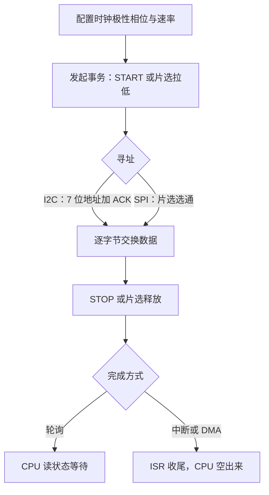

# 外设协议：I2C 与 SPI

片上的总线译码解决不了板上的问题：出了封装就是引脚和导线，两个器件要说话，先得约定谁出时钟、谁认地址、谁先松开总线。

<footer>—— 据 NXP UM10204（I²C-bus specification）；Motorola SPI 应用说明整理</footer>

[上一课](/cs/emb-interrupt-practice)解决了「片上事件如何到达代码」：中断把外设的请求送进向量表。但一块板子上真正干活的器件——温湿度传感器、Flash 存储器、屏幕——大多不在片上，CPU 必须穿过引脚、焊盘和几厘米的导线与它们交换数据。主干课的[I²C / SPI / UART](/cs/i2c-spi-uart)已把三种串行协议的定义讲过；本课站在器件选型与驱动实现的角度，回答芯片手册不写的那部分：什么时候选哪条总线、时序参数从哪来、出问题时示波器上先看什么。

## 问题

引脚是 MCU 上最硬的预算：封装引出多少根，你就只有多少根。并口把地址线数据线一根根接过去，容量一大就不可布线；串行化的代价是**时间换引脚**，而两种主流的换法对应两种场景。SPI 用四根线（SCLK、MOSI、MISO，加每器件一根片选）换全双工与高时钟率，几十 MHz 平常；I2C 用两根线（SDA、SCL）挂一串器件，靠地址区分，标准模式 100 kbit/s、快速模式 400 kbit/s。缺口不是「哪个更好」，而是**在引脚数、器件数、速率三者之间做显式交易**：引脚紧张挂 I2C，带宽紧张走 SPI，两者都要时才谈重构。

### 地址、应答与选通

两条总线对「谁在听」给出了不同答案。I2C 帧以 START 开场，主机发 7 位地址加读写位，被点名的器件拉低 SDA 回一个 ACK；7 位地址空间去掉保留段，可用地址只有 112 个，同型号传感器出厂地址固定，挂两片就得靠地址引脚。SPI 干脆没有地址：每器件一根片选线，选中谁谁听，代价是器件越多引脚越多；也没有 ACK，主机发出去的数据对不对，要靠读回状态寄存器验证——这份「不验证」正是 SPI 快的一部分原因。

## 方法

驱动实现按三层搭。寄存器层：两组外设的控制器都是 MMIO 状态机，延续[总线与 MMIO](/cs/bus-mmio)的口径，读写状态、时钟与数据寄存器即可，配置项集中在时钟极性与相位——SPI 的四种模式必须与器件手册一致，错一档，收到的每个字节都稳定地错位。传输层：低速轮询，事件驱动用[中断实践](/cs/emb-interrupt-practice)的纪律把完成事件交给 ISR；速率上去之后轮询的每个字节都在烧 CPU，改用 DMA 收发，[DMA 控制器与散布聚集](/cs/dma-scatter-gather)的描述符思路原样适用。错误层：I2C 要处理仲裁丢失与卡死的总线——从机拉死 SDA 时，主机发 9 个时钟外加 STOP 才能救回来。

I2C 的速率上限不写在协议里，写在物理上：开漏线靠上拉电阻充电，上升时间 $t_r \approx 0.85\,RC$，总线电容上限 400 pF。上拉 4.7 kΩ 配 400 pF，上升沿近 1.6 µs，快速模式 2.5 µs 的位时间就被吃掉大半——升不上去的边沿，不是驱动写得不好。

## 机制

I2C 最反直觉的一处是**线与**：两根线都是开漏输出加电阻上拉，任何器件都能拉低，没人拉低才是高。这个设计一举三得——多主机仲裁不需要额外线（谁发 1 却听到 0 谁退出）、从机可以用拉住 SCL 的方式请求减速（时钟拉伸）、电平不同的器件也能安全共线。SPI 反其道用推挽输出：不共享就无需仲裁，边沿陡峭，所以快。理解了「共享线必须容忍冲突」，两条总线的一切差异——应答位、仲裁、速率、引脚数——都能从开漏与推挽这一对物理选择推出来。

## 边界

本课只写板级两条总线，不写差分与长距离：几厘米是 I2C/SPI 的适用半径，再远要上 RS-485 或改造成 [USB 协议分层](/cs/usb-protocol)那样的分层栈。UART 的异步约定在主干课已讲，不重写。也不写外设驱动的抽象层：Linux 下 probe/match 那套是操作系统的课，本课停在寄存器与 DMA。两条工程边界值得钉死：一是逻辑分析仪的采样率要高于 SCL 四倍才看得清 ACK 位的归属；二是多器件共线时逐一断开定位故障，总线上贴着器件逐个排除，比改驱动快得多。

## 小结

- 引脚、器件数、速率构成显式交易：I2C 省引脚靠地址，SPI 换带宽靠选通。
- I2C 的 ACK、仲裁、时钟拉伸都从开漏线与推出，SPI 的快有推挽与不验证两份贡献。
- 驱动分寄存器、传输、错误三层；速率上去必须交给 DMA，轮询是调试期的脚手架。
- I2C 上升时间由上拉与总线电容决定，边沿升不上去先查物理，不先怀疑代码。
- 出处：NXP UM10204，*I²C-bus specification and user manual*；Motorola SPI Block Guide；据本栏 bus-mmio、dma-scatter-gather 两课口径整理。
