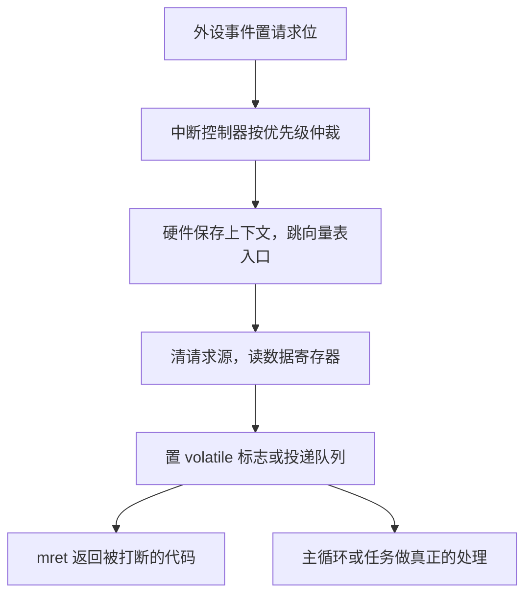

# 中断实践

中断是硬件对软件说的一句「现在有事」；真正的工程量不在听到这句话，而在回答什么时候处理、处理多久、以及处理期间谁被挡在门外。

<footer>—— 据 Yiu, The Definitive Guide to ARM Cortex-M3；RISC-V Privileged Spec 整理</footer>

[上一课](/cs/emb-bare-metal-boot)把复位到 main 之间的启动契约补齐了，向量表里除复位项外的每一项都还指向空处理函数。本课把它们填上：外设的事件如何沿着「外设请求线—中断控制器—向量表入口—服务函数」这条链到达你的代码，以及写服务函数时哪些动作会毁掉整块板子的实时性。主干课的[异常与中断入口](/cs/exception-interrupt-entry)讲过硬件如何保存 PC、跳到 `mtvec` 再用 `mret` 返回；本课不再推导入口协议，只写入口之后你必须做对的事。

## 问题

轮询是新手的第一反应：主循环里反复读外设状态寄存器。它的事件延迟取决于循环周期，CPU 在无事可做时也满负荷空转——对一个要用电池跑一年的设备，这不是低效，是不可行。缺口因此是**把「何时有事」的决定权交给硬件**：外设置位请求线，控制器按优先级仲裁，处理器在指令边界保存上下文并跳转。但把轮询换成中断只是换掉了一半问题，另一半是[中断下半部](/cs/interrupt-bottom-half)讲过的老原理在无 OS 场景下的重演：上半部必须短，因为你在中断里占用的每一微秒，都在推迟同级与更低优先级事件的响应。

### 服务函数的四条纪律

第一，先清请求源再谈别的：不清就是退出后立即重入，栈被吃穿才发现「程序卡死」。第二，共享变量必须 `volatile` 并按位宽原子访问——编译器看不到中断会改它，会把「等待标志」的循环优化成死循环。第三，不许阻塞、不许 printf、不许忙等：服务函数里调用任何可能再次被中断打断还不重入的库，都是在攒一个概率性死机。第四，能推迟的都推迟：服务函数只置标志或投递队列，真正的工作留给主循环或 RTOS 任务。

## 方法

配置一个中断的完整清单按链路顺序检查：外设侧使能事件并允许发请求；控制器侧设置优先级与使能位（NVIC 用几比特优先级加抢占分组，PLIC 走 [PLIC 与中断号](/cs/plic-irq)的 claim/complete 流程）；向量表侧确认入口函数名与启动文件一致——名字打错一个字母，链接器不报错，事件照常发生，只是落进了默认死循环。临界区用关中断保护「读—改—写」共享状态，但窗口要按指令数而不是行数计算：关中断一百条指令，百兆主频下就是一微秒级的延迟抖动，直接吃掉后课要谈的实时余量。

Cortex-M3 的中断入口是 12 个周期（零等待内存下），咬尾中断把连续两个中断之间的出栈再入栈压到 6 周期；NVIC 提供 4 比特优先级即 16 级。这些常数决定了「服务函数预算」的单位是百纳秒，不是毫秒。

## 机制

中断系统的本质是一台**优先级仲裁机**：多个请求同时挂起时，谁先被服务由优先级决定；正在服务低优先级时来了高优先级，允许抢占，反之等待。这条规则的可观测后果是**反转的延迟账**：最高优先级事件的响应延迟，等于最长的关中断窗口加最长的高于它的服务时间，而不是平均服务时间。所以「服务函数要短」不是风格建议，是给最坏情况账本减数的唯一手段。优先级分组、抢占使能这些配置项，都是在回答同一道题：你愿意让哪个事件为哪个事件让路。

## 边界

本课停在单核 MCU：多核的中断路由、核间中断与亲和性是 [APIC 与中断路由](/cs/apic-interrupt-routing)的世界，DMA 与中断的配合留给下一课的外设协议。锁与关中断的完整搭配在[锁与关中断](/cs/lock-irq)展开，本课只立「临界区窗口要短」的纪律。也不写 RTOS：中断里能不能调用 `xQueueSendFromISR` 这类专有接口、中断优先级与任务优先级如何对表，留给后课实时操作系统。最后一条：中断延迟不能靠示波器抓一次就下结论，最坏情况要按关中断窗口与优先级配置推算，这是后课功耗与看门狗设计的前置。

## 小结

- 中断把「何时有事」交给硬件仲裁，但服务函数的长度仍是你对最坏延迟的承诺。
- 四条纪律：先清源、共享量 volatile、不阻塞不打印、能推迟都推迟。
- 配置按链路逐级核对：外设、控制器、向量表，名字错一字就是静默死循环。
- 最坏响应延迟由最长关中断窗口与更高优先级服务时间决定，不由平均值决定。
- 出处：Yiu, *The Definitive Guide to ARM Cortex-M3*；RISC-V Privileged Spec；据本栏 exception-interrupt-entry 与 interrupt-bottom-half 两课的入口与下半部口径整理。
