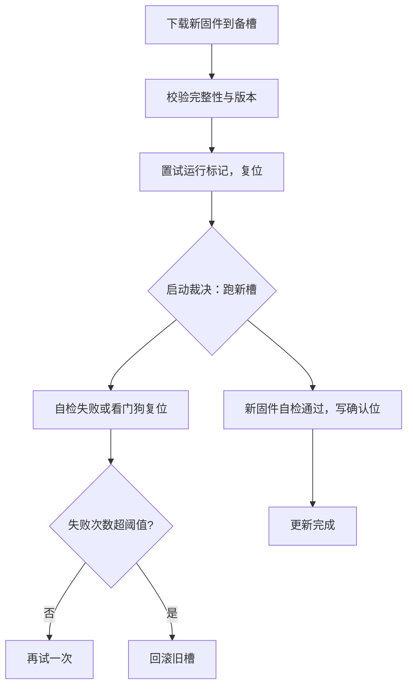

# OTA 更新

更新固件最难的不是传输，而是承诺：无论何时断电、固件多坏，设备醒来都得还能启动。做不到这一点的 OTA，是在给整个机队埋雷。

<footer>—— 据 MCUboot 设计文档；嵌入式 A/B 分区工程实践整理</footer>

[上一课](/cs/emb-watchdog-failsafe)让设备能从失效中自行恢复，但恢复到的仍是同一份固件——bug 还在原地。修复最彻底的办法是换固件，而设备已经出厂：焊在外壳里、装在房顶上，插不上调试器。缺口是把「换固件」变成一条**设备自己就能安全走完的路径**：下载、校验、切换、回滚，每一步都要经得起断电。

## 问题

闪存不能就地覆盖：写入只能把 1 改成 0，擦除按整块进行，擦过的块全是 1 再逐字写——这套物理在主干课 [NAND 闪存与 FTL](/cs/nand-ftl) 讲过，片内闪存同样遵守。于是「更新到一半」不是罕见事故而是必然事件：下载会断，写入时会断电，写完的固件可能根本跑不起来。直接在正在运行的分区上写入，一次断电就把设备变砖——几万台设备的机队里，「必然事件 × 机队规模」等于必然有几台死掉。缺口因此是**把不可事务的写入变成可恢复的流程**：任何时刻断电，设备重启后要么还在跑旧固件，要么跑经验证的新固件，不存在第三种状态。

### 双槽与启动裁决

主流答案是双槽 A/B：闪存划出两个固件槽，新固件写进备槽，主槽照常运行；启动代码在每次复位时做裁决——两个槽各验完整性，跑「最新的那个通过校验的」。新固件首次运行后必须主动「确认」自己可用；不确认就复位，引导侧把失败次数记在不掉电的存储里，超过阈值自动回滚旧槽。坏固件若跑挂在死循环里，[看门狗与失效安全](/cs/emb-watchdog-failsafe)的复位把它送回裁决点，回滚自然发生——上一课的失效路径在这里接成了升级保险。

引导加载器是机队里唯一「不能替自己换自己」的部件：它一坏，全机队只能拆机返修。行业惯例是把它的职责压到三条——验槽、数失败次数、选槽启动，代码量压到几 KB，出厂前单独评审。

## 方法

落地清单按流程走。传输侧：固件分块下载、逐块写闪存、整体校验（CRC 或哈希），断了从断点续传，版本与机型匹配检查放在下载之前，防止刷错包。写入侧：擦除按块对齐，进度状态写到不掉电的备份寄存器或专门的旗标扇区，写完才改标记——绝不允许「边运行边改自己的槽」。预算侧：片内闪存的擦写寿命典型一万到十万次，[SSD 的磨损账](/cs/ssd-gc-wear)在片上同样成立，固件每天自升级一次的设计一年就吃掉几块扇区的寿命；差分升级只传新旧镜像的差量，把射频侧的电量与时间一起省下来。

## 机制

整个机制只有一个不变量：**启动裁决是单点控制**。无论断电发生在下载、擦除、写入还是切换的哪一步，复位后控制权都回到引导代码，它按旗标重新计算「该跑哪个槽」——不变量保证所有中间状态都等价于「更新未完成」，旧固件照常可用。切换本身可以做成保守的整槽复制（安全、多花一倍时间）或原位试跑（省擦写、逻辑多一层），取舍由闪存预算决定。确认机制补上「能跑」与「该跑」的差距：镜像校验只证明传输无误，不证明业务正确，能连接上服务器、能读到传感器，才算新固件被接受。

## 边界

本课只管「把对的固件安全放进去」；「对的」怎么证明——镜像验签、密钥与信任链——是下一课嵌入式安全的主题，未验签的 OTA 通道等于向所有邻居广播「可以给我写任意代码」。也不写手机与服务器场景：那些有恢复分区与虚拟化兜底，MCU 没有第三份固件替你收拾残局。还有两条：引导加载器自身永不单独升级；多芯片产品要先约定谁先升级、版本如何对表，否则新旧固件对不上协议，功能照样瘫痪。

## 小结

- 闪存不可就地覆盖，更新流程必须把任何断电都等价为「未完成」，这是唯一不变量。
- 双槽加启动裁决加试运行确认加失败回滚，构成断电安全与坏固件自救的闭环。
- 看门狗复位把挂死的坏固件送回裁决点；确认位补上「能跑」与「该跑」的差距。
- 擦写寿命与差分升级是预算侧的两笔账；引导加载器出厂即冻结，职责压到三条。
- 出处：MCUboot 项目的设计文档（mcu-tools/mcuboot）；各 MCU 闪存控制器手册；据本栏 nand-ftl、ssd-gc-wear 两课的闪存口径整理。
