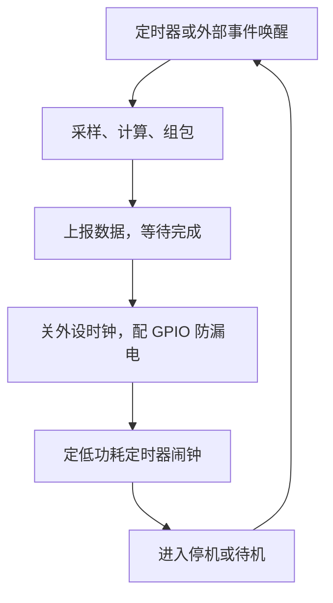

# 功耗管理

电池设备的功耗账只有一个除法：容量除以寿命。账本上没有「差不多省点」，只有平均电流乘上小时数，一微安一微安地抠出来。

<footer>—— 据各 MCU 数据手册的低功耗模式表；TI/ST 低功耗应用笔记整理</footer>

[上一课](/cs/emb-rtos)的调度器让阻塞的任务不再烧 CPU，但「不参与调度」不等于「省电」：只要时钟还在跑、电压还在维持，电流就在流。电池供电的设备把这笔账推到极端——一颗 CR2032 纽扣电池标称 220 mAh，撑一年，平均电流必须压在 25 µA 附近，而 MCU 运行态动辄几毫安，差两个数量级。缺口不是优化代码，而是**重新设计能量的时间结构**：让芯片绝大部分时间待在深度睡眠里，醒来只做必要的事，做完立刻回去。

## 问题

平均电流 $\bar{I}=\sum_k I_k \cdot d_k$，各模式电流乘驻留占比再求和。运行态 5 mA、睡眠 2 µA 的芯片，只要运行占比压到 0.5% 以下，平均电流就能进 25 µA 预算；占比一旦到 5%，平均 250 µA，电池半年见底。低功耗设计的全部工作因此是一张两列表：把每个模式的电流压到手册值，把高电流模式的驻留时间压到功能允许的最短。新手死在第二列：轮询式的「醒来—看一眼—没事—再睡」把驻留时间拖长一个量级，代码再省也救不回占空比。

### 睡眠模式的深度与代价

睡眠不是一档而是一列。浅睡只停 CPU 核，外设与时钟照跑，唤醒几乎免费，但电流常在百微安级；停机模式切掉主时钟、保住 SRAM 与寄存器，电流进微安级，代价是唤醒后要等时钟源重新稳定；待机模式连 RAM 的电都断，只留备份寄存器，电流进亚微安级，代价是唤醒即复位——启动代码和运行时状态从头再来。每一档都在「省下的电流」与「唤醒的延迟和丢的状态」之间交易，选档的依据是两次活动之间隔多久、醒来要多快。

深睡前 GPIO 是隐形漏电大户：浮空输入脚悬在中间电平，施密特触发器反复翻转，一个脚能漏几十微安。进停机前把不用的脚配成模拟输入或带上拉的输出——数据手册写了、代码评审最常漏的一条。

## 方法

实现按三条线走。第一，事件驱动重构：唤醒后一口气做完采样、计算、上报，再定好下一次闹钟进深睡，绝不在睡眠与运行间反复横跳——每次切换都有固定的能量税。第二，tickless 空闲：RTOS 的周期节拍本身就是功耗敌人，[实时操作系统 RTOS](/cs/emb-rtos) 的阻塞模型配上 tickless，让内核在无任务可跑时停掉节拍、用低功耗定时器定下次唤醒点，空闲才真正变成深睡。第三，外设与时钟门控：不用的外设时钟逐个关掉，这延续了[时钟门控与 DVFS](/cs/clock-gating-dvfs) 的机制——门控切断局部时钟树，动态功耗随 $CV^2f$ 同步消失。测量用串接采样电阻加示波器或功耗分析仪：没有电流波形，一切「优化」都无法验收。

## 机制

为什么深睡能省两个数量级？芯片电流是动态与静态两笔之和，主干课[功耗：动态与静态](/cs/power-dynamic-static)讲过口径：动态随翻转率走，时钟一停即趋零；静态是漏电流，由工艺与温度决定，压不掉但可以少留「活着的电路」。睡眠档位本质是在逐块减少活着的那部分：浅睡停核，停机停时钟树，待机只留唤醒逻辑。唤醒延迟随之上升，因为恢复的层次更深——这决定了占空比有物理下限：每次唤醒的固定能量除以活动间隔，就是省不掉的那份平均电流。设计的目标不是「最深的睡」，而是让固定税被更长的睡眠摊薄。

## 边界

本课写的是通用 MCU 的功耗工程，不写三块。射频的功耗协议栈——BLE 的连接间隔、LoRa 的扩频预算——是无线的课，本课只负责让 CPU 与外设不白耗。DVFS 连续调档是应用处理器的玩法，MCU 上更常见的是几个离散电压档，主干课 DVFS 的机制照用，形态不同。电池也是边界：锂纽扣电池有自放电与脉冲电流限制，账要按真实放电曲线算，不能只拿标称容量除。最后一条纪律：功耗验收用整机静态电流加动态波形两个数，只报「睡眠 2 µA」不报驻留占比的，账都算不平。

## 小结

- 功耗设计是占空比设计：平均电流等于各模式电流乘驻留占比，账要一列一列算。
- 睡眠按深浅选档，每深一档省电流、丢状态、长唤醒，选档依据是间隔与实时要求。
- 事件驱动加 tickless 把空闲真正变成深睡；GPIO 漏电与外设时钟是最常见的暗账。
- 唤醒的固定能量税除以活动间隔，是平均电流省不掉的物理下限。
- 出处：各 MCU 数据手册与低功耗应用笔记；据本栏 clock-gating-dvfs、power-dynamic-static 两课的功耗口径整理。
