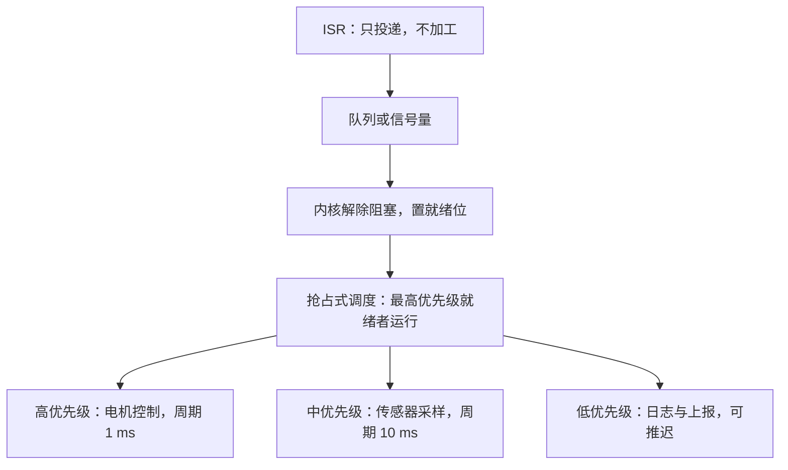

# 实时操作系统 RTOS

实时不等于快，等于按时：系统的正确性系于截止期，超时的答案和错误的答案同罪。调度器卖的就是这份「最坏情况也来得及」。

<footer>—— 据 Liu and Layland, JACM 1973；Barry, Mastering the FreeRTOS Real Time Kernel 整理</footer>

[上一课](/cs/emb-i2c-spi)把传感器与存储器接上了总线，事件经中断进来、工作推迟到主循环。事件一多，主循环就退化成一长串「if 标志就处理」：哪个先处理由代码书写顺序决定，和哪个事件更紧急无关；一个偶发事件插进来，所有周期任务的时序都跟着漂。缺口是把「谁先跑」从书写顺序改成**按截止期仲裁的调度器**。主干课的[实时调度对照](/cs/realtime-sched)、[速率单调](/cs/rate-monotonic)与 [EDF](/cs/edf-sched)已把算法与利用率界限讲清；本课写它们在几 KB 内存的 MCU 上落成什么样的内核，以及中断与任务两条优先级线怎么对表。

## 问题

裸机主循环的正确性靠「循环足够快」这个隐式假设撑着。任务加到五六个，假设开始漏：串口解析块了，电机控制就晚一拍；晚一拍在示波器上是一格相移，在产品里是抖动和啸叫。缺口不是代码风格，而是**时序耦合无法局部推理**：改任何一处延时，都要在脑子里重跑全部路径。RTOS 把每段工作包成有独立栈的任务，给内核一张任务表，由抢占式调度保证高优先级事件总是先被处理——于是「最坏响应时间」变成可以按利用率与关中断窗口推算的账，而不是猜。

### 内核只有四件事

 MCU 上的 RTOS 核心极小，抓四个部件就够。时钟节拍：SysTick 周期中断驱动延时与超时。上下文切换：每个任务有独立栈，PendSV（配成最低优先级）统一保存与恢复寄存器。抢占式固定优先级调度：就绪的最高优先级者运行，同级可配时间片。阻塞式通信：任务等队列、等信号量时干脆不参与调度，把 CPU 让给就绪者——这一条把「等待」从烧循环变成零成本。

## 方法

落地按三步。第一步划任务：每个任务一个「频率域」，周期与最坏执行时间 $(C, P)$ 写在设计文档里，按 [速率单调](/cs/rate-monotonic)的口径「周期越短优先级越高」指派；$n$ 个任务利用率 $\sum C_i/P_i$ 不超过 $n(2^{1/n}-1)$ 才有静态优先级的可调度保证。第二步接中断：[中断实践](/cs/emb-interrupt-practice)的「能推迟都推迟」在这里兑现成 `FromISR` 接口——ISR 只投队列或给信号量，唤醒哪一级任务由内核裁决，中断优先级与任务优先级是两套坐标系，混用是新手事故第一名。第三步处理锁：共享外设要互斥，但[优先级反转](/cs/priority-inversion)的教训必须兑现成带继承的互斥量，而不是普通信号量。

RM 的利用率界限随任务数下降：$n=3$ 时 $3(2^{1/3}-1)\approx 0.780$，$n\to\infty$ 时趋于 $\ln 2\approx 0.693$。这是充分不必要条件——界限之内必可调度，之外仍可能可行；把它当「不可调度」的判决书会错杀可行任务集。

## 机制

上下文切换的机制值回票价的地方在**栈预算**：每个任务的栈都要按最坏调用深度加中断嵌套预留，配小了不报编译错，只在运行中践踏相邻任务的对象——嵌入式最难查的偶发死机多半来自这里。内核自带的栈高水位检查要常开，上线前把余量压到有账可查。其次，RTOS 的实时性上限由你而不是内核决定：内核的关中断窗口加上你的临界区窗口，才是最坏响应延迟的真实分母；一个关中断去搬屏的驱动，能把任何调度算法的保证撕掉。这延续了[锁与关中断](/cs/lock-irq)的账本口径。

## 边界

本课写的是软实时的工程口径：错过截止期产品质量下降但不毁坏。硬实时——超时即事故、需要 WCET 证明与认证的那一档，靠的除了调度还有编译器与硬件的时序可分析性，超出本课。也不写 Linux 实时化：PREEMPT_RT 打补丁的思路属于通用内核，主干课的实时调度对照已经给过分界。内存与算力边界也钉一下：几 KB RAM 上跑内核要付每个任务独立栈的税，任务划分过细会先把 RAM 花光——四个到八个任务通常是 MCU 上的合理粒度。

## 小结

- 实时的本义是可按时完成；调度器把最坏响应时间从猜测变成可推算的账。
- 任务按周期域划分，RM 指派优先级，利用率界限是充分条件而非判决书。
- ISR 只投递不加工，`FromISR` 接口与中断优先级是两套坐标系，不可混表。
- 互斥必须带优先级继承；每个任务栈要留最坏余量，偶发死机先查栈践踏。
- 出处：Liu and Layland, *JACM*, 1973；Barry, *Mastering the FreeRTOS Real Time Kernel*；据本栏 rate-monotonic、priority-inversion 两课口径整理。
