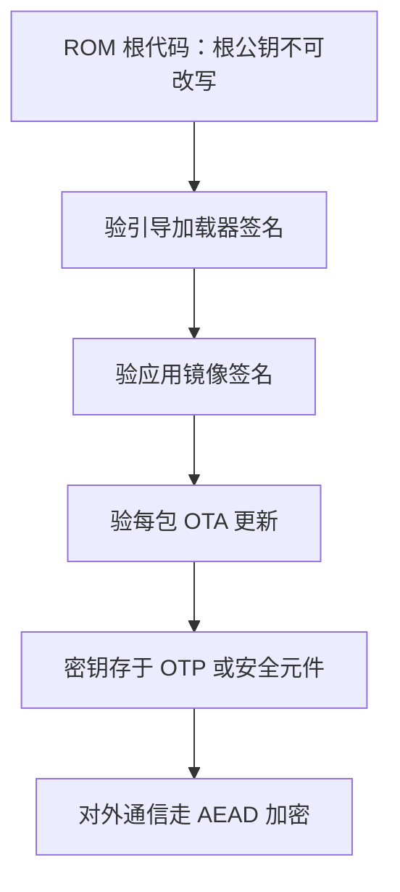

# 嵌入式安全

嵌入式攻击者的优势是物理：设备在他手里，示波器、探针、拆焊台都在他手里。防守的目标不是「攻不破」，而是让攻击的成本高于设备本身的价值。

<footer>—— 据 NIST SP 800-193（平台固件恢复）；Mirai 事件后的 IoT 安全实践整理</footer>

[上一课](/cs/emb-ota-updates)把更新通道打通了，但留下一笔欠账：镜像只验了完整性，没验来源——谁能往那条通道里写东西，谁就能给整个机队换上自己的固件。本课把嵌入式设备当成一个完整的攻击面来防守。与服务器安全的分野只有一个：这里的攻击者**拿得到物理设备**。

## 问题

物理在手意味着什么？SWD/JTAG 调试口两根线就能读写全部闪存；SPI 闪存夹上编程器夹，几分钟拷走完整镜像；板上的 [I2C 与 SPI](/cs/emb-i2c-spi) 总线明文传输，示波器直接回放。再叠加软件侧的懒——出厂统一口令、永不更新的固件——就是 2016 年 Mirai 僵尸网络的配方：约六十万台摄像头与路由器被默认口令收编，砸瘫了半个美国东海岸的 DNS。缺口的形状因此清楚：设备需要一条**从不可改写的起点出发的信任链**、一个**密钥的容身之处**、以及**出厂时对攻击面的收缩**，三者都要在几百 KB 闪存的预算内完成。

### 信任链与密钥的家

信任链的起点必须是攻击者改不了的东西： masked ROM 或一次性熔丝里的根公钥。芯片上电先跑 ROM 代码，验证引导加载器的签名，通过才移交；加载器再验证应用，应用再验证每一包 OTA 更新——[安全启动链](/cs/secure-boot-chain)讲的逐级验签在 MCU 上落成同一结构，只是每一环都小得多。密钥的「家」按预算三选：最省的是 OTP eFuse，写进去了谁也读不出（只能比对）；好一些的是带 TrustZone-M 的芯片，把密钥隔离在安全世界；顶配是外挂安全元件，密钥根本不出那颗芯片。对称密钥用 AES-GCM 这类 [AEAD](/cs/aead-gcm-internals) 同时拿机密性与真实性；非对称签名用于镜像与固件，因为验证端只需要公钥。

调试口是最大也最常漏的洞：SWD 两根线即可读写全部闪存与全部外设寄存器。量产固件必须在选项字节里关掉调试口或设置读保护——但读保护等级与调试能力的取舍各家芯片不同，锁死之前先确认产线还能烧录。

## 方法

按威胁模型排预算，而不是按功能堆砌。先回答「攻击者要什么」：要控制设备（僵尸网络），则口令治理与更新通道优先；要固件里的算法与数据，则读保护与镜像加密优先；要密钥本身，则安全元件优先。再按清单收缩攻击面：调试口锁定或读保护；引导加载器冻结（上一课的纪律在这里有了安全含义）；默认口令在首次配网时强制更换；通信全部走带认证的加密通道；日志与错误码不泄露内部结构。生命周期状态显式管理：开发态全开调试，量产态上锁，退役态销毁密钥——三个态的转变用 OTP 单向阀实现，只进不退。

## 机制

安全的机制内核是**锚点的不可改性**：整个链条的安全性都压在根公钥那一小块存储上，ROM 与 OTP 的意义就是把「改写它」从软件问题抬升到开盖、聚焦离子束的物理问题——攻击成本由这里决定。验签先于执行是第二个不变量：任何代码只有通过验证才获得控制权，顺序反了，漏洞在验证完成前就已生效。至于加密与签名的关系，机密性防「读走」，真实性防「换掉」，两者独立：加密但不验签的固件通道，攻击者虽看不懂也能整包替换——完整性必须由带密钥的认证保证，AEAD 内部机制主干课已讲透，不重写。

## 边界

本课不写三块。形式化认证（Common Criteria、FIPS）是流程与评估体系，不是工程本身；侧信道与故障注入——差分功耗分析、电压毛刺跳过验签——是真实威胁，但属于芯片级对抗，MCU 工程师能做的是选带抗性的器件、不在同一条电源轨上跑敏感操作；协议密码学的内部在主干课 AEAD 一课已展开。也要承认物理安全的极限：攻击者无限期持有设备并动用实验室级设备，多数 MCU 终会被攻破；工程目标是把这条路径的成本抬到高于收益，并把最敏感的部分交给专门的硬件。

## 小结

- 物理可及改写威胁模型：调试口、闪存夹取、明文总线都是第一跳，口令治理是最便宜的补丁。
- 信任链从不可改写的 ROM 根公钥出发逐级验签，验签先于执行是顺序不变量。
- 密钥按预算安家：OTP、TrustZone 隔离、外挂安全元件，三档对应三种攻击成本。
- 加密防读走、认证防换掉，二者独立；镜像通道必须验签，否则 OTA 就是后门。
- 出处：NIST SP 800-193；UEFI 安全启动与 MCU 安全启动实践；据本栏 secure-boot-chain、aead-gcm-internals 两课口径整理。
