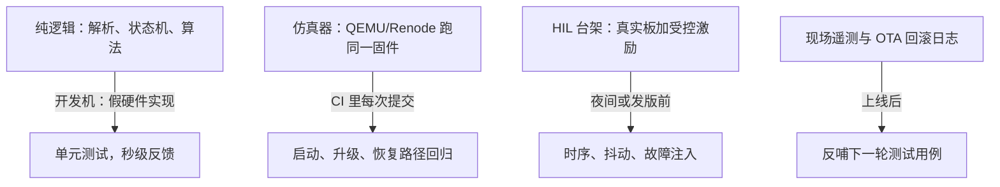

# 测试与仿真

固件测试的难点从来不是「没有断言」，而是被测对象长在硬件上：没有板子跑不了，插着调试器跑又变了样，时间本身就是行为的一半。

<footer>—— 据 MISRA C:2012；Renode 与 QEMU 的嵌入式测试实践整理</footer>

[上一课](/cs/emb-security)要求在攻击者之前先找出自己的漏洞，而「找出」靠的是一套能日常运行的测试体系。固件测试比应用软件难在两处：代码绑在硬件上，板子没到位一切停摆；行为的一半是时间——只看「算得对不对」的测试，测不出「来不来得及」。缺口是**把被测对象从硬件上分层剥下来**：哪些逻辑在开发机测，哪些在仿真器里测，哪些只能上真实硬件，各归各位。

## 问题

把所有测试都推到「上板手动跑」，代价是三个。慢：一次全流程回归要人在场点按半天，没人愿意天天跑，回归只能靠用户报障。测不到：真实故障路径——看门狗复位后恢复是否正确、总线卡死能否解救——恰恰是手动流程里不敢按、也按不准的。测不准：printf 走 UART 会拖住时序，10 个字节在 115200 波特率下要近一毫秒，一个毫秒级控制循环被日志彻底改形。缺口的本质是**可测性没有被设计进去**：代码与硬件的边界若不在架构上切开，测试就只能从最贵的那一层开始。

### 从逻辑里剥离硬件

分层的第一刀是把「纯逻辑」从硬件访问里剥出来：协议解析、状态机、补偿算法，都不该直接摸寄存器。硬件访问收敛到一层薄抽象（HAL），逻辑层只依赖接口；到了开发机上，接口后面换成假实现——喂一段录制的传感器字节流，断言解析器的输出与状态迁移。同一份固件代码，在开发机上跑的是逻辑的真实、硬件的假象；这一刀切干净了，单元测试才有立锥之地。

故障注入是固件测试的独门科目：在随机位置注入一次延迟或损坏一帧数据，看看门狗、复位、恢复路径是否各就各位。上一课设计的那条失效梯子，只有在这里被反复踩过，才敢说它在现场会工作。

## 方法

落地按四层金字塔排布。底层单元测试在开发机跑，目标秒级反馈，覆盖解析与状态机的边界——I2C 的 NAK、半包、粘包都做成用例。第二层仿真回归：QEMU 或 Renode 启动同一份固件镜像，验证[裸机启动](/cs/emb-bare-metal-boot)、[OTA 更新](/cs/emb-ota-updates)的断电与回滚流程——这些「多次重启加写入」的路径在真实板上慢而脆弱，在仿真器里可以每次提交都跑。第三层 HIL 台架：真实板加可编程电源与信号源，专测仿真器给不了的时序——唤醒延迟、抖动分布、欠压行为，并在这里跑故障注入。第四层现场遥测：复位原因计数、栈高水位、看门狗触发率，回传后变成下一轮用例。静态分析贯穿四层：MISRA C 挡住大半未定义行为，比动态测试便宜。

## 机制

分层之所以成立，依赖一个架构事实：**固件的多数缺陷是逻辑缺陷**，只有少数是时序与硬件交互缺陷——把两类分开测，便宜的工具覆盖多数，昂贵的工具聚焦少数。仿真器的机制价值在于**重启的廉价**：断电恢复、看门狗超时、升级中断这类「重启密集」的路径，真实板上一次几分钟，仿真器里一秒几十次，回归频率因此完全不同。但仿真保真度要诚实对待：外设模型常常是功能级的，I2C 上升时间、电源跌落的边沿都不在里面——所以 HIL 层不可省，时序类结论只认真实硬件。[RTOS](/cs/emb-rtos) 的调度抖动同理：仿真器里的延迟数字不构成证据。

## 边界

本课写的是固件与板级测试，不写两块。芯片内部的制造测试——扫描链、内建自测——是[可测性设计与扫描链](/cs/dft-scan-chain)与[内建自测](/cs/bist)的世界，固件工程师是用户而非作者；RTL 级验证与测试平台在[验证与测试平台](/cs/verification-testbench)讲过。形式化验证只点名：关键状态机可用模型检查穷举，成本高，只配给出错即事故的模块。最后一条纪律：HIL 台架要当产品的一部分维护——用例版本化、台架自检、坏了先修；带病的台架会污染所有发版决策，比没有台架更糟。

## 小结

- 可测性是架构属性：HAL 把硬件访问切薄，纯逻辑才能在开发机秒级回归。
- 四层金字塔：单元测试、仿真回归、HIL 时序与故障注入、现场遥测反哺用例。
- 仿真器的价值在重启廉价，适合升级与恢复路径；时序结论只认真实硬件。
- 故障注入把看门狗与恢复梯子踩实；MISRA 静态检查比动态测试便宜一个量级。
- 出处：MISRA C:2012；QEMU/Renode 文档与嵌入式 CI 实践；据本栏 emb-rtos、emb-watchdog-failsafe 两课的时序与失效口径整理。
