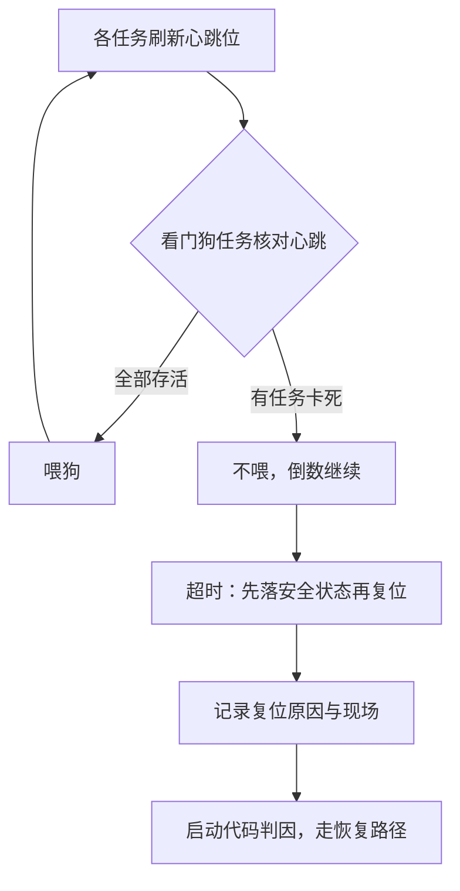

# 看门狗与失效安全

看门狗回答的不是「程序会不会挂」，而是「挂了之后世界怎么办」：喂狗是承诺，超时是违约，复位是补救——三件事要在出事前就设计好。

<footer>—— 据各 MCU 参考手册的 IWDG/WWDG 章节；IEC 61508 失效安全概念整理</footer>

[上一课](/cs/emb-power-management)把芯片的大半时间送进了深睡，设备越来越自主：现场没有人按复位键，失效只能自己兜住。而失效的形式很朴素——等一个永不置位的标志、跑飞的指针跳进数据区、[软错误](/cs/soft-error-ecc)翻转指令位、电源跌落让状态机走进半途。缺口是一根**独立于软件死活的线**：无论代码卡在哪，硬件都能在时限内把系统拉回已知状态。

## 问题

很多人把看门狗写成「定时器中断里喂一下」，这恰好把它的价值喂没了：能准时进中断喂狗，恰恰证明中断和定时器还活着；真正的故障——主循环死锁、任务饿死、状态机卡住——往往发生在中断照常运行的背景之下。缺口有两层。第一层是**喂狗策略**：喂狗必须绑定「业务真的在推进」的证据，而不是「CPU 还在执行指令」。第二层是**复位之后**：复位不是终点，是失忆的重启——若没有失效日志与安全状态的设计，设备会带着同一个 bug 无限循环重启，用户看到的就是「永远在重连」。

### 窗口看门狗补上另一半

普通看门狗只惩罚「来不及喂」，不惩罚「喂得太勤」。跑飞的代码若恰好落在喂狗寄存器的写操作上，或被放进高频定时器里无条件执行，超时永远不触发，看门狗形同虚设。窗口看门狗加一条下界：早于窗口打开就喂，同样复位。喂狗因此被夹进一个时间区间——太慢是违约，太快也是违约，盲目喂狗的路径被硬件直接判死。

## 方法

落地按四步。第一步分域：看门狗用独立时钟（片内低速 RC），主时钟、锁相环、软件全挂掉它照常倒数；超时按「最坏一次合法业务循环」的数倍设定。第二步定喂狗点：喂狗函数由主循环或看门狗任务调用，喂之前先核对各任务心跳——每个任务周期性刷新自己的心跳位，全部存活才喂；任何一块业务卡死，狗就饿着。第三步定安全状态：复位前把继电器断开、电机使能拉低、输出锁到无害值——「失效安全」的含义是失效后落在安全的一侧，不是简单地重启。第四步留证据：复位原因寄存器区分上电、看门狗、软复位与欠压，看门狗复位时把关键状态写进不掉电的备份区，供下次启动上报。

STM32 的独立看门狗跑在约 32 kHz 的片内低速 RC 上，超时可从毫秒级调到 32 秒；窗口看门狗是 7 位计数器，窗口只有毫秒量级，专盯主循环节奏。两颗狗超时相差百倍，用的正是「独立域」与「窗口」两个正交机制。

## 机制

看门狗的机制价值来自**信任域的分离**：计数器住在与主系统不同的时钟域，软件再乱也改不了它的倒数——软件定时器与被监控的代码共享同一个死法。窗口约束把「喂狗」从动作升级成**证据**：只有业务以正常节奏推进，喂狗事件才落进窗口。失效安全的梯子——检测、遏制、复位、带记忆的恢复——每级都要单独设计；漏掉恢复一级，设备就会在「复位—复现—复位」里打转。深睡设备还要把狗与功耗一起算：独立看门狗阻止最深的睡眠档，待机档下它本身也停，唤醒后的首轮自检要接替它站岗。

## 边界

本课写的是单点失效的工程兜底，不写高安全等级的冗余：双通道表决、安全完整性等级的形式化论证是另一套体系，看门狗在那里只是最后一环。ECC 与存储器保护在软错误一课已讲，看门狗不纠错，只止损。内部狗可被错误代码关闭，外部狗芯片连着复位线，选型取决于你信不信自己的代码。最后一条纪律：看门狗路径必须在台架上实测——故意挂起主循环、故意饿死一个任务，观察安全状态与复位日志是否如期出现；没演练过的失效路径，等价于不存在。

## 小结

- 看门狗是独立时钟域的倒数器，监控的是「业务在推进」，不是「指令在执行」。
- 喂狗绑定全任务心跳；窗口看门狗把喂得太勤也判死，堵住盲目喂狗的路径。
- 复位前先落安全状态，复位后凭原因寄存器与备份日志走恢复，缺一级就打转。
- 独立看门狗与深睡档互斥，功耗与看门狗要一起设计，不能各自为政。
- 出处：各 MCU 参考手册 IWDG/WWDG 章节；IEC 61508 基础概念；据本栏 soft-error-ecc 一课与心跳喂狗实践整理。
