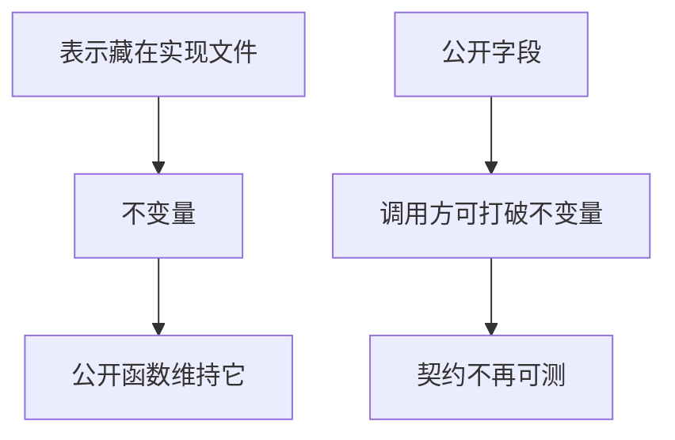

# 封装与不变量

不变量是对象在公开操作之间必须保持的性质；封装把能打破它的存储藏起来，只留维持它的函数。

<footer>—— 据 Kernighan & Ritchie, The C Programming Language, 2nd ed.；ISO/IEC 9899 整理</footer>

上一课[版本控制与变更](/cs/vcs-changeset)把接口改动收成可回放的差。本课不重讲提交，也不从 Java 可见性修饰符另起。缺口是：头文件已经能分享结构体布局，**一旦调用方直接改字段，函数边界上的契约就会被绕开**。封装是为不变量服务的，不是为了「看起来像对象」。

## 问题

结构体课给出了公开字段与偏移。若任何翻译单元都能写 `s->count++`，则「`count` 与链表长度一致」无法只靠一组函数来维持。缺口因此不是再加几个函数，而是**谁被允许碰表示**。C 用编译单元加不完整类型：调用方只有 `Foo *`，完整 `struct Foo` 放在实现文件里。公开头文件只声明创建、查询、修改、销毁。

不变量在构造（或初始化函数）后为真，每个公开函数假设进入时为真、返回时仍为真。失败路径也必须维持它或把对象标为不可用并释放。测试可以断言公开可观察的性质；内部断言辅助实现，但不替代封装——内部断言挡不住另一个 `.c` 直接写字段，若布局被公开的话。

### 封装不是「加一层 getter」

若 getter/setter 只是把字段原样暴露，不变量仍可以在两次调用之间被组合破坏（先改长度再忘了改指针）。封装要限制**允许的状态转移**，不是给每个字段改个名字。把封装理解成访问器生成，会回到公开布局，只是多了函数调用税。

K&R 用静态函数和文件作用域静态变量隐藏实现。ISO C 的不完整类型让指针在头文件里可用、布局不可用。本课不把 C++ `private` 当默认语法，机制相同：表示不可从边界外写。

## 方法

选定表示（计数、头指针、容量）。写出不变量：例如「`len` 等于从 `head` 走访的节点数，且所有节点由本对象拥有」。公开函数只通过内部辅助改这些字段。创建函数建立不变量；销毁函数释放所有权并结束寿命。调用方不得保存内部节点指针越过可能使其无效的操作——那条要写进契约，与悬挂课衔接。

文件作用域 `static` 让辅助函数与表不进入链接器的全局符号，减少上一课那种「不该出现在公开差里」的符号。这是封装在链接层面的对应。

创建与销毁必须成对出现在公开面上：只暴露修改、不暴露创建，调用方就只能去猜布局并自己 `malloc`，封装立刻失败。不变量检查可以放在每个公开函数入口的断言里，发行配置关掉后仍靠类型不完整来挡外部写入。多文件模块若把完整 `struct` 放进「内部头」再被外部偷偷包含，封装是社会约定而不是编译器强制——审查与包含路径要挡住这条。后课虚表把操作入口收成一张表，表示仍然只在实现文件里完整。

## 机制

不变量把推理从「任意比特组合」缩小到「合法状态」。调试时先查不变量是否破，再查算法。并发课会证明：没有封装，锁也不知道该保护哪一块。本课仍是单线程：共享可变是后课，但已经能看出，可变表示必须有唯一的修改入口，否则入口太多等于没有不变量。

不完整类型把偏移从调用方的编译单元里拿走：他们不能写 `p->len`，因为 `struct` 在该单元里没有成员。这比「请不要碰」的注释硬。测试若为了图方便把内部头文件包含进用例，等于把不变量的检查改成对表示的快照，重构一次就全红——那是在测试实现，不是测契约。文件作用域静态表也是封装：链接器不导出，别人即使用 `extern` 声明也链不上。后课虚表在封装之上加间接，表示仍然不完整。

## 边界

本课不讲继承，不把虚函数请来。下一课[动态分派与虚表](/cs/vtable-preview)在封装之上加「同一契约、多种表示」。后课默认：合法状态由不变量刻画；表示默认不完整；公开函数是唯一切换状态的入口。调用方保存内部节点指针越过可能使其无效的操作，仍是悬挂，封装不能代替寿命契约。

不变量要用公开可观察的量来陈述，才能被测试执行。内部节点形状可以变，只要长度、顺序、失败语义不变。把内部指针比对外公布，封装就只剩注释。

## 小结

- 不变量是公开操作之间保持的性质；封装禁止从外部打破表示。
- 不完整类型加实现文件是 C 的主要手段。
- 访问器若原样暴露字段，就没有封装。
- 测试应对公开可观察量，不要冻结内部布局。
- 下一课让同一接口背后换实现，而不改调用方。
- 出处：K&R 静态与多文件隐藏；ISO C 不完整类型。
