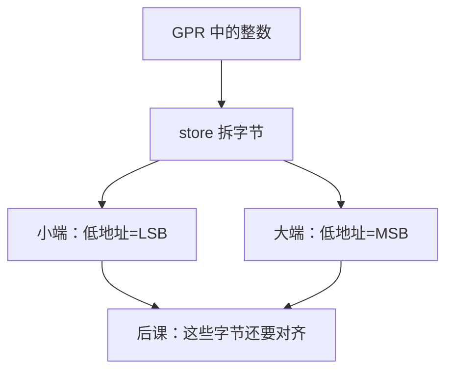

# 大小端

  
多字节整数在内存里从哪一端放下「最低位字节」，是 ISA 与协议必须钉死的约定；算术在寄存器里并不知道自己曾被拆成哪一串字节。

  <footer>—— 据 Cohen, On Holy Wars and a Plea for Peace, IEEE Computer 1981；The RISC-V Instruction Set Manual；ARM ARM；Intel SDM 整理</footer>

[上一课](/cs/condition-codes-predication)决定比较结果放标志还是放 GPR。寄存器内部的位编号与**内存字节序**不是同一件事。缺口是 **endianness**：x86/RISC-V 默认小端，网络与部分历史 ISA 大端，ARM 可双端。

## 问题

`sw` 把 32 位值写成四个字节。小端：最低地址放最低有效字节；大端相反。CPU 在 GPR 里做的加、[位操作](/cs/bit-manip-ext) 的 `rev8` 正是在两种视图之间翻。缺口不是再讲 load/store，而是**同一比特串在总线与文件里的排列**，以及跨核、跨设备、跨网络时必须一致。

指令流：RISC-V/A64 取指也按约定的端序读半字/字；与数据端序通常相同，但规范允许实现另述。把「位 0 是 LSB」直接当成「地址 0 是 LSB 字节」，对照课会混。

### 大小端不是「谁更自然」

Cohen 1981 已经指出争论多半是命名。本课不选边。也不把 TCP 的 network byte order 写成要在本栏实现的协议栈——只要求：多字节字段在共享内存与 ABI 里有端序。

Cohen, IEEE Computer 1981。Intel 长期小端（SDM）。ARM ARM 的字节序与 `SETEND` 历史、A64 默认 LE。RISC-V 非特权默认小端；特权规范可提供端序控制位。

## 方法

编译器按目标 ABI 生成字访问；跨端数据用显式字节交换（`rev`/`bswap`/`rev8`）或按字节读写。原子与 [LR/SC](/cs/lr-sc-cas) 的对象是整字，端序决定那一颗字的内存图像，不改变保留集语义。[SIMD](/cs/simd-extensions) 的打包通道有自己的元素序，和标量端序一起写进手册，不要靠猜测。

与页表：PTE 多字节字段同样有端序；[Sv39](/cs/sv39-page-table) 在小端内存上定义位域。hypervisor 填 `hgatp` 指向的表时不能按大端主机格式瞎写。

## 机制

条件码不编码端序。下一课对齐：即使端序已知，地址相对宽度未对齐时，一次「逻辑上的字访问」可能拆成两次总线事务，或直接 trap。ISA 对照必须把「允不允许非对齐」与「端序」分开写。

## 边界

本课不裁定文件格式，不把 base64 当端序。不保证所有 RISC-V 核实现大端模式。不进入量化行情的 wire 格式。

后课默认：当代 x86 与默认 RISC-V/A64 用户态是小端；跨端要显式交换。下一课对齐与非对齐访问。

## 小结

- 端序规定多字节在内存中的字节排列。
- 寄存器算术不自动知道磁盘与网络的端序。
- `bswap`/`rev8` 是 ISA 提供的翻转。
- 出处：Cohen 1981；RISC-V ISA；ARM ARM；Intel SDM。
