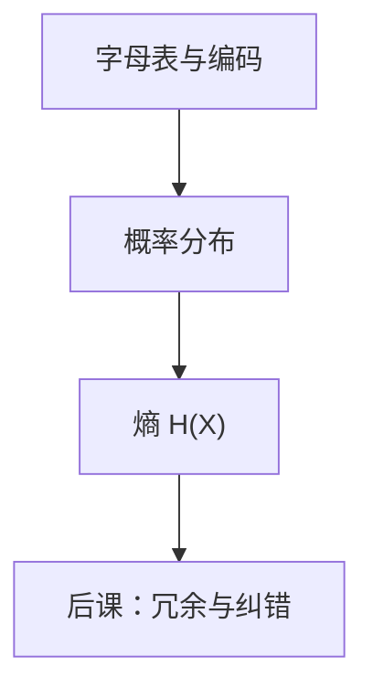

# 信息量与熵

一个符号携带多少信息，不取决于它长什么样，而取决于它有多意外。

<footer>—— 据 Shannon, A Mathematical Theory of Communication, 1948 整理</footer>

上一课[UTF-8 变长](/cs/utf8)钉死了：字母表可以编号并编成字节。本课不重讲 UTF-8，也不从「通信系统框图」另起一篇综述。[第一课](/cs/bit-as-distinction)已经借用 Shannon 的区分，但明确把熵留给本课。缺口是：有了符号，还没有**量**。

## 问题

码位表给出 $|\mathcal{X}|$，均匀时每个符号用 $\log_2|\mathcal{X}|$ 比特就够编号。真实源不是均匀的：空格、`e`、某些字节远更常见。缺口因此不是再发明一种字符集，而是在概率模型上定义：观察到 $x$ 消除了多少不确定性。

Shannon 自信息 $I(x)=-\log_2 p(x)$，熵 $H(X)=\mathbb{E}[I(X)]$。单位是比特——这里的比特是**平均不确定度**，不是上一课那个物理区分位置。两种「比特」同名，对象不同；本课只钉前者。信道容量、纠错码的冗余还没有。

### 熵不是「文件大小」

UTF-8 文件的字节数是编码长度，可以远大于 $nH(X)$。熵是分布的性质，压缩下界；某一次实现用了多少字节是另一回事。没有分布，熵句无法写。把「信息量」说成语义重要性，也离开本课：Shannon 不管符号「意思」。

第一课的比特是字母表大小为 2 的位置。本课的比特是 $-\log_2 p$ 的单位。后课纠错码用的汉明距离又是第三种尺子：组合距离，仍可以不谈熵。

## 方法

取有限 $\mathcal{X}$ 与 $p(x)\gt 0$。$H(X)$ 在均匀分布达最大 $\log_2|\mathcal{X}|$，退化分布为 $0$。联合熵、条件熵满足 $H(X,Y)=H(X)+H(Y|X)$。本课不把典型集证明写完，只锁定：独立同分布源的平均最小码长以熵为界。

离散概率的严格公理在[更后的课](/cs/discrete-probability)才补；本课够用的是有限支撑上的 $p$，加法与期望。连续熵、微分熵不进主干：本栏对象仍是有限字母表。

## 机制

熵给压缩和信道一个公共尺子。后课若只重复编号，冗余为零，一位翻转就换一个合法符号。若故意让码字互相离开，平均长度超过熵，换来的是检错能力。本课只指出这个权衡，不构造汉明码。

互信息 $I(X;Y)=H(X)-H(X|Y)$ 度量「看见 $Y$ 对 $X$ 少了多少不确定」。后课噪声信道会用它，本课不把容量公式 $C=\max I(X;Y)$ 展开成证明。

## 边界

本课不引入算术编码实现，不讨论自然语言的「意义」，也不把大模型栏的 token 分布请进来。连续物理噪声的模型是后课信道；这里只有符号概率。Kolmogorov 复杂度是另一套，不混进 Shannon 熵。

后课默认：谈到「这一位携带多少信息」，先问分布；均匀编号只是上界。检错、纠错要另加几何。

## 小结

- 自信息是 $-\log_2 p(x)$；熵是它的期望，单位比特。
- 熵是压缩下界，不是 UTF-8 文件长度。
- 与第一课的「二元区分」同名不同层。
- 出处：Shannon, *A Mathematical Theory of Communication*, 1948。
