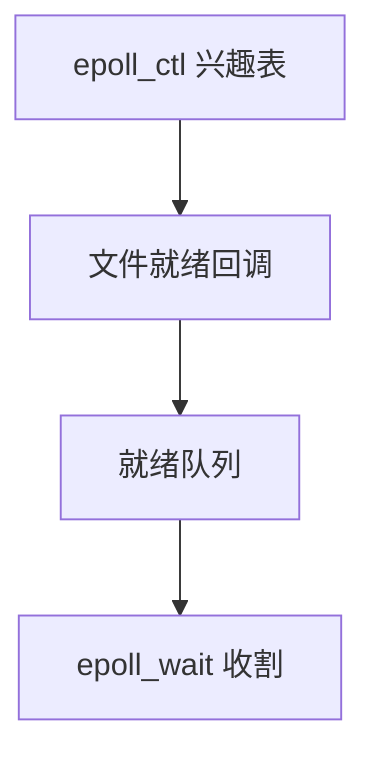

# epoll

在内核为进程保存兴趣表；就绪事件放进队列，wait 不必每次携带并扫描全部描述符。

<footer>—— 据 Linux epoll 手册；Stevens 对大规模事件通知的讨论</footer>

[上一课](/cs/select-poll)每次把 n 个 fd 拷进内核做 O(n) 扫描。连接数上万时，扫描本身比工作还重。缺口是 **epoll**：`epoll_ctl` 改兴趣，`epoll_wait` 只取已就绪。合并水平与边沿触发，不当两篇词条。

## 问题

select 的兴趣是调用参数，无状态。epoll 实例是一个 fd，内核红黑树（或等价）记住监视哪些 fd、要哪些事件。文件真正就绪时，回调把该项放进就绪链表。wait 只收割链表。缺口不是新的管道，而是这份内核状态以及 ET（边沿：只在状态变化时报告）与 LT（水平：与 poll 相同）的差别。

本课不把 `epoll_ctl` 每个 op 的错误码背完。

ET 要求一次读到 EAGAIN，否则事件丢失在应用逻辑里。LT 更不易用错，就绪队列可能反复报告同一 fd。本课不写攻击，只写语义。

## 方法

`epoll_create` → 对每个连接 `EPOLL_CTL_ADD` → 循环 `epoll_wait` → 对返回的 fd 做非阻塞 `read`/`write`。关闭 fd 会自动从兴趣表删除（实现相关，教学上仍应显式 DEL）。与 [信号掩码](/cs/sigmask) 可用 `epoll_pwait` 原子搭配。底层仍是各文件的 poll 回调，与 VFS 操作表相连。

## 机制

epoll 把复杂度从「每次系统调用 × n」降到「事件发生时 O(1) 插入 + wait 收割」。它仍是同步 I/O 的就绪通知，不是下一课的异步提交。线程安全：同一 epoll fd 可被多线程 wait，语义要小心惊群——实现有过变化，主干只承认「有这个对象」。

不要把 epoll 写成 Windows IOCP 的逐条对照表。

## 边界

本课不引入 `io_uring` 的 SQE。不保证 epoll 在所有文件类型上等价（部分设备 poll 实现粗糙）。下一课：把「等就绪再 read」换成「提交读请求，完成进队列」，进一步减少陷入。

后课默认：兴趣表可规模化。系统调用本身仍是每批 wait；下一课 io_uring 用共享环形缓冲提交与完成。

## 小结

- epoll 在内核保存兴趣并维护就绪队列。
- LT 似 poll；ET 只报变化，要读到 EAGAIN。
- 异步提交完成队列是 io_uring 的缺口。
- 出处：Linux `epoll(7)`；Stevens；Love, *LKD*。
