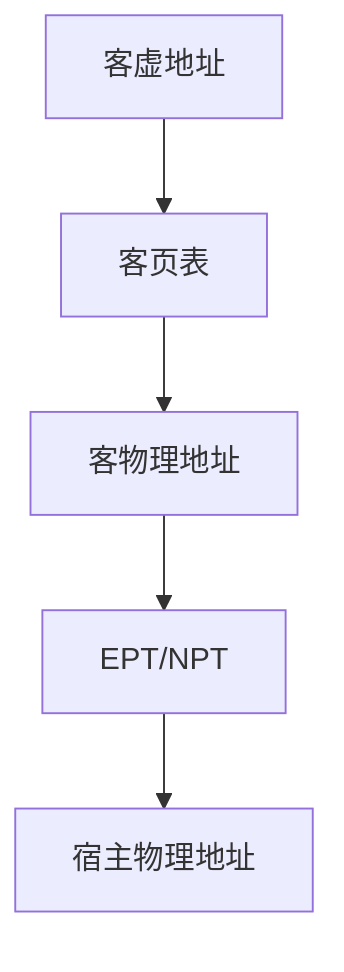

# EPT 与 NPT

扩展页表为客机物理地址再走一层硬件翻译到宿主物理地址，避免 VMM 用影子页表同步每一条客 PTE。

<footer>—— 据 Intel SDM 对 EPT、AMD 对 NPT/RVI 的概述；硬件辅助虚拟化的教学整理</footer>

[上一课](/cs/trap-and-emulate)在软件里模拟 MMU 时，客内核改页表会频繁陷入。[分页](/cs/paging-vm) 与 [TLB](/cs/tlb-translate) 已有一层翻译；再加客机后变成 GPA→HPA。影子页表：VMM 把客 PTE 合成真 PTE，客写 CR3 或 PTE 都要介入。缺口是 **EPT/NPT**：硬件走两层页表，缺的是 EPT 违例而不是每一次客内核填表。

## 问题

影子页表正确但贵：客 OS 写 PTE 是普通 store，要写保护或半虚拟化才能截获。EPT：CPU 先用客页表把 GVA→GPA，再用 EPT 把 GPA→HPA。客内核填自己的页表不必陷入。缺口不是重导宿主页表格式，而是承认第二层对象、EPT TLB、以及 shootdown 现在包括 INVEPT 一类。

本课不把 EPT 项的每个内存类型位背完。

两层都可能缺页：客缺页由客内核处理；EPT 缺页（GPA 未映射）由 VMM 处理，类似宿主的缺页路径，对象是客机物理页。

## 方法

VMM 为每个客机建 EPT。客机 RAM 是宿主匿名页或大页，填进 EPT。客 OS 按 [按需调页](/cs/demand-paging) 管理自己的 GPA。VMM 可用大页覆盖客 RAM 以减 TLB 压力。设备 DMA 要用 IOMMU 指向允许的 HPA，直通时更关键。

## 机制

硬件嵌套翻译把 trap-and-emulate 的 MMU 部分从「每次填表陷入」降为「缺 EPT 时陷入」。TLB 现在缓存两层结果，容量压力更大，大页更有价值。这仍共享 CPU 微架构，不是网络。不要把侧信道写成利用课。

与容器对照：容器没有 GPA 这一层。

## 边界

本课不引入嵌套虚拟化（L2 的 EPT）全文。不保证所有 ARM Stage-2 细节与 x86 同名。下一课：即便 MMU 快了，设备 I/O 若逐寄存器模拟仍然慢——客机需要半虚拟化队列。

后课默认：GPA 可由硬件译到 HPA。客机块/网设备如何用共享队列通知宿主，下一课 virtio。

## 小结

- EPT/NPT 硬件完成 GPA→HPA，减轻影子页表。
- 两层缺页分给客内核与 VMM。
- 设备 I/O 的半虚拟化队列是 virtio 的缺口。
- 出处：Intel SDM（EPT）；AMD NPT；Tanenbaum *MOS*。
