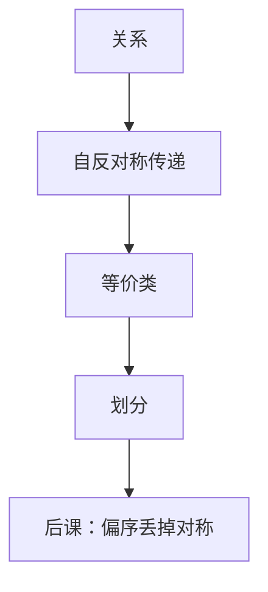

# 等价关系与划分

自反、对称、传递的关系，正好把集合切成互不重叠的块；块里的元素彼此可替换，块与块之间不可。

<footer>—— 据 Rosen, Discrete Mathematics and Its Applications 整理</footer>

上一课[集合与关系](/cs/sets-relations)钉死了关系是有序对的集合，并点名「等价 $\Leftrightarrow$ 划分」，当时不证、不展开类。本课不重讲笛卡尔积，也不从「抽象代数」另起。缺口是：后课同余、连通分量、类型等价，都要把「当成同一个」写成类。点名不够，必须把对应钉成双向构造。

## 问题

关系可以只对称不传递（「相邻」），或只传递不对称。缺口因此不是新的 $\subseteq$，而是三条一起：**等价关系** $\sim$。对 $a\in A$，类 $[a]=\{x:x\sim a\}$。全体类构成 $A$ 的划分：非空、互不相交、并集为 $A$。反过来，给定划分，定义「在同一块里」即得等价关系。两构造互逆。

模 $n$ 同余是本栏已经用过的例子：位权课的模 $2^n$ 加法，现在有了关系语言。连通分量要等[图](/cs/graph-definition)有了边再写；本课只准备「类」。

### 类不是「随便分组」

每一对相关的元素必须进同一块，无关的不能进同一块。把学生「随便分成若干组」当成等价类，后课商集没有运算。也不把偏序的可比当成对称：下一课序关系故意丢掉对称、改用反对称。

Rosen 用同余与「相同余数」当主例，并证明等价与划分一一对应。商集 $A/{\sim}$ 是类的集合；后课函数要对类良定义，须与代表元无关。

## 方法

验证 $\sim$ 三性质；写出几个类，检查相交为空。从划分回到关系：$(a,b)\in R$ 当且仅当存在一块同时含 $a,b$。细化：更细的划分对应更小的等价关系（作为有序对集合）。本课不引入格——那是[下一课](/cs/poset-lattice)用包含关系做的。

## 机制

有了类，才能说「模 $2^n$ 下相等」是关系，而不是散文。后课哈希碰撞是「不同键映到同一槽」，那是函数不是等价——除非再定义核。布尔函数相等是真值表相同，是函数集合上的等价；化简课已经在用，现在有名字。

## 边界

本课不讨论选择公理下的怪划分，不把群的正规子群提前。偏序、格、函数单射满射都还没钉。有限与无限只影响类的个数是否可数，可数是再后一课。

后课默认：谈到「同一类 / 同余 / 商」，先给出等价关系或划分二者之一，另一份跟着来。

## 小结

- 等价关系的类构成划分；划分诱导等价关系。
- 同余是已用过的模算术的关系写法。
- 下一课改谈反对称的序，不再对称。
- 出处：Rosen, *Discrete Mathematics and Its Applications*。
