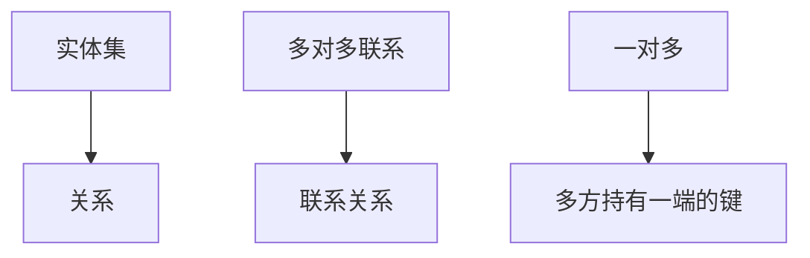

# ER 到关系

实体与联系是设计草图；落到关系模型时，实体成表，联系成外键或单独的关系。

<footer>—— 据 Chen, The Entity-Relationship Model, TODS 1976；Date 对从 ER 到表的整理</footer>

[上一课](/cs/relational-model)把事实命名成属性上的元组集合。本课不重定义域与模式。缺口是设计入口：人们先画「谁与谁有关」，再写成表。Chen 的实体–联系图是草图；本课只收**翻译规则**，使后课键与完整性有来历。不写 SQL。

## 问题

关系模型禁止把指针当一等对象，但建模仍要从现实对象起步。实体有属性，联系有基数（一对多、多对多）。若不翻译，读者会以为表是从文件记录直接改名。缺口是：强实体 → 关系；多对多联系 → 带两端键的关系；一对多常把键放在多方。弱实体带上拥有者的键。

ER 不是存储。ISA 层次如何并成一张表或拆成多张，是后课范式的亲戚，本课只要求翻译后仍是关系。

## 方法

每个实体集一张表，属性成列。二元多对多：联系表，属性为两端候选键（后课才叫外键）。一对一按哪一侧可选来决定键放哪。三元联系不要强行拆成三个二元而不检查语义。本课不引入全部 Chen 记号变体。

## 机制

翻译保证：图画上的「一个订单属于一个客户」在值上可检查，而不是靠应用程序记住指针。后课[键与完整性](/cs/keys-integrity)会把「一端的键」升级成候选键与外键约束。代数仍对翻译后的关系运算。

## 边界

本课不把 UML 类图当另一套数据模型插进主干，不讨论 ORM 的懒加载。元组如何唯一、引用如何禁止悬挂，下一课。

后课默认：表来自实体与联系的翻译。还没有主键声明。

## 小结

- ER 是草图；实体成表，多对多成联系表。
- 一对多把键放在多方。
- 键与参照完整性下一课。
- 出处：Chen, *TODS* 1976；Date；Codd 1970。
