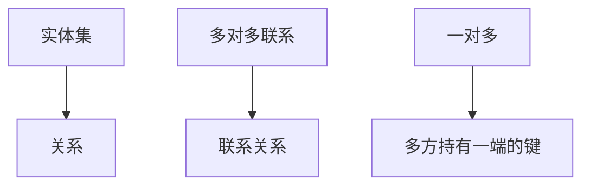
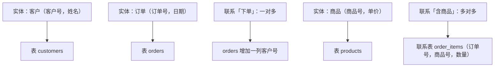

# ER 到关系

实体与联系是设计草图；落到关系模型时，实体成表，联系成外键或单独的关系。

<footer>—— 据 Chen, The Entity-Relationship Model, TODS 1976；Date 对从 ER 到表的整理</footer>

[上一课](/cs/relational-model)把事实命名成属性上的元组集合。本课不重定义域与模式。缺口是设计入口：人们先画「谁与谁有关」，再写成表。Chen 的实体–联系图是草图；本课只收**翻译规则**，使后课键与完整性有来历。不写 SQL。

## 问题

关系模型禁止把指针当一等对象，但建模仍要从现实对象起步。实体有属性，联系有基数（一对多、多对多）。若不翻译，读者会以为表是从文件记录直接改名。缺口是：强实体 → 关系；多对多联系 → 带两端键的关系；一对多常把键放在多方。弱实体带上拥有者的键。

基数就是「一根线两端各能挂几个」：一对多是「一个客户下多张订单，一张订单只属于一个客户」；多对多是「一张订单含多件商品，一件商品出现在多张订单」。读 ER 图先读线上的基数——翻译成表时，键放在哪全由它决定。

ER 不是存储。ISA 层次如何并成一张表或拆成多张，是后课范式的亲戚，本课只要求翻译后仍是关系。

## 方法

每个实体集一张表，属性成列。二元多对多：联系表，属性为两端候选键（后课才叫外键）。一对一按哪一侧可选来决定键放哪。三元联系不要强行拆成三个二元而不检查语义。本课不引入全部 Chen 记号变体。

多对多的「联系表」可以想象成一张登记簿：订单表不直接记商品，商品表也不直接记订单，每成交一次就在登记簿添一行「哪张订单、哪件商品、几件」。登记簿的两列编号分别指向两边——后课的外键约束，查的就是这两列不许指向不存在的行。

```mermaid
flowchart TD
  ENT["实体集"] --> REL["关系"]
  RELN["多对多联系"] --> BRIDGE["联系关系"]
  CARD["一对多"] --> FK["多方持有一端的键"]
```

## 机制

翻译保证：图画上的「一个订单属于一个客户」在值上可检查，而不是靠应用程序记住指针。后课[键与完整性](/cs/keys-integrity)会把「一端的键」升级成候选键与外键约束。代数仍对翻译后的关系运算。

```mermaid
flowchart TD
  C["实体：客户（客户号，姓名）"] --> CT["表 customers"]
  O["实体：订单（订单号，日期）"] --> OT["表 orders"]
  B["联系「下单」：一对多"] --> FK["orders 增加一列客户号"]
  P["实体：商品（商品号，单价）"] --> PT["表 products"]
  L["联系「含商品」：多对多"] --> BT["联系表 order_items（订单号，商品号，数量）"]
```

初学者容易把一对多的外键放错边：直觉上「客户有多张订单」，想往客户行里塞一列订单——可关系模型一行只有固定列，塞不下变长的列表。正确方向是反过来：在多的一方（订单）存一的一方（客户）的键，一列就够，重复也不怕。

## 边界

本课不把 UML 类图当另一套数据模型插进主干，不讨论 ORM 的懒加载。元组如何唯一、引用如何禁止悬挂，下一课。

后课默认：表来自实体与联系的翻译。还没有主键声明。

## 小结

- ER 是草图；实体成表，多对多成联系表。
- 一对多把键放在多方。
- 键与参照完整性下一课。
- 出处：Chen, *TODS* 1976；Date；Codd 1970。
