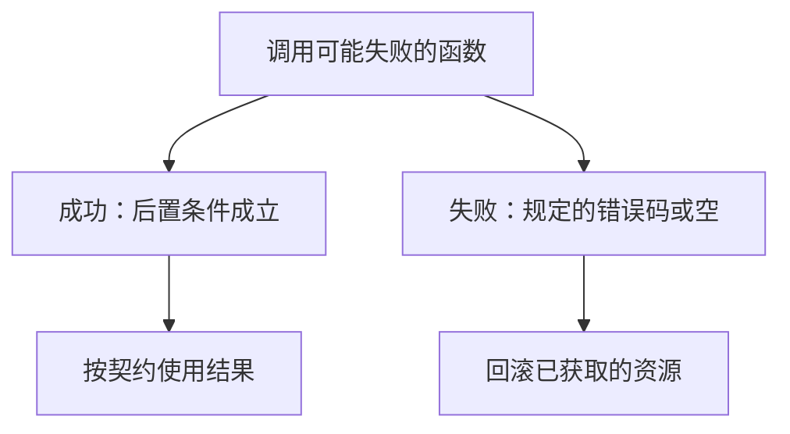

# 错误码与失败

C 的函数用返回值或输出参数报告失败；忽略它，调用方会把半完成的状态当成成功继续走。

<footer>—— 据 Kernighan & Ritchie, The C Programming Language, 2nd ed.；ISO/IEC 9899 整理</footer>

上一课[模块与头文件](/cs/module-header)把契约写成可包含的声明。本课不重讲 `extern`，也不从异常模型另起。缺口是：函数边界已经能说「成功时指针活多久」，**失败时哪些事没有发生、调用方怎样被迫看见**。系统接口几乎处处会失败；语言却没有强制性的展开。

## 问题

`malloc` 可以返回空，`fopen` 可以失败，写文件可以只写出一部分。契约若只描述快乐路径，悬挂与泄漏会在失败分支上爆发：已经申请的块没有释放，已经打开的描述符没有关闭，输出结构体处于半初始化。缺口因此不是「记得检查返回值」的口号，而是**失败也是接口的一部分**，必须与所有权一起设计。

C 常见报告方式：返回错误码（0 成功或负值失败）、返回空指针、设置 `errno`、通过输出参数给出部分结果。几种可以组合，但不能互相假设。本课钉一条纪律：每个可能失败的边界都要规定成功与失败两套后置条件。后课测试会把失败路径变成必须覆盖的规格。

### `errno` 不是返回值的替代

`errno` 是线程里一块可被许多库函数改写的状态。成功路径上它的值不必清零；失败路径上才有意义，而且必须在下一次可能改它的调用之前读走。把 `errno` 当成第二个返回值随便用，会读到别人留下的旧错误。返回值才是「这次调用是否失败」的主通道；`errno` 是补充分类。

K&R 与标准库把空指针、EOF、非零返回当作失败信号。ISO C 定义 `errno` 与若干标准错误名。本课不把 Windows HRESULT 或 C++ 异常当默认模型——系统课会再碰到系统调用的负返回。

## 方法

设计函数时同时写：失败时返回什么；哪些输出参数未被写入；已经获取的资源由谁在失败路径释放。内部若有多步，用单一出口或显式回滚，避免「中间一步失败但前面的 `malloc` 还挂着」。调用方把检查写在调用点旁边，而不是假设「这台机器内存无限」。

部分成功（写了 $k$ 字节）要在契约里写成合法结果，而不是偷偷当成全成功。把部分成功与失败混成同一个 `-1`，调用方无法重试。

把错误码挤进返回值与「真正结果」共用时，必须留出不可能的值（空指针、负长度）。若所有返回值都合法，就要用输出参数报告状态，不能让调用方用结果当布尔。线程里 `errno` 是线程局部的，这是 C11 之后的模型；在此之前多线程会互相覆盖。本课不把信号与取消当错误通道。测试必须覆盖失败：否则错误路径上的泄漏与双释放要到生产才出现。后课把这些例子收成可执行规格。

## 机制

没有强制检查时，失败会沿栈向上变成错误的数据，而不是立刻停机。这与 UB 不同：忽略错误码常常仍是「合法程序」，只是逻辑错——直到某次空指针解引用才落入 UB。因此错误处理是抽象边界的延续：把「可能失败」从实现细节提升为调用方必须分支的状态。后课系统调用会把同一模式放到用户与内核之间。

系统调用包装把内核的负错误变成 `-1` 与 `errno`，于是同一套检查纪律从库函数延伸到陷入。忽略 `write` 的短写，等于把部分成功当成契约里没有的第三种状态。RAII 课会要求失败出口与成功出口走同一销毁；本课先把「失败也是后置」写进签名注释，测试才能为它造例子。不要用断言代替错误返回：断言在发行版可被编译掉，那是规格探测，不是调用方能依赖的通道。

## 边界

本课不讲事务内存，不引入异常语法。下一课[测试作为规格](/cs/test-as-spec)把成功与失败都变成可执行断言。后课默认：可能失败的函数在边界上同时规定两套后置；资源在失败路径上有主人；`errno` 只在失败后、立即读取才有意义。

把成功定义为「没崩溃」等于没有契约。调用方必须能区分：失败且无副作用、失败但已部分提交、成功。三种后置写不清，测试也无法造例子。系统调用的短写属于第二种，不能当成第一种处理。

## 小结

- 失败是契约的一半：返回方式、未写入的输出、要回滚的资源。
- 忽略错误码会把半完成状态当成成功，随后才变成悬挂或 UB。
- `errno` 补充分类，不替代这次调用的返回值。
- 下一课用测试把这些分支钉死。
- 出处：K&R 标准库惯例；ISO C 库函数与 `errno`。
