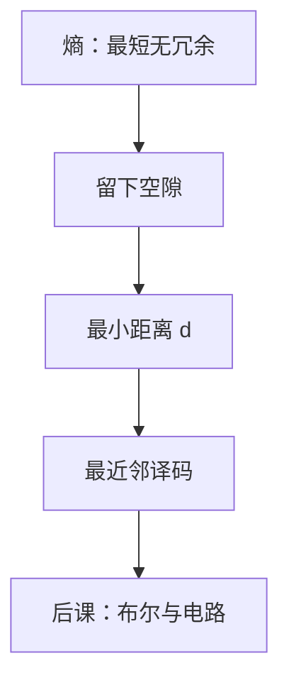

# 纠错码直觉

检错靠码字互相离开；纠错则是把收到的串判给最近的那个合法点。

<footer>—— 据 Hamming, Error Detecting and Error Correcting Codes, 1950；Shannon, 1948 整理</footer>

上一课[联合熵与互信息](/cs/mutual-information)钉死了：平均不确定度有下界，压缩不能无代价地短于熵。本课不重讲 $H(X)$，也不从信道容量定理另起一篇综述。缺口是：熵假定符号已经正确到达。第一课承认翻转会发生，到现在还没有尺子说「错了多少、怎样改回来」。

## 问题

合法码字若占满 $\Sigma^n$，一位翻转仍是某个合法字，接收方无法发现。缺口因此不是更大的字母表，而是**不用完**所有串：选出子集 $C\subset\Sigma^n$，使任意两个码字的汉明距离至少为 $d$。则少于 $d$ 位的错可被发现；少于 $d/2$ 的错，按最近邻可被纠正。

Hamming 的 $(7,4)$ 码用 3 位奇偶把 $d$ 放到 $3$，纠正 1 位。本课只钉距离与球，不把线性码的生成矩阵写完，也不证明 Shannon 第二定理。

### 奇偶校验不是纠错

一比特奇偶使 $d=2$，发现奇数位错，不能定位。纠错需要定位：冗余必须随长度增长。把 CRC 的「几乎总能发现」说成「已经纠正」，后课存储阵列会把检错和重传混成一步。

汉明距离是翻转位数，与熵无关：几何先于概率。Shannon 说噪声信道上仍可任意可靠，条件是速率低于容量且块够长；Hamming 给出短块、可构造的几何。

## 方法

定义 $d(u,v)$ 为相异位数。码 $C$ 的最小距离 $d_{\min}=\min_{c\neq c'}d(c,c')$。译码：在 $\{u:d(r,u)\le t\}$ 里找唯一码字，其中 $2t+1\le d_{\min}$。重复码、奇偶、Hamming 码是三条由短到长的例子；本课用它们说明冗余换距离，不选哪一种做后课内存的唯一方案。

## 机制

存储与总线把这一层做成 ECC DIMM、磁盘的 CRC：发现了可以重读或报警，纠正了可以静默恢复。后课 SRAM 阵列会假定位翻转是稀有事件；本课只提供「为何加校验位」的几何。编码是线性时，校验是矩阵乘，电路上是一组异或——布尔代数还没有正式进场，本课不把门图画出来。

距离保证最坏情况；平均情况可以更好。概率模型与几何模型要分开写：上一课的熵管速率，本课的 $d$ 管可纠正半径。

## 边界

本课不讲 Reed–Solomon、LDPC、不把容量 $C$ 的随机编码证明展开。也不把加密完整性（MAC）当成纠错：主动攻击不是独立比特翻转。字符 UTF-8 的非法序列检测不是汉明码。

后课默认：谈到检错、纠错，先问最小距离；奇偶只能检、不能纠。电路如何实现校验，从布尔代数开始。

## 小结

- 不用完 $\Sigma^n$，码字之间才有距离。
- $d_{\min}$ 决定能检几位、纠几位；奇偶只是 $d=2$。
- 几何（Hamming）与熵（Shannon）分工：一个管距离，一个管速率。
- 出处：Hamming, 1950；Shannon, 1948。
