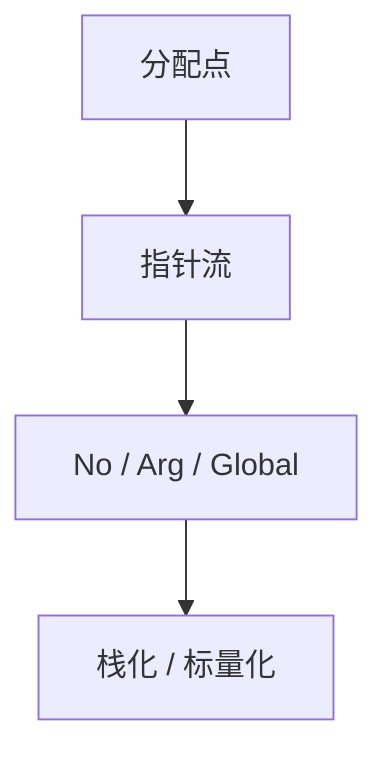

# 逃逸分析

若对象从不逃出当前函数或线程，则可栈分配、标量替换或去掉同步。分析跟踪指针是否存到堆、返回、或传给未知代码。

<footer>—— 据 Choi 等 Escape Analysis for Java；Blanchet, Escape Analysis for Object-Oriented Languages；Appel 对照整理</footer>

上一课[尾调用](/cs/tail-call-opt)关心帧能否丢掉。缺口是**堆对象的寿命**：`new` 的结果若只在当前帧用，不必进 GC 堆。逃逸分析（EA）：NoEscape / ArgEscape / GlobalEscape。本课钉 AOT 视角；JIT 里的 EA 后课再加投机。不写 SROA 细节——下一课。

## 问题

指向分析说指向谁；EA 说**指针是否流出**。流出：写入静态域、返回、传入未知函数。未逃逸：可分配在栈、或拆成标量。缺口是**连通与摘要**，不是 TCO。

Java：未逃逸对象的锁可删（若语言允许）。C：`malloc` 未逃逸可改 `alloca` 或寄存器，但 `alloca` 与 VLA 有栈风险。

### 未逃逸不是「没有别名」

函数内两个局部指针仍可别名同一未逃逸对象。EA 不替代别名，只约束寿命与分配位置。

Choi et al. OOPSLA。Blanchet POPL。HotSpot 的 EA 是 JIT 名场景。本课先过程内+简单过程间摘要。

## 方法

从分配点沿 store/load/参数走。遇未知调用当 GlobalEscape。过程间：形参 ArgEscape 表示只逃到 caller 可见。迭代到不动点。

与[内联](/cs/inlining-heuristics)：内联后未知调用变已知，EA 更精。顺序：内联再 EA 常见。

## 机制

递归结构、函数指针、异常路径都要保守。不要把「未逃逸」当可以延长到 TCO 跳转之后——帧没了栈对象也没了。

多线程：未逃逸到其它线程可去同步；分析错则数据竞争。须可靠。

## 边界

本课不写完整连接图算法。后课默认：未逃逸可栈化。下一课 SROA：把聚合拆成标量 SSA 名。

也不把 EA 当线性类型；线性是语言纪律，EA 是分析。

## 小结

- 逃逸分析跟踪指针是否流出函数/线程。
- NoEscape 允许栈分配、去同步、拆标量。
- 必须保守；与内联、指向分析配合。
- 出处：Choi et al.；Blanchet；对照 Appel 堆栈决策。
