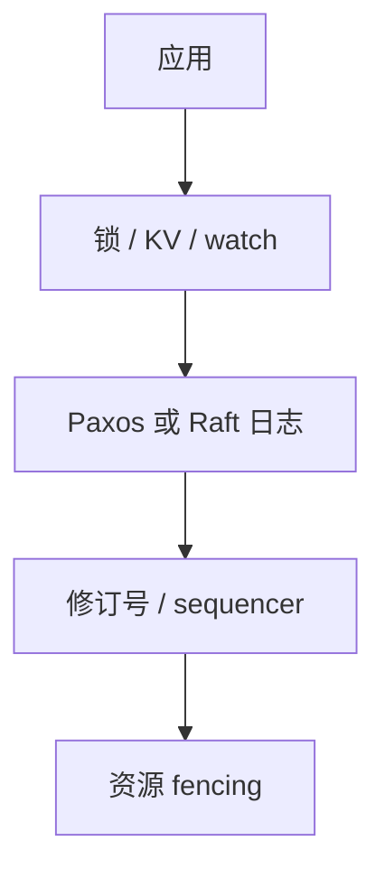

# etcd / Chubby

小容量线性一致的锁与配置服务：共识复制状态机对外变成文件、会话和通知。Kubernetes 与 GFS 客户端都把脑裂问题外包给它。

<footer>—— 据 Burrows, The Chubby Lock Service for Loosely-Coupled Distributed Systems, OSDI 2006；etcd 基于 Raft 的工程实践整理</footer>

上一课[fencing](/cs/distributed-lock-fencing)要一个发 token 的线性一致服务。缺口是**产品形态**：Chubby 是 Google 的锁服务；etcd 是 Raft 键值，API 不同，规格同族。本课不重写 Raft 投票。后课 PoW 是无许可成员的另一套「谁说了算」，不要和 Chubby 混。

## 问题

需要：选主、配置发布、小组缓存一致性。自己在每个应用里嵌 Paxos 容易嵌错。Chubby：类文件系统节点、advisory lock、sequencer、事件通知、会话 keepalive（[租约](/cs/leases)）。客户端缓存节点，失效靠通知+租约，接 Gray–Cheriton。底层 Paxos（Made Live）。

etcd：`/key` 修订号、lease、watch、事务 `Compare`。修订号当 fencing token。Kubernetes 把对象存在 etcd，控制器调和是最终一致，**存储**是 CP。

Chubby 论文强调：锁是建议性的，正确性靠 sequencer 进 RPC。etcd 不声称自己是 Chubby 克隆，但课程序列里它们填同一缺口。

## 方法

部署：五节点跨故障域，避免双机房各两台的偶数脑裂。请求走领导者。watch 是前缀广播的工程近似，不是独立 pub/sub 保证（后课）。快照与压缩修订号，接[Raft 快照](/cs/raft-membership-snapshot)。

不要把大型 blob 放进 etcd：RSM 日志不是对象存储。那是后课 GFS/S3。

## 机制

会话死 ⇒ 临时节点/lease 键删除 ⇒ 选主观察者收到 watch ⇒ 新主 acquire。这条链的正确性 = 租约算术 + 删除的线性一致 + fencing。任一环用最终一致缓存跳过，脑裂回来。

读：Chubby/etcd 都可以从跟随者读以降低延迟，线性一致读必须注明（etcd `linearizable` vs `serializable` 读）。默认读档要当规格读，不当营销读。

本课不把 Consul、Zookeeper 再写一遍：ZK 上一课已钉。三者都是元数据 RSM。

## 边界

本课不列全部 etcd API，不写 Chubby 多单元地理。后课默认：集群协调数据放 CP 的锁/KV；业务大数据放专用存储。PoW 下一课处理开放成员，不替代数据中心锁服务。

小日志、强一致、会话、通知。四个词就是这类服务。应用仍要自己把 token 打进副作用。

## 小结

- Chubby/etcd：RSM 做成锁与配置 API。
- 修订号/sequencer 供 fencing；会话是租约。
- 不存放业务大对象；跟随者读可能掉线性一致档。
- 出处：Burrows, OSDI 2006；Raft；etcd 文档中的线性一致读。
