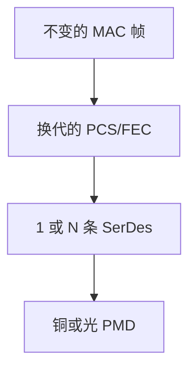

# 以太网速率演进

从 10 Mb/s 共享到 800 Gb/s 串行，MAC 帧几乎不动，变的是 PCS、FEC 与并行通道数。

<footer>—— 据 IEEE 802.3 各代标准；Metcalfe and Boggs, 1976 对照整理</footer>

[上一课](/cs/optical-transceivers-wdm)给出模块与波长。缺口是**速率档如何叠上去**：10/100/1000/10G/25G/40G/100G/400G……同一[帧与 MAC](/cs/frame-mac) 格式，PHY 换调制、块码、FEC 与 lane。本课不把自协商状态机写完。

## 问题

若每升一档就改帧格式，交换芯片与抓包工具全断代。802.3 的策略：MAC 服务不变，介质相关子层升级。百兆 4B/5B，千兆 8B/10B，10G 64B/66B，25G+ 常配 RS-FEC。40G/100G 用多 lane 绑定（如 4×25G）。标称速率是 MAC 侧净荷量级，毛速率含编码——接住前几课的开销账。

共享同轴的 10BASE5 已退出；当代默认全双工点到点。CSMA/CD 留在主干课对照，不在本档复活。

802.3 用「BASE」命名介质与编码。多 lane 对齐是 PCS 的 deskew，不是 LACP。LACP 是后课把多条已成立链路绑成一条逻辑链路。

### 升速改 PHY 不改帧

MAC 服务稳定，变的是 PCS、FEC 与 lane。多 lane deskew 不是 LACP。标称速率对照毛符号率时必须先扣块码。

## 方法

列演进轴：符号率、每符号比特、lane 数、FEC。画：MAC → Reconciliation → PCS/PMA → PMD。强调 25G 单 lane 成为数据中心积木，100G 常 4×25 或 2×50。不要背年份表当课。

方法止于选定对象与对照；机制才说它如何嵌入已有分层与主干课。

## 机制

容量课的 $C$ 随工艺与调制上升；以太网把上升收成可互操作的档。交换机「40G 口」可能是 4 条 10G lane，对 IP 仍是一个接口。主干[VLAN](/cs/vlan) 标签加在 MAC 上，与速率档正交。

FEC 使净荷时延增加几十到几百纳秒，对存储 RoCE 后课敏感，本课只点名。

## 边界

本课不引入 802.3cg 单对以太网的全部工业剖面。自协商与双工是下一课。后课默认：升速改 PHY，不改以太网帧语义。

营销「无损以太网」是 PFC 后课，不是速率档的性质。

上一课留下的缺口在本课收口；「以太网速率演进」进入后课词汇表后只引用。文献用来钉对象与边界，不把本课写成该主题的独立综述。下一课[自协商与双工](/cs/autonegotiation)。

## 小结

- 帧格式稳定；PCS、FEC、lane 承载升速。
- 标称速率含编码约定，对照毛符号率。
- 多 lane 是 PHY 绑定，不是 LACP。
- 后课只引用本课钉死的对象，不从该领域总问题重开。
- 出处：IEEE 802.3；Metcalfe–Boggs, 1976。
