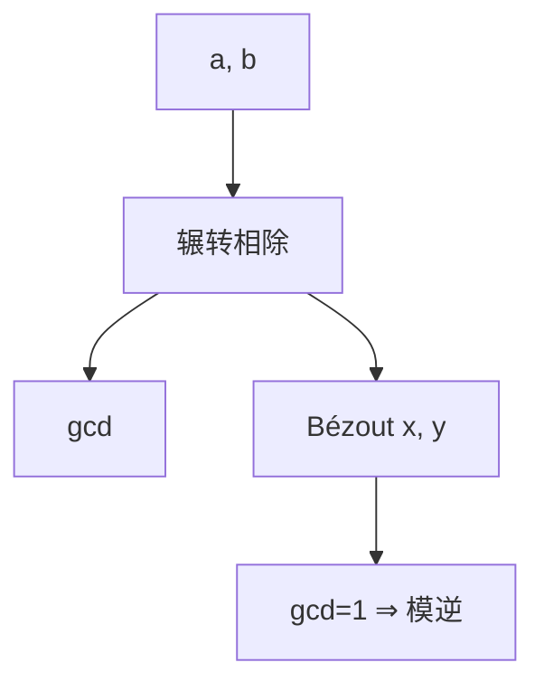

# 欧几里得与扩展欧几里得

$\gcd(a,b)=\gcd(b,a\bmod b)$；回溯系数得 $ax+by=\gcd$。$\gcd(a,n)=1$ 时 $x$ 就是模 $n$ 的逆。

<footer>—— 据 Euclid, Elements 卷 VII；Knuth, TAOCP 卷 2 整理</footer>

上一课[模运算](/cs/modular-arithmetic) 留下 $ax\equiv 1\pmod n$。缺口是**欧几里得算法**与扩展形式。不重写剩余类。复杂度：除法步数 $O(\log\min(a,b))$（最坏 Fibonacci）。

## 问题

$\gcd$ 与最小正线性组合重合：存在 $x,y$，$ax+by=\gcd(a,b)$（Bézout）。扩展欧几里得在递归同时带回 $x,y$。$\gcd(a,n)=1\iff a$ 在 $\mathbb{Z}/n\mathbb{Z}$ 可逆，$a^{-1}\equiv x\pmod n$。$\gcd\gt 1$ 则 $ax\equiv 1$ 无解；$ax\equiv b$ 有解当 $\gcd\mid b$。

二进制 gcd、Lehmer 加速是实现，本课标准除法版。

### 不是「约分分数」的小学课

对象是任意大整数，密码里几百比特。算法要停在 $\log$ 步，不能试除到 $\sqrt a$ 来求 gcd。

欧几里得原本对线段。Knuth 分析步数与 Fibonacci 最坏。本课不证 Lamé。RSA 解密指数 $d$ 用扩展欧几里得求 $e$ 对 $\varphi(n)$ 的逆，后课欧拉。

## 方法

手算 $\gcd(240,46)$ 并列 $x,y$。写出 $a^{-1}\bmod n$ 当且仅当互素。点名：求逆失败即发现与 $n$ 不互素——RSA 模上这几乎是分解，实践中信息位随机不会碰到。

## 机制

有了逆，乘法群 $(\mathbb{Z}/n\mathbb{Z})^\times$ 才真的是群（下一课欧拉函数数它的阶）。高斯消元在模 $p$ 上需要每步求逆。扩展欧几里得也是格基、RSA CRT 实现的组件。

不要用费马小定理 $a^{p-2}$ 当本课主算法——那要 $p$ 素数且更贵。

Lamé：最坏步数由连续 Fibonacci 达到。二进制 gcd 用移位，硬件友好。模逆失败返回 $\gcd\neq 1$：RSA 随机消息碰到 $p$ 的概率可忽略。线性方程 $ax\equiv b\pmod n$ 有 $\gcd$ 个解当 $\gcd\mid b$，解之间差 $n/\gcd$。

## 边界

本课不引入连分数攻击，不证素性。后课默认：互素则可逆，逆由扩展欧几里得。下一课费马与欧拉，给指数运算减指数。

Bézout 系数就是模逆（当 gcd 为 1）。算法对数步，适合密码整数。费马 $a^{p-2}$ 也能求逆，但更贵且要素数；本课主算法是扩展欧几里得。

## 小结

- 欧几里得算 gcd；扩展给出 Bézout 系数。
- $\gcd(a,n)=1\iff$ 模逆存在。
- 步数对数，适合大整数。
- 出处：Euclid；Knuth, TAOCP 卷 2。
