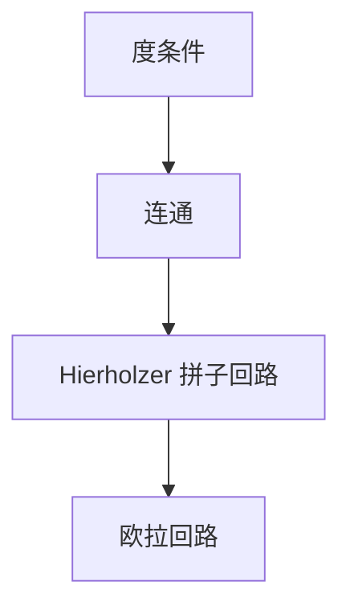

# 欧拉回路

每条边恰好走一次并回到起点：无向图要求连通且度数皆偶；有向图要求弱连通且入度等于出度。Hierholzer 一次扫描拼出回路。

<footer>—— 据 Euler, 1736；Hierholzer, Über die Möglichkeit, einen Linienzug ohne Wiederholung und ohne Unterbrechung zu umfahren, 1873；CLRS 练习与标准图论整理</footer>

上一课[2-SAT](/cs/two-sat)把公式收成蕴涵图的 SCC。本课对象换成**边的遍历**：一笔画是否存在，以及如何构造。不重做强连通判定——有向欧拉需要「底图连通且度平衡」，比 SCC 弱一点、条件不同。缺口是充分必要条件 + 线性构造，不是哈密顿（那是下一课，点要恰好一次）。

## 问题

欧拉回路：闭迹，含每条边恰好一次。欧拉路：开迹，同样用尽边。无向连通（忽略孤立点）：回路 $\Leftrightarrow$ 全偶度；路 $\Leftrightarrow$ 恰两个奇度（或零，退回回路）。有向：底图弱连通，且每个点入度 $=$ 出度则有回路；恰一顶点出度多 $1$、一顶点入度多 $1$ 则有路。

Königsberg 七桥是反例：奇度多于两个。缺口是判定之后**构造**：Hierholzer 从当前点沿未用边走，走不动则该点局部已用尽；把子回路接到先前断点上。Fleury 每次不走桥除非无奈，正确但实现烦，本课不主写。

### 边一次不是点一次

哈密顿回路要求每个点恰好一次，NPC。欧拉在边。不要把「看起来都走遍」混名。中国邮路在欧拉基础上加重复边，本课点名不展开。

Euler 1736 判 Königsberg。Hierholzer 1873 给出构造。有向情形与欧拉回路定理同一精神。后课 Held–Karp 才碰哈密顿的指数 DP。

## 方法

检查连通与度。从起点（有向则任意平衡点）做栈：反复沿剩余出边走，无边可走则弹栈写入答案（倒序即回路）。邻接表用迭代器或删边，总 $O(E)$。

多重边、自环合法。不连通且有边则无。

## 机制

度偶保证每次进入能离开，直到回到起点；连通保证没有边落在圈外。Hierholzer 的正确性：走不动时当前点的局部边已用尽，剩余边落在已访点的另一连通块，再从栈里较早的点接着走。与 DFS 不同：这里消耗的是边，不是点的颜色。

混合图（有向+无向）的欧拉判定更细，本课不写。

## 边界

本课不证哈密顿、不写 TSP。不处理带权中国邮路的匹配归约（那是一般图匹配）。后课默认：欧拉回路线性可判定、可构造。下一课点的哈密顿与精确 TSP，复杂度跳到指数。

## 小结

- 欧拉：边恰好一次；条件是连通加度平衡。
- Hierholzer 线性构造，不是 NPC 的哈密顿。
- 有向、无向条件对称：入出度或奇偶。
- 出处：Euler, 1736；Hierholzer, 1873。
