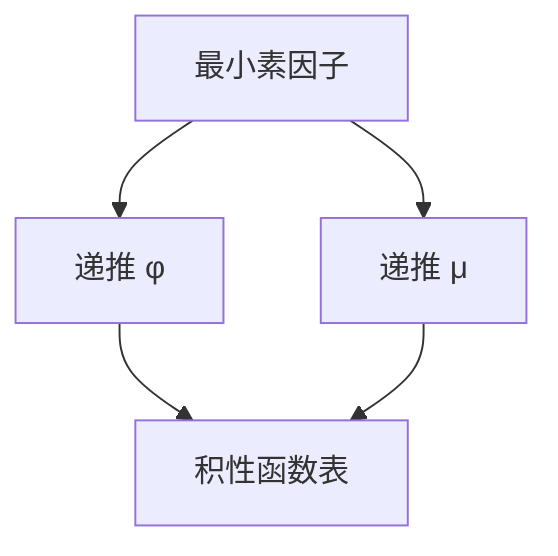

# 欧拉函数与莫比乌斯

$\varphi(n)$ 计与 $n$ 互素的剩余；$\mu$ 在平方因子上为 0、在 $k$ 个不同素因子上为 $(-1)^k$。二者积性，可与素数同筛。

<footer>—— 据 Euclid–Euler；Möbius；CLRS 第 31 章；[欧拉定理](/cs/fermat-euler) 对照整理</footer>

上一课[素数筛](/cs/sieve)给出最小素因子。主干[费马–欧拉](/cs/fermat-euler)已用 $\varphi$ 于模幂。本课缺口是**函数值表**：积性函数随筛填 $\varphi$、$\mu$。不重证欧拉定理。后课 BSGS 用群阶，本课先把 $\mu$ 备好给反演。

## 问题

$\varphi(n)=n\prod_{p\mid n}(1-1/p)$。$\mu(n)=0$ 若平方因子，否则 $(-1)^{\omega(n)}$。积性：$m,n$ 互素则 $f(mn)=f(m)f(n)$。线性筛：已知 $minp[i]$，可递推 $\varphi(i)$、$\mu(i)$。狄利克雷卷积 $(f*g)(n)=\sum_{d\mid n}f(d)g(n/d)$。$\sum_{d\mid n}\mu(d)=[n=1]$。

缺口是表与积性，不是再证 $a^{\varphi(n)}\equiv 1$。

### $\mu$ 不是随机符号

$\mu$ 由素因子个数决定，筛出来是确定的。后课反演才用卷积逆。

CLRS 31.3–31.4 欧拉函数。Möbius 反演下一课专讲，本课先定义。后课离散对数假定知道阶。

## 方法

线性筛数组 `phi[]`、`mu[]`、`primes[]`。按 $p\nmid i$ 与 $p\mid i$ 分情况递推。单点 $\varphi(n)$：分解 $n$，$O(\sqrt n)$。

前缀和 $\sum_{i=1}^n\varphi(i)$、$\sum\mu$ 后课杜教筛点名。

## 机制

积性使 $n=\prod p^k$ 时函数乘起来。筛的递推正是按最小 $p$ 拆。与高斯线性基无关。与生成函数：$\sum\mu(n)/n^s=1/\zeta(s)$ 点名，本课不进解析数论。

## 边界

本课不写杜教筛、不写 Dirichlet L。后课默认：$\varphi$、$\mu$ 可线性筛；$\mu$ 是卷积单位的逆。下一课 BSGS 离散对数。

## 小结

- $\varphi$、$\mu$ 积性，随线性筛填表。
- $\sum_{d\mid n}\mu(d)=[n=1]$。
- 单点可分解；表用于后课反演。
- 出处：CLRS 第 31 章；古典 $\varphi$、$\mu$。
