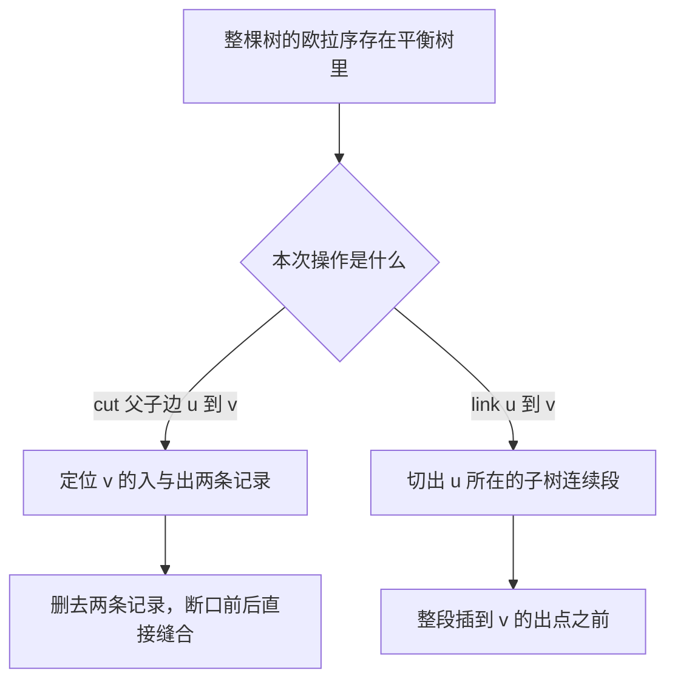
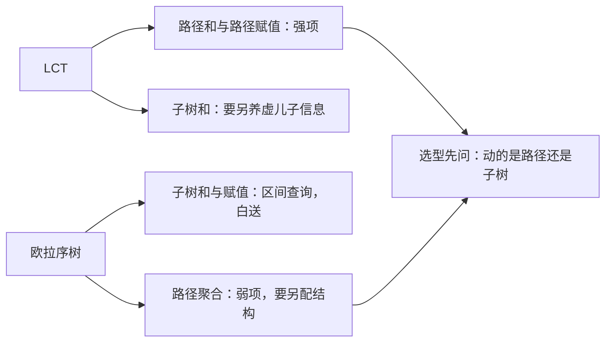

# euler-tour-tree

把整棵树绕一圈，进出各记一笔，森林就变成一条可以前后缝合的序列：子树是连续区间，断边与连边只是剪开再粘上。

<footer>—— 据 Henzinger 与 King 的欧拉序树结构, 1995；全动态树算法综述</footer>

[上一课](/cs/link-cut-tree)的 LCT 把任意路径拉直，路径聚合顺手，子树信息却是软肋——要给每个点养一份虚儿子之和。缺口在这：增删边照旧，主战场换成子树。办法是把树拍平成 **欧拉序**，用平衡树伺候这条序列。本课写欧拉序树（ETT），不写全动态二连通。

## 问题

静态子树和的标配是 DFS 序加 [segment-tree](/cs/segment-tree)：子树对应连续区间。麻烦在 cut——一次断边让编号重排，区间全体搬家。LCT 补不了这一面（见上一课边界）。缺口：边增删照常跑，子树和、子树赋值、判连通都要快。本课不碰全动态图的最短路类算法，也不展开 LCT 与 ETT 拼合的混合结构。

术语翻译：Euler tour 通译「欧拉序」或「欧拉环游」，此处指 DFS 进入与离开各记一次的环游序（长 $2n$），不是图论里一笔画的那条欧拉回路——同一名词两个世界，别混。

## 方法

环游序定义在有根树上：进入点记「入」，从子树回来记「出」，全程 $2n$ 条记录。关键观察一：子树 $v$ 恰是「$v$ 的入」到「$v$ 的出」这一段。关键观察二：把序列首尾接成环，link 与 cut 都只需搬小段——cut 删掉 $v$ 的入出两条记录再把断口缝合，link 把 $u$ 的子树段整体插到 $v$ 的出点之前。用可分裂合并的平衡树（treap、splay 均可）维护。

搬动成本是平衡树的分裂合并，$O(\log n)$ 级，与被搬子树的大小无关——这是与「重排整个 DFS 序」的本质区别。

数字实例：$n=5$ 的树环游序长 $10$；link 一棵 $3$ 个点的子树，整段只搬 $2\times 3=6$ 条记录，分裂合并不超过二十步，全程与树高无关。

## 机制

为什么子树信息天然免费：环游序里子树就是一段区间，区间和、区间赋值、区间打标全是平衡树的看家菜。为什么 cut 只删两条：环上删两处、缝两针，环的拓扑不变。判连通也便宜：每棵树的环游序单独存一棵平衡树，比较两点所在树的标识即可。代价在同一枚硬币反面：路径和、路径最值在环游序上没有连续区间可用，ETT 反过来要借 LCT 的思路补——两种结构互为镜像。

常见误区：把环游序写成只记进入的 DFS 序（长 $n$）。那样的序列里子树虽是区间，cut 却无法对称删除——错在省掉了「出」记录；进出成对，才保得住环上缝合的对称性。

## 边界

ETT 默认有根树，换根是它的另一个软肋；频繁换根回 LCT。点权挂在入出记录里随段搬动，边权信息进区间标记即可。判连通若高频，另配并查集只判不删更省。结构这一层到此换挡：下一课的对象干脆没有树形——一段数列，问题变成「哪条最短线性递推能生成它」。

直觉类比：环游序像巡更人绕楼一圈的打卡记录——进每个房间刷一次、出来再刷一次。封掉一条走廊（cut）只是撕掉两页打卡并粘上；把整个楼层挂到另一栋楼（link）是把那一沓记录整本插进新位置。

## 小结

- 环游序 $2n$ 条记录，子树即区间，link/cut 即环上剪贴。
- 平衡树 split/merge 承担全部结构变动，单操作 $O(\log n)$。
- 与 LCT 互为镜像：子树强则路径弱，选型看动哪一头。
- 出处：Henzinger 与 King, *Fully Dynamic Biconnectivity in Graphs*, Algorithmica 1999（欧拉序树结构）；对照 Tarjan 与 Vishkin 的动态树工作。
