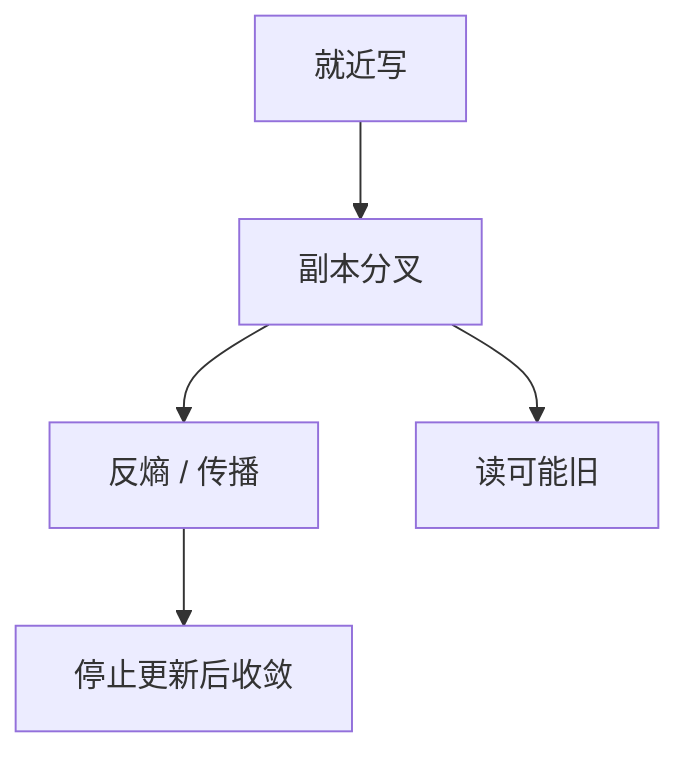

# 最终一致性

若不再有更新，副本终将收敛到同一值。收敛时刻与中间读到的值都不在规格里，除非另加会话或冲突协议。

<footer>—— 据 Vogels, Eventually Consistent, CACM 2009；Terry et al., Bayou, 1995 整理</footer>

上一课[顺序与因果](/cs/sequential-causal-consistency)仍要求可见性尊重某种序。缺口是**广域与离线**：写先落到附近副本，读可能旧，冲突可能分叉。本课钉「最终」二字的精确弱含义，不把 Dynamo 的反熵提前写完。后课 CAP 解释为何分区时有人选这一档。

## 问题

最终一致：有一个时刻之后所有副本相等——前提是更新停止、故障有限、反熵或传播连通。它**不**说：现在读到的是谁写的、会不会回退、并发写谁赢。缺口是把口号收成可证性质，并标明还要另选：LWW、应用合并、CRDT。

Bayou、DNS、缓存 TTL 都是这一档的老成员。Vogels 的短文把它变成云存储的默认话术；话术不是证明。没有反熵，分区愈合后可以永远分叉。

「最终」是活性命题，不是安全命题。安全往往只是「不伪造从未发生的写」。中间状态可以任意旧、任意分叉。

## 方法

传播：懒惰副本、提示移交、Merkle 反熵（后课 Dynamo）。读：可能 stale。写：通常就近成功。冲突：版本向量检出并发（上一课因果的工具），再交给 LWW 或合并函数。

不要把最终一致写成「没有一致」。它禁止永久分叉，允许暂时分叉。若合并不交换、不结合，收敛可以不成立——那是 CRDT 课的缺口。

## 机制

与线性一致：没有线性化点，实时上更晚的读可以更旧。与因果：可以先看到结果再看到原因，除非系统另保证因果最终一致（COPS 等，后课地理复制点名）。工程上常叠**会话保证**（后课）：同一客户端读己之写，不把全局线性一致买回来。

停止更新的前提在线上服务几乎不真：总有新写。于是「最终」表现为「落后副本在追」，追的差距是运维指标，不是规格里的 $t$。SLA 不能替代反熵正确性。

本课不把 BASE 当理论：它是口号。也不把多主数据库的「自动冲突解决」默认成正确：LWW 会丢更新。

## 边界

本课不写 quorum 不等式，不引入 PACELC。不把 CDN 缓存当复制协议全文。后课默认：选最终一致必须配套传播与冲突规则；只说「最终」等于没说。CAP 下一课解释分区时为何有人放弃线性一致读。

活性承诺依赖连通与修复。安全承诺几乎为空，应用必须能消化旧读与丢更新，或升级合并。

## 小结

- 最终一致：更新停止后副本收敛；中间可读旧、可分叉。
- 是活性不是安全；冲突规则另选。
- 会话保证把部分体验拉回客户端，不恢复全局线性化点。
- 出处：Vogels, CACM 2009；Terry et al., Bayou。
