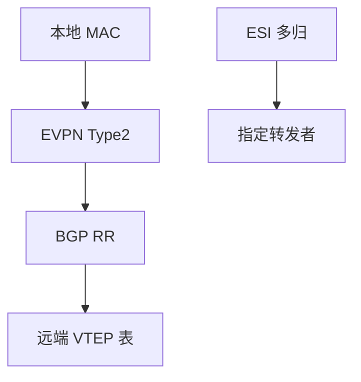
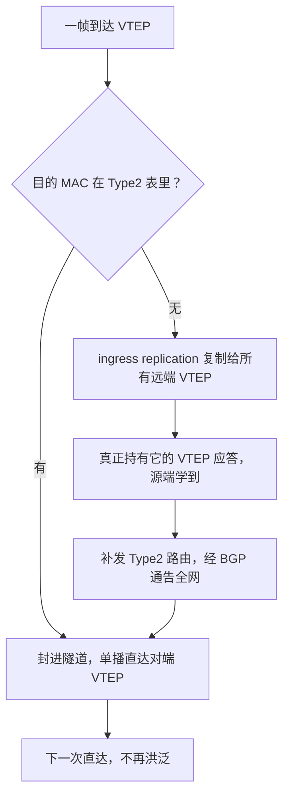

# EVPN

用 BGP 分发 MAC/IP 与 VNI，替代覆盖网上的洪泛学习；同一套控制面还能做 IRB 与多归。

<footer>—— 据 RFC 7432 BGP MPLS-Based Ethernet VPN；RFC 8365 EVPN overlay 整理</footer>

[上一课](/cs/vxlan-overlay) 数据面仍可能洪泛。[iBGP 与 RR](/cs/ibgp-route-reflector) 已能传前缀。缺口是 **EVPN 路由类型**：Type 2 MAC/IP、Type 3 组播隧道、Type 1 多归以太网段。本课不把 GRE 头写完。

## 问题

VXLAN 无控制面像透明桥：未知就复制。EVPN：VTEP 把学到的 MAC 打成 BGP NLRI，RR 反射，对端装表——二层学习从数据面迁到控制面，像「MAC 的 BGP」。多归：主机双连两台叶子，以太网段 ESI 防环（DF 选举），对照 RSTP 但在覆盖上。IRB：同一 EVPN 里做 L2 与 L3 网关，减少绕核心。

不要把 EVPN 写成替代全球 BGP 互联网：这是数据中心/VPN 地址族。

RFC 7432 先对 MPLS，RFC 8365 对 VXLAN。Type 5 前缀路由做 L3VPN 风格。本课不把每类 NLRI 字段背完。

### MAC 走 BGP

控制面分发替代洪泛学习。ESI/DF 处理多归。这是 VPN/DC 地址族，不是互联网 eBGP 替代。

## 方法

画：本地学习 → Type 2 通告 → 远端表。对照 MAC 老化：BGP 撤回替代未知洪泛。与 RPKI 无关（不同 AF）。

```mermaid
flowchart TD
  LEARN["本地 MAC"] --> T2["EVPN Type2"]
  T2 --> RR["BGP RR"]
  RR --> REM["远端 VTEP 表"]
  ESI["ESI 多归"] --> DF["指定转发者"]
```

术语翻译：EVPN 就是给 MAC 地址装上 BGP 这台「广播电台」——每台 VTEP 把自己学到的 MAC 当成一条路由对外通告，其余 VTEP 订阅收听。传统交换机的洪泛学习是「喊一嗓子看谁答应」，EVPN 是提前发通讯录，未知单播洪泛因此大幅消失。

## 机制

收敛：MAC 移动要序列号，防双活脑裂。这比 STP TCN 更像 BGP 前缀移动。底层仍 ECMP；EVPN 别把同一流钉死到死掉的 VTEP。IXP 一般不用 EVPN 给公网对等。

```mermaid
flowchart TD
  F["一帧到达 VTEP"] --> L{"目的 MAC 在 Type2 表里？"}
  L -- "有" --> U["封进隧道，单播直达对端 VTEP"]
  L -- "无" --> R["ingress replication 复制给所有远端 VTEP"]
  R --> A["真正持有它的 VTEP 应答，源端学到"]
  A --> ADV["补发 Type2 路由，经 BGP 通告全网"]
  ADV --> U
  U --> T["下一次直达，不再洪泛"]
```

数字实例：几千台虚拟机的数据中心，MAC 表动辄数万条；靠数据面洪泛学习，一台新虚机上线要等它的 ARP 广播跑遍全网。用 EVPN，只有挂着它的那台叶子发一条 Type 2 路由、经 RR 反射一遍就位——把「全网广播一遍」变成「全网收一条通告」。

BUM：Type 3 建 ingress-replication 或组播组，收口上一课的洪泛。

## 边界

本课不引入 EVPN E-Tree 的全部。GRE 与隧道是下一课。后课默认：覆盖的 MAC 用 BGP 分发；数据面可以是 VXLAN 或 MPLS。

控制面规模仍受 RR 与表项容量约束，不是无限租户。

常见误区：初学者把 EVPN 当成「另一种加密 VPN」——它不加密、不认证用户流量，只是分发二层/三层可达信息的控制面协议，与远程访问 VPN 更是两回事。也别以为有了 EVPN 就万事大吉：多归防环靠 ESI 与 DF 选举，控制面规模仍卡在 RR 与表项容量上。

下一课[GRE 与隧道](/cs/gre-tunnels)。

## 小结

- EVPN 用 BGP 传 MAC/IP，收敛洪泛。
- ESI/DF 处理多归，替代大 STP 域。
- 与 VXLAN 数据面搭配最常见。
- 后课只引用本课钉死的对象，不从该领域总问题重开。
- 出处：RFC 7432；RFC 8365。
