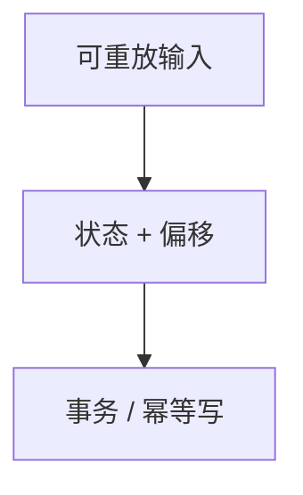

# 恰好一次

端到端恰好一次不是「消息只投一次」，而是效果幂等：重复投递不改变状态。检查点、事务 sink 与去重键一起才够。

<footer>—— 据流系统 exactly-once 实践（Kafka transactions、Flink 检查点）；网络课重试幂等对照</footer>

[上一课](/cs/watermark-late-events)让窗口能关。缺口是故障：算子重跑会把同一窗口结果写两遍。本课钉恰好一次；TPC 下一课换成基准，不在这里写协议细节到可利用的程度。与 [重试幂等](/cs/retry-idempotency) 对照：那是 RPC，这是流状态。

## 问题

至少一次：简单，重复。至多一次：丢。恰好一次：需要 (1) 输入可重放；(2) 算子状态与输入偏移一起检查点；(3) sink 事务或幂等键。缺口是**效果**，不是网卡只发一帧。外部副作用（发邮件）没有事务就只能幂等。

「Kafka exactly-once」指事务生产者与读已提交；跨多个异构 sink 仍要自己的幂等设计。

## 方法

检查点：对齐或非对齐 barrier，状态后端快照。sink：两阶段提交或按主键 upsert。去重：事件 ID 在窗口内。失败：从检查点重放，sink 回滚或覆盖。与湖仓：表快照提交是事务 sink。

## 机制

确定性重算 + 原子提交使第二次效果等于第一次。非确定性（随机、系统时间当事件时间）会打破。barrier 对齐等待最慢分区，与 watermark 的 min 同类。检查点间隔即 RPO：未检查点的丢失像异步提交。事务 sink 把偏移与写出同一提交；否则至少一次加下游幂等键（窗口+键+版本）。

CDC 槽推进类似偏移提交。杀工人重放是测试手段，不是协议漏洞利用。端到端三处对齐：源、状态、sink 缺一则重复或丢。外部副作用（邮件）没有事务就只能幂等。

## 边界

本课不提供绕过幂等去刷写外部系统的办法。下一课基准测吞吐，不测你是否真 exactly-once。Jepsen 再后课测隔离声明。跨多个异构 sink 仍要各自的幂等设计，单靠 Kafka 事务不够。

后课默认：跨系统用幂等或事务对齐偏移。没有幂等键的「事务 sink」在非事务下游上仍会重复。

## 小结

- 恰好一次是状态效果幂等，不是物理只投一次。
- 检查点必须绑输入偏移；sink 要事务或幂等键。
- TPC-C / TPC-H 下一课。
- 出处：流引擎检查点与 Kafka 事务公开设计；对照网络幂等课。
