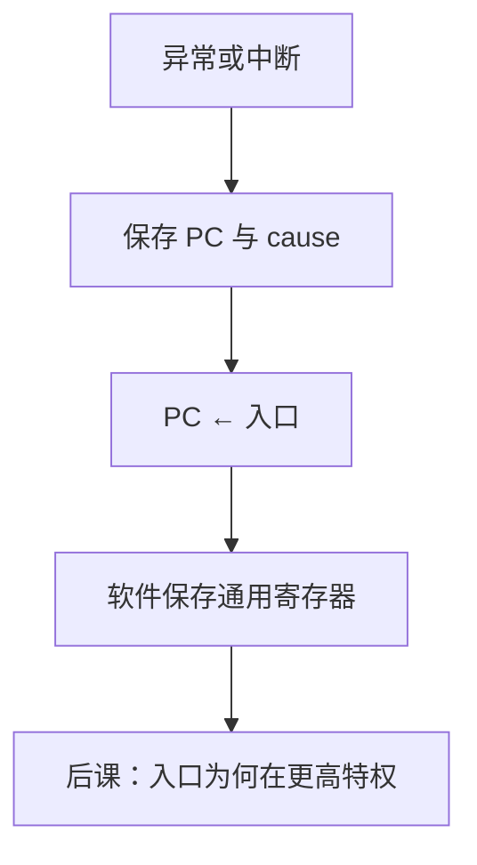

# 异常与中断入口

指令内部的故障与外部的异步请求都不能当成 `jal`：要保存当时的 PC 与原因，再跳到事先约定的入口。

<footer>—— 据 Patterson and Hennessy, Computer Organization and Design (RISC-V)；The RISC-V Instruction Set Manual, Volume II: Privileged Architecture 整理</footer>

上一课[调用约定与栈](/cs/calling-convention-stack)钉死了自愿的 `jal` 与栈帧。本课不重画 ABI 寄存器表，也不从操作系统下半部另起。缺口是：未对齐的 `lw`、非法 opcode、外部设备请求，都要打断顺序执行。它们**不是过程调用**：没有编译器安排的 `ra`，必须由硬件写入专门的 CSR，并把 PC 改到入口。

## 问题

单周期/多周期到现在只处理正常指令。缺口是陷阱路径：同步异常（相对某条指令）与异步中断（相对时钟边沿）。硬件：停止当前指令的提交（或定义哪一条被杀死），把 PC 写入 `mepc`（教学用机器模式名），原因写入 `mcause`，PC ← `mtvec`（基址或向量）。返回用 `mret` 恢复 PC，不是 `jalr ra`。

本课只钉入口与保存。谁允许接受中断、用户态能否执行 `mret`，是[下一课](/cs/privilege-rings)的特权级。

### 中断不是「再来一条分支指令」

分支是指令语义内的 PC 更新。中断可以在指令之间插入，不对应程序里的 `beq`。把中断服务写成普通函数却不保存 `mepc`，返回会跳错。入口处的寄存器保存是软件的第二套「调用约定」（往往更完整），与 ABI 的 caller-saved 不是同一张表。

Patterson/Hennessy 用异常说明控制流的第三种（顺序、分支、陷阱）。RISC-V 特权手册定义 `mtvec`/`mepc`/`mcause`。教材若只用「异常 PC 寄存器」不写 CSR 名，对象仍是同一组。

## 方法

分类：故障（需指向过错指令以便重试或 kill）、陷阱（ecall，指向后一条）、中断（指向未执行的下一条）。精确异常：对外可见状态像是停在那条边界上。多周期在确定拍转入「保存并跳转」状态；单周期要加异常 MUX 改 PC，并抑制写堆/写存。

## 机制

`ecall` 是自愿陷入，用来请求后课才会讲的系统服务；本课只当同步陷阱。中断需在状态机里采样、可能等当前指令完成以保证精确。流水线上的异常更麻烦，体系结构课再开。

## 边界

本课不讲 Linux 信号、不讲底半部软中断。不把 DMA 完成当成与中断同一机制以外的魔法：它通常以中断通知。页故障的处理要有页表，很后。

后课默认：非指令内控制流走陷阱入口，PC 与原因在 CSR 里。入口代码跑在更高特权，下一课钉级。

## 小结

- 异常/中断保存 PC 与原因，跳到 `mtvec`，用 `mret` 返回。
- 与 `jal` 的栈约定分离；精确性要求定义停在哪条指令。
- 特权尚未分级，但入口已经需要「能执行 `mret` 的模式」。
- 出处：Patterson and Hennessy, COD (RISC-V)；RISC-V Privileged Spec。
