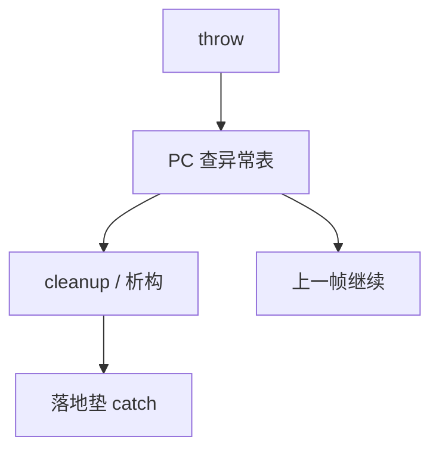

# 异常表

throw 不是 `goto` 到调用者源码：运行时用 PC 查表，找到落地垫与必须执行的清理，沿栈一帧帧展开，直到处理器匹配。

<footer>—— 据 Itanium C++ ABI；DWARF 异常处理；Appel, Modern Compiler Implementation 整理</footer>

上一课[标记清除与分代](/cs/gc-mark-gen)把堆上的对象按可达性回收。`throw` 会拆掉一串还没返回的帧，那些帧上的栈对象要析构，堆对象仍须从还活着的根够到。本课不重写三色。缺口是**落地信息**：编译器为每段可能抛的代码发出 PC 区间 → 处理器/清理例程的表，而不是在每条边插显式跳转。组成课的[异常与中断入口](/cs/exception-interrupt-entry)是硬件陷入；本课是语言运行时的展开。编译课到此结束，下一课内核与用户态。

## 问题

若用返回码把错误层层传，每层都要写。异常：动态找到最近的 `catch`。实现：不在热路径设「当前处理器」寄存器链表（也可，setjmp 风格），主流是表驱动：`.eh_frame` / LSDA 描述「PC 在这区间时，落地垫在那，要先跑哪些 cleanup」。展开：从当前帧的返回地址查表，执行析构与 finally，恢复上一帧 FP/SP/PC，重复。缺口是这份表，不是 `try` 语法。

精确 GC 与展开同时发生：展开中的栈仍是根；落地垫的栈图必须能枚举。本课点名合作，不把分代屏障再写一遍。

### 表不是 ISA 陷阱向量

缺页、非法指令进内核向量。`throw` 在用户态走运行时，通常不陷入，除非运行时主动 abort。不要把本课当特权级课。

Itanium C++ ABI 成为跨架构 unwinder 的事实描述。DWARF CFI 描述如何恢复寄存器。Appel 讨论异常作为非局部出口。零开销：未抛时 `try` 不写热路径，代价在表与抛时。

## 方法

前端把 `try`/`catch`/`finally` 做成 AST。中端可当 CFG 额外边，或保持区域。后端：为区域发射落地垫代码，把 (beginPC, endPC, landingPad, action) 写入只读表。运行时提供 `__cxa_throw` 一类入口，查表展开。

无匹配处理器则 `terminate`。跨共享库展开要依赖同一 unwinder 约定，与 ABI 同类合同。

## 机制

零开销模型：正常路径看不到异常寄存器。代价在代码体积与抛路径。setjmp/longjmp 模型在 `try` 时保存寄存器，热路径更重。本课主干表驱动。不要调度把「可能抛的调用」移过不能重排的副作用而不更新表区间。

与 PIC：表里的地址常是相对的，以便文本滑动。

## 边界

本课不写内核信号与 `sigaction` 的叠放全文。不把 Windows SEH 抄成第二条主干。后课默认：语言异常靠用户态表展开，不能改页表。内核与用户态是操作系统课第一课：谁拥有机器、越过边界只能陷入。

## 小结

- 异常表把 PC 区间映到落地垫与清理；抛时展开栈。
- 与硬件陷阱分家；与 GC 共享栈根枚举。
- 编译课收束；下一课命名内核。
- 出处：Itanium C++ ABI；DWARF；Appel。
