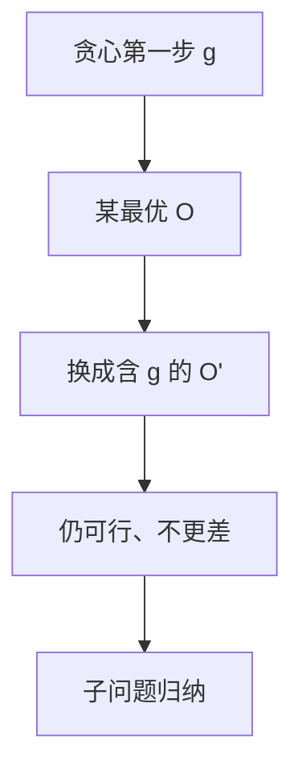

# 交换论证

任取一份最优解，把它与贪心的第一步对换而不变差；重复对换，最优被改造成贪心序列。

<footer>—— 据 CLRS 第 16 章；活动选择与 Huffman 的标准交换整理</footer>

上一课[贪心正确性](/cs/greedy-correct)已经命名「贪心选择性质 + 最优子结构」，并用活动选择点过交换。本课不重做「何时允许贪心」的总则。缺口是把**交换**写成可重复的手续：差异第一处、替换、代价不增、前缀与贪心一致。后课动态规划处理「不能证明只走一步」的枚举。本课只钉手续，不把 Huffman 树再证一遍。

## 问题

贪心输出 $g_1,g_2,\ldots$。最优 $OPT$ 若 $g_1\notin OPT$，要在 $OPT$ 里找到可与 $g_1$ 对换的元素（活动选择里那个结束更晚的第一件），换成 $g_1$ 后仍可行且目标不差。于是存在最优包含 $g_1$。子问题同型，归纳得整份贪心最优。缺口是「对换哪两个、为何可行」，不是再列失败的密度背包。

与「领先论证」（stay-ahead）：证明贪心前 $i$ 步在某度量上从不落后最优前 $i$ 步。交换是改造最优；领先是同步比较。二者都接到最优，本课以交换为主，领先点名。

### 交换不是任意互换

必须保持可行：区间不重叠、树仍连、前缀码仍瞬时。只比目标值而不查可行，会把合法最优换成非法。拟阵上的交换公理保证总能换；本课不展开公理，只要求每一题单独证明可换。

CLRS 16.1 活动选择的交换是模板。Huffman 合并最小两棵是另一份。Kruskal 的安全边也是「换掉环上更贵的边」。算法课前面的 MST、Dijkstra 已用过，本课把手续抽出来对照 DP。

## 方法

写贪心第一步 $g$。取最优 $O$。若 $g\in O$，完。否则构造 $O'=O-\{x\}\cup\{g\}$，证 $O'$ 可行且 $c(O')\le c(O)$（或最大化时 $\ge$）。则 $g$ 可出现在某最优中。对剩余输入重复。

失败时给最小反例：任何对换都变差或不可行——那是后课 DP 或近似的入口，本课不硬贪。

## 机制

交换把「局部看起来好」变成「与某全局最优只差可修补的第一步」。最优子结构保证修补后的尾巴仍是子问题最优。没有子结构（最长简单路）时，换完尾巴可以不是原问题意义下的最优，手续中断。

不要把「排序后扫描」都叫交换：先排序可能只是实现，正确性仍要这一步对换或领先。

## 边界

本课不证拟阵。不写近似比（贪心 2-近似是更后的课）。0-1 背包反例只作对照。后课默认：能交换则贪心；不能则考虑把所有第一步都做成子问题——那就是动态规划。

## 小结

- 交换：改造任意最优，使它含贪心第一步，目标不差。
- 领先是对照写法；拟阵是一类自动可换的结构，本课不展开。
- 接不上就不要贪心。
- 出处：CLRS 第 16 章。
