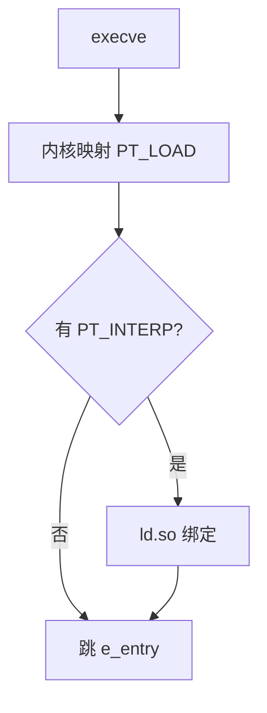

# ELF 加载

内核读程序头，按段 `mmap` 进地址空间，设入口；动态则把解释器 `ld.so` 一并映射，由它完成重定位与构造器。

<footer>—— 据 System V ABI；Linux `fs/binfmt_elf.c` 传统行为；主干[加载与动态链接](/cs/load-dynlink)；Levine 整理</footer>

上一课[ELF 格式](/cs/elf-format) 给出表。缺口是**执行**：`execve` 之后谁映射谁跳。主干加载课有直觉。本课钉内核 vs `ld.so` 分工、ASLR、辅助向量 `auxv`。交叉编译下一课收束链接课序。

## 问题

`ET_EXEC` 固定地址（现代少）；`ET_DYN` PIE 随机基址。内核：映射 `PT_LOAD`，处理 `PT_INTERP`、栈上放 `argv`/`envp`/`auxv`。`ld.so`：找 `.so`、写 GOT、跑 `DT_INIT`。缺口是**这条启动链**，不是节头字段表。

栈权限、NX、RELRO 在加载时落实。

### 加载不是解释字节码

映射后跳到机器入口。字节码 VM 是后一单元。不要把 `ld.so` 当 JVM。

binfmt_elf。SysV。主干 load-dynlink。本课补内核视角与 auxv（AT_PHDR、AT_ENTRY、AT_RANDOM）。

## 方法

对照 `readelf -l` 与 `/proc/self/maps`。动态：`LD_DEBUG=files` 看搜索。静态：无 interp，内核跳 `e_entry`。

与[unwind](/cs/stack-unwinding)：加载器注册的对象列表供展开器找 FDE。

## 机制

失败：找不到 `.so`、重定位溢出、栈执行被拒。setuid 忽略部分环境（`LD_PRELOAD`）——安全点名。不要在 setuid 路径依赖预加载。

构造器顺序：与跨 `.so` 依赖有关，陷阱。

## 边界

本课不写 `mmap` 系统课全文。后课默认：ELF 由内核+ld.so 加载。下一课交叉编译与三元组：生成哪一种 ELF。

也不把加载当浏览器加载 URL。

## 小结

- 内核映射段并设栈；动态把控制交给 ld.so。
- PIE/ASLR 改基址，重定位必须 PIC。
- auxv 把phdr 与随机数传给用户态。
- 出处：ELF/SysV；Linux binfmt_elf；Levine；主干 load-dynlink。
