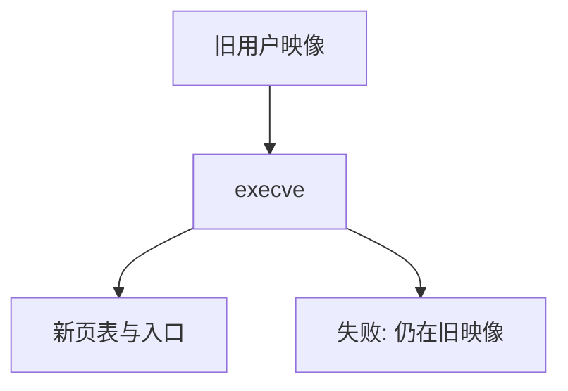

# execve

exec 用一个新程序覆盖当前进程的用户地址空间，PID 不变；成功则不返回，失败才回到旧映像。

<footer>—— 据 Tanenbaum and Bos, Modern Operating Systems；Silberschatz et al. 整理</footer>

[上一课](/cs/fork)造出子进程，但子仍跑同一段代码。shell 要子去执行用户键入的命令，必须**换掉用户页、入口 PC 与栈上的 argv/envp**，同时保留 PCB 的身份（PID、打开的文件除非 close-on-exec）。缺口是 `execve`，不是再复制一份 PCB。

## 问题

若 fork 已经复制了父的堆栈，子直接跳进新程序会带着旧映射。exec：打开可执行文件（权限与解释器头是文件课），建立新的用户地址空间，把参数拷进新栈，把 trapframe 的 PC 指向入口，丢掉旧用户页。[加载与动态链接](/cs/load-dynlink) 的用户态加载器可以在 exec 后作为解释器再跑；本课只钉内核把映像换成「新程序已就绪」。

成功的 exec 在用户看来是：调用没有返回。失败（找不到文件、不是可执行）返回错误，旧地址空间原封不动。

## 方法

校验路径与权限 → 读入文件头 → 分配新 `mm`、装入段或设立后课的按需调页 → 安装新用户栈（argc/argv/envp）→ 关闭 close-on-exec 描述符 → 重置信号处理为默认（捕获函数地址已无意义）→ 从新 trapframe 返回用户。动态链接器作为程序解释器时，内核先把解释器装入，用户入口是 ld.so。

线程：POSIX 规定 exec 后只留调用线程；其余线程结束。本课点名，不写实现。

## 机制

exec 与 fork 合在一起才是「创建运行新程序」：身份来自 fork，内容来自 exec。PID 不变，于是父的 `wait` 仍找得到这个孩子。文件系统的 shebang 把脚本变成「解释器 + 脚本路径」，仍是一次 exec 语义。

不把新程序写成「在旧堆上覆盖字节」：页表根换成新的，旧页引用计数下降，为零则释放。

## 边界

本课不把 ELF 节表当正文，不讨论 setuid 的全部安全后效——那是安全课。也不把 `posix_spawn` 优化路径当成另一种操作系统。按需调页如何让 exec 不立刻读入全部段，是虚存课。

后课默认：进程可以换成新程序且 PID 不变。子结束时父如何收取退出码、为何会留下僵尸，下一课讲 `wait`。

## 小结

- execve 覆盖用户映像，PID 与多数打开文件保留。
- 成功不返回；失败才回到旧代码。
- 父收取退出状态是下一课。
- 出处：Tanenbaum and Bos, *MOS*；Silberschatz et al., *OSC*。
