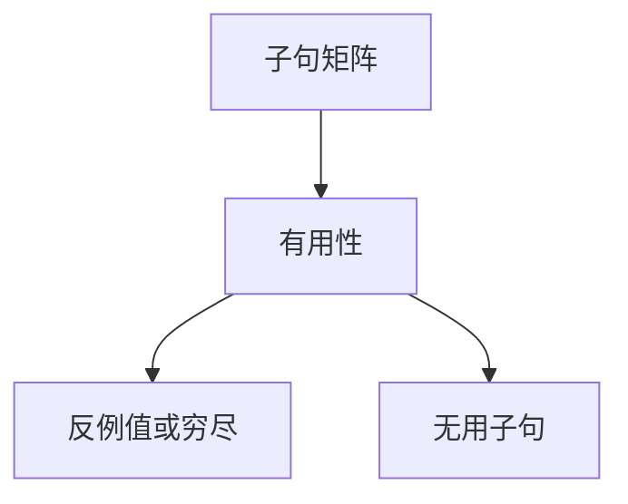

# 穷尽性检查

若存在一个值，使得所有子句都失败，则匹配不穷尽。无用子句是永远被前面挡住的模式。二者都可在构造子有限时判定。

<footer>—— 据 Maranget, Warnings for Pattern Matching, 2007；Peyton Jones 等 GHC 诊断；Pierce 对 case 穷尽的讨论整理</footer>

上一课[模式匹配编译](/cs/adt-pattern-compile)把子句变成判定树。缺口是**静态诊断**：没写 `Nothing`、或 `x::_` 挡住了后面的 `[]`。Maranget 用「反例值」与矩阵的有用性。本课钉检查，不重写分派代码生成。

## 问题

编译判定树时，默认边若到达「无子句」则运行时失败（ML 的 `Match` 异常）。语言可拒绝不穷尽，或警告。算法：在子句矩阵上求是否存在向量 $v$ 逃过所有行；若存在，pretty-print 成模式当反例。无用行：去掉该行后覆盖不变。缺口是**覆盖关系**，不是词法。

与[子类型](/cs/subtyping-variance)：开世界（可另编译新子类）不能穷尽；ADT 闭世界可以。OOP 的 visitor 穷尽靠密封类或默认方法。

### 警告不是健全性定理

忽略警告仍可生成代码。依值类型里「穷尽」更强，后课点名。此处是代数数据类型上的模式覆盖。

Maranget 2007（JFP）。GHC `-Wincomplete-patterns`。本课不把 SMT 当穷尽引擎，尽管守卫里的布尔可用求解器辅助。

## 方法

空类型、空构造子、通配。递归：按列展开构造子，对每个构造子形成子矩阵。反例：沿失败边收集构造子前缀。守卫：保守当「可能失败」，故带守卫的子句不贡献穷尽——除非语言另有分析。

与错误恢复：不穷尽是类型/模式层诊断，不是语法 `error` 记号。

## 机制

指数：构造子笛卡尔积。实用：按列剪枝、共享。记录模式、或模式（or-pattern）是覆盖的糖。可变与并发不在覆盖里：值在匹配中途被改是内存模型，后课。

不要用「加一个 `_`」当唯一建议而不展示反例；反例才教人补哪一枝。

## 边界

本课不写 GADT 细化后的不可达模式全文。后课默认：闭 ADT 可查穷尽与无用。下一课依值类型：穷尽可依赖值，检查变成证明。

也不把 Prolog 的子句搜索当穷尽性。

## 小结

- 穷尽 = 不存在逃逸值；无用 = 覆盖不变。
- 闭的构造子世界可判定；开世界不能。
- 守卫使检查保守。
- 出处：Maranget, 2007；对照 Augustsson；Pierce TAPL case。
