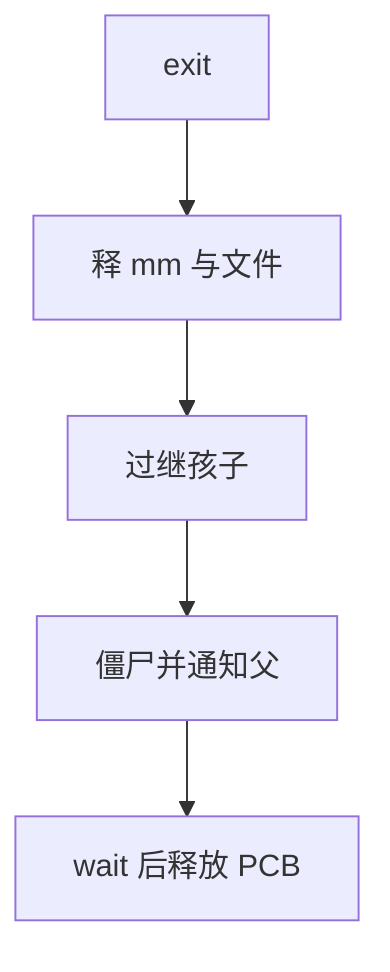

# exit 与回收

退出不是只把 PC 停掉：要拆文件、内存、通知父进程，并在最后留下可供 wait 的瘦 PCB。

<footer>—— 据 Love, Linux Kernel Development；Tanenbaum MOS 整理</footer>

[上一课](/cs/orphan-init)保证父指针在父先走时仍指向会 wait 的人。[wait 与僵尸](/cs/wait-zombie)说明结束态要留退出码。缺口是把 **exit 路径**按顺序列出来：哪些资源在进入僵尸前释放，哪些必须留到 wait 之后。本课钉回收顺序，不把每个子系统的析构函数写成清单。

## 问题

用户调用 `_exit` 或最后一条线程结束，内核必须：停止其他线程（进程退出）、把地址空间引用减掉、关闭文件描述符、去掉信号处理、从调度队列摘下、过继孩子、向父发通知。若先释放 PCB 再通知，wait 协议破；若先通知再拆内存，父 wait 到的瞬间子仍占 RAM，也行，但通常先拆用户资源再变僵尸。缺口是这条顺序，不是新的 fork。

内核线程的 stop 没有用户地址空间可拆，但仍要摘队列、释放内核栈。用户进程的 mm 可能被线程共享，最后一条线程才放掉。

## 方法

进入 `do_exit` 一类路径：不可再回到用户（trapframe 无意义）。释放 `mm`（若引用到零）、关闭文件、去掉命名空间引用、把状态改为僵尸、`exit_notify` 唤醒父或过继。真正 `free(task)` 发生在父 wait 或 init 收割时。错误路径（OOM 杀进程）走同一套，只是退出码不同。

不能在硬中断里 exit；退出是线程上下文，可睡（关文件可能等磁盘）。

## 机制

回收把[进程映像](/cs/process-image)从厚变薄：用户页先走，PCB 后走。文件表引用计数下降可能触发最后一次写回，那是文件课。与[系统调用路径](/cs/syscall-path)的关系：exit 本身也是系统调用，但不返回；汇编从内核直接切到别的线程。

异常杀掉（非法访问）也汇入同一路径，只是入口是故障而不是自愿 `_exit`。

## 边界

本课不把 cgroup 的收费与 oom_score 写完，不讨论 `exit_group` 与单线程 `exit` 的全部差别——点到「进程退出拆线程组」即可。也不把核心转储的文件格式当正文。

后课默认：用户资源在僵尸之前释放，PCB 在 wait 之后释放。作业控制还要把若干 PCB 编成组，下一课讲进程组与会话。

## 小结

- exit 先拆用户资源，再成僵尸并通知父；PCB 等 wait。
- 杀进程与自愿退出汇入同一回收。
- 把进程编成作业是下一课。
- 出处：Love, *LKD*；Tanenbaum and Bos, *MOS*。
