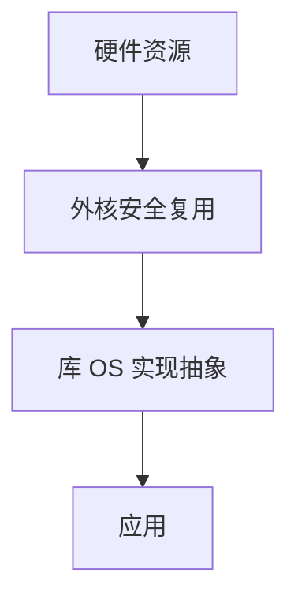

# 外核与库 OS

外核只安全地复用硬件：把页、块、网卡队列的能力交给库 OS，抽象（文件、进程）在用户库里实现，避免内核强加错误抽象。

<footer>—— 据 Engler, Kaashoek, O'Toole, Exokernel, SOSP 1995；[unikernel](/cs/unikernel) 为库 OS 部署形态</footer>

[seL4](/cs/microkernel-sel4) 仍提供页与 IPC 抽象。外核更狠：**几乎不提供 POSIX**。缺口是 Exokernel 直觉，以及和 DPDK 的亲缘。

## 问题

宏内核的文件可能不是应用要的。外核：分配物理页、时间片、磁盘块号给库，库自己实现 FS。缺口：安全复用（撤销能力）；多应用如何共存。本课不把 1995 年实验当今日默认。

DPDK/VFIO 是外核精神在 Linux 上的局部实现：把网卡交给库。对象是抽象下沉。

## 方法

内核：保护 + 调度原始资源。libOS：TCP、文件。对照 [virtio](/cs/paravirtualization)：客户库对环。对照 [malloc](/cs/malloc-implementation)：用户已在切页。对照 Kata：相反，再加一层通用 OS。

## 机制

外核把「内核该提供什么」从 POSIX 改成安全复用，让应用选抽象。今日以旁路 I/O 和 unikernel 复活。不要写成取消操作系统。与 [memcg](/cs/memcg)：仍要有人做会计，或完全静态划分。

无通用抽象则工具链断裂。

实现上：撤销能力必须能收回已借出的帧和时间片。今日 DPDK/SPDK 是同一精神的局部。没有通用文件抽象则备份与安全工具都要按应用重做。 读法上只引用[上一课](/cs/microkernel-sel4)的结论，不把对象换成训练推理或限价簿。

本课在操作系统进阶的「虚拟化与隔离进阶 / 容器与内核形态」课序里，对象是 **外核与库 OS**。

- 先修只引用，不重导：上一课的结论当公理，本课只补差。
- 五栏不吞并：不把本课写成大模型训练/推理，也不写成限价簿或权重量化。
- 文献用 OSTEP、McKusick、内核文档与具名会议论文；不发明 arXiv 编号。

## 边界

本课不引入所有 Aegis/ExOS 细节。不保证多租安全证明等于 seL4。下一课语言：Rust in kernel。

版本字段会变，课序钉的是机制对象「外核与库 OS」，不是某一主线内核的结构体名。
后课默认：抽象可放在库里，内核只保复用。用 Rust 写内核模块，下一课。

## 小结

- 外核：安全复用原始硬件；库 OS 做文件/协议。
- 与今日用户态驱动/unikernel 同谱。
- Rust in kernel 是下一课。
- 出处：Engler et al., SOSP 1995；L4/unikernel 对照。
