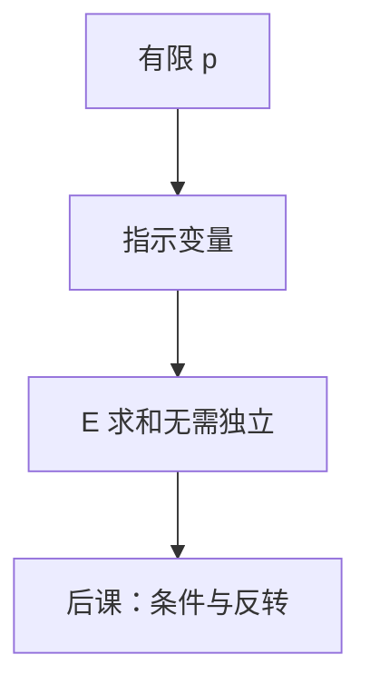

# 期望与线性性

期望可拆成和，即使变量互相纠缠；指示变量把「计数有多少个」变成一排 $0/1$ 的期望相加。

<footer>—— 据 Rosen, Discrete Mathematics and Its Applications；Shannon, 1948 整理</footer>

上一课[离散概率够用的那一层](/cs/discrete-probability)已经写下 $\mathbb{E}[X+Y]=\mathbb{E}[X]+\mathbb{E}[Y]$ 无需独立，并把熵当成 $-\log p$ 的期望。本课不重定义 $p_\omega$，也不从测度论另起。缺口是：线性性还只是一句公理。后课哈希碰撞数、随机算法比较次数，要把「有多少对出事」写成和，必须会造**指示变量**，并忍住去假设独立。

## 问题

$X$ 是碰撞对数、环的个数、成功探测次数时，直接对 $X$ 的分布求和往往难。缺口因此不是再讲 $\sum p$，而是 $X=\sum_i X_i$，其中 $X_i\in\{0,1\}$ 表示事件 $A_i$ 是否发生，则 $\mathbb{E}[X]=\sum_i P(A_i)$，无论 $A_i$ 如何相关。独立只在要把方差、或要把 $P(A\cap B)$ 收成乘积时才需要；本课不算方差。

[鸽笼](/cs/pigeonhole)给最坏存在碰撞；本课给期望个数。两者都不是「高概率」的 Chernoff——那不进主干。

### 期望不是众数

$\mathbb{E}[X]$ 可以不是支撑上的点，也可以远小于「几乎必然」的上界。把期望链长当成最大链长，后课哈希最坏情况会消失。

Rosen 用指示变量数有多少个固定点、多少对同生日。Shannon 的 $H(X)=\mathbb{E}[-\log p(X)]$ 现在是线性性的实例：$-\log p$ 不必拆成独立和。下一课才把条件期望与贝叶斯当计算工具展开。

## 方法

确定指标集（点、边、无序对）。令 $X_i=\mathbf{1}_{A_i}$。计算单个 $P(A_i)$——常常比 $X$ 的整分布容易，再用线性性。例子： $n$ 个球 $m$ 个箱，期望非空箱数、期望碰撞对数。本课只写到 $\mathbb{E}$，不把分布写成泊松。

## 机制

后课快排期望比较次数、Bloom 的期望误阳，都是指示变量套线性性。熵已经是期望，无需本课再推；本课补的是「计数型」随机变量。器件噪声仍不是本课对象。

## 边界

本课不引入方差、协方差、大数定律证明。连续期望不进本栏。条件期望 $\mathbb{E}[X|Y]$ 与贝叶斯公式下一课才钉成计算步骤；上一课的 $P(A|B)$ 定义在此够引用，不够当方法。

后课默认：要期望个数，拆指示变量再相加；独立另说。反转 $P(\text{因}|\text{果})$ 是下一课。

## 小结

- 线性性对相关变量也成立；指示变量把计数变成概率和。
- 期望个数不是最坏存在，也不是高概率界。
- 条件概率的反转与全期望展开留给下一课。
- 出处：Rosen；Shannon, 1948。
