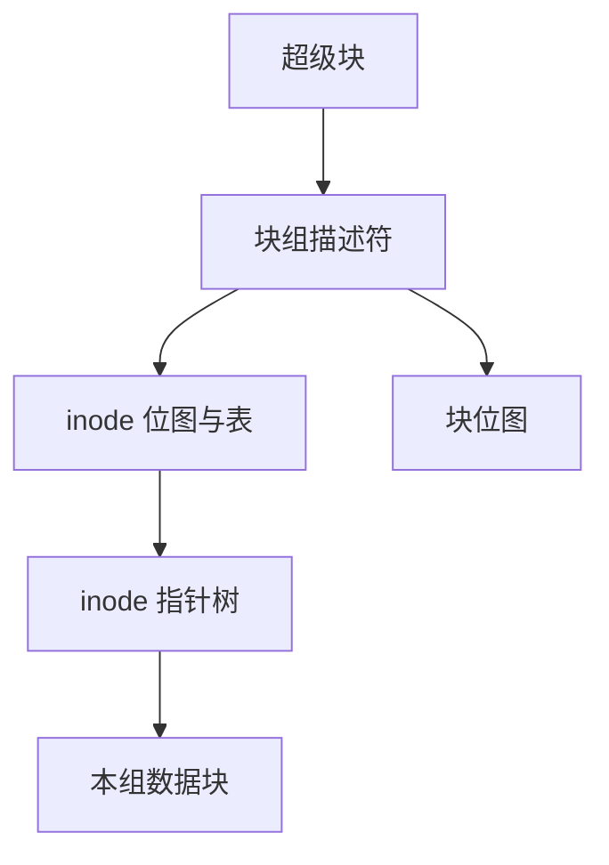

# ext2 块组与位图

把盘切成块组，每组自带 inode 表、块位图与 inode 位图，是为了让元数据离数据更近，而不是再做一张全局 FAT。

<footer>—— 据 Card, Ts'o, Tweedie, Design and Implementation of the Second Extended Filesystem；McKusick et al., A Fast File System for UNIX</footer>

[上一课](/cs/fat-filesystem)把文件变成簇链。缺口立刻暴露：一张 FAT 是随机写热点，大卷上扫空闲项也贵。Unix 主干的 [inode](/cs/inode-dir) 需要落盘位置。[FFS](/cs/ext4-journal) 之前的布局课序在此补 **ext2 块组**：位图代替链表，inode 表按组切开。

## 问题

FAT 的「下一簇」与「空闲」挤在同一数组；inode 若也做成一张巨大线性表，柱面（或闪存擦除带）两端来回跑。McKusick 的 FFS 把盘分成柱面组；ext2 把同一直觉收成块组（block group）。缺口不是再定义 inode，而是：超级块描述组大小，每组有块位图、inode 位图、inode 表，数据块尽量落在 inode 所在组。

本课不把 ext3 日志再讲一遍，那是 [JBD2](/cs/ext4-journal) 已钉过的对象。

位图每一位对应一组内一块或一个 inode。分配先试文件所在组，满了再扩组。间接块仍是 inode 里的树，不是 FAT 链。

## 方法

mkfs 按块大小与 inode 比率切组。`creat`：在目录所在组找空闲 inode 位，初始化 inode（模式、链接计数、时间），再在目录文件里写名字与 inode 号——这是 Unix 目录项，不是 FAT 的「首簇即身份」。写数据：按 inode 的直接/间接指针填块号，同时把块位置 1。读：inode → 块号 → [页缓存](/cs/page-cache) 填页，不再沿 FAT 跳。

## 机制

块组把分配局部化：同一目录的文件倾向同一组，降低磁头行程（HDD）或让元数据与数据共享闪存局部性。超级块与组描述符常有备份，避免单点损坏整卷。对照 FAT：空闲查询是位图扫描或 buddy 式的内存缓存，不是跟链表。间接指针让大文件随机访问 $O(\log)$ 次块读，而不是 $O(\text{簇数})$ 的链走。

崩溃窗口与主干一致：位图、inode、目录项三者可能互指错误，于是才有后课的日志、软更新与 fsck。本课只把「布局已经是 Unix 形状」钉住。

不要把块组写成 RAID 条带：条带是块设备的几何，块组是文件系统自己的切法，可以落在一块盘上。

实现上：块组大小受位图必须装进一块的约束：4KiB 块则每组最多 32768 块。inode 比率在 mkfs 时选定，事后增加 inode 表很痛，这是布局一旦写成盘就难改的例子。 读法上只引用[上一课](/cs/fat-filesystem)的结论，不把对象换成训练推理或限价簿。

本课在操作系统进阶的「文件系统实现 / 布局与日志」课序里，对象是 **ext2 块组与位图**。

- 先修只引用，不重导：上一课的结论当公理，本课只补差。
- 五栏不吞并：不把本课写成大模型训练/推理，也不写成限价簿或权重量化。
- 文献用 OSTEP、McKusick、内核文档与具名会议论文；不发明 arXiv 编号。

## 边界

本课不引入 extent、延迟分配、flex_bg。不保证 32 位块号的 ext2 能装下今日的盘——那是 ext4 的地址与 extent 课。下一课把「一级级间接块」换成连续区段描述符。

版本字段会变，课序钉的是机制对象「ext2 块组与位图」，不是某一主线内核的结构体名。
后课默认：ext2 用块组 + 位图 + inode 指针树。大文件如何少间接块、如何表示空洞，下一课 extent。

## 小结

- ext2 按块组切盘；位图管空闲，inode 表在组内。
- 文件用直接/间接指针，不再走 FAT 链。
- extent 是下一课的缺口。
- 出处：Card, Ts'o, Tweedie；McKusick et al., FFS；Arpaci-Dusseau, *OSTEP*。
