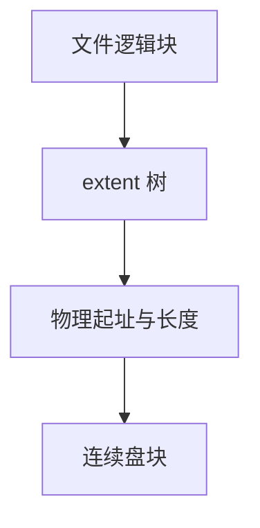

# ext4 extent

extent 用「起始逻辑块、起始物理块、长度」描述一段连续分配，替换 inode 里那棵间接块树。

<footer>—— 据 Mathur et al., The new ext4 filesystem, OLS 2007；Linux ext4 文档对 extent 树的整理</footer>

[上一课](/cs/ext2-block-groups)把块指针放进 inode。大文件要多层间接块，元数据放大，顺序文件也被拆成百万个指针。[日志](/cs/ext4-journal) 能捆更新，但不能把「一百万个块号」变短。缺口是 **extent**：连续区段，外加一棵小的索引树。

## 问题

间接树的每个叶都是一个块号。1 TiB 文件、4 KiB 块，指针数量以亿计，inode 无法直接放下，读一个范围要先读多层间接块。缺口：一个 extent 覆盖最多 $2^{15}$ 或实现所限的连续物理块（具体上限随内核版本），inode 内嵌几个 extent，溢出则变成 extent 树（内部索引结点指向叶）。逻辑空洞用「没有覆盖该逻辑块的 extent」表示，不必真分配。

本课不把延迟分配的红黑树全部字段当课纲。

ext4 默认 extent；老 inode 仍可走间接块以兼容。`fallocate` 可预先插入 extent。与稀疏文件后课分工：这里先钉表示法。

## 方法

写扩展：分配器尽量返回连续物理块，合并进相邻 extent，否则插入新叶。树按逻辑块号排序，查找范围是一次树下降。截断：缩短最后一个 extent 或删叶，释放位图。对照 FAT：连续区段在 FAT 上仍是一段链，表项个数不减；extent 把链收成三元组。对照块组：分配仍优先本 [块组](/cs/ext2-block-groups)，extent 只是记录结果的方式。

## 机制

extent 把顺序工作负载的元数据从 $O(\text{块数})$ 降到 $O(\text{段数})$。碎片仍会产生很多短 extent，于是有在线整理与分配策略，但对象不变：记录的是段，不是 FAT 项。日志仍写元数据块映像——extent 树结点也是元数据，[JBD2](/cs/ext4-journal) 照样进事务。不要把 extent 当成数据库 B+ 树里的记录指针；叶上没有元组，只有块范围。

与页缓存：`readpage` 仍按页填，FS 用 extent 把页偏移译成盘地址，VFS 看不见树。

实现上：extent 树的内部结点按逻辑块排序，插入可能分裂，于是一次追加写也会动多层元数据，仍要进 JBD2。bigalloc 把簇改成更大分配单元，是 extent 之上的另一层，本课不展开。 读法上只引用[上一课](/cs/ext2-block-groups)的结论，不把对象换成训练推理或限价簿。

本课在操作系统进阶的「文件系统实现 / 布局与日志」课序里，对象是 **ext4 extent**。

- 先修只引用，不重导：上一课的结论当公理，本课只补差。
- 五栏不吞并：不把本课写成大模型训练/推理，也不写成限价簿或权重量化。
- 文献用 OSTEP、McKusick、内核文档与具名会议论文；不发明 arXiv 编号。

## 边界

本课不引入 btrfs 的 B 树键空间，不把 bigalloc 簇写成另一文件系统。也不保证 extent 树在崩溃后无需日志——它替代的是间接块，不是崩溃协议。下一课把「原地改树」换成「永远追加日志」：LFS。

版本字段会变，课序钉的是机制对象「ext4 extent」，不是某一主线内核的结构体名。
后课默认：ext4 文件的块图是 extent。若每次写都追加而非改原地，布局会变成什么，下一课日志结构文件系统。

## 小结

- extent 用连续段代替间接块树；树按逻辑块索引。
- 空洞是未被覆盖的逻辑范围，不必占位图。
- 追加式布局是 LFS 的缺口。
- 出处：Mathur et al., OLS 2007；Linux `Documentation/filesystems/ext4/`；*OSTEP* 对 extent 的对照。
