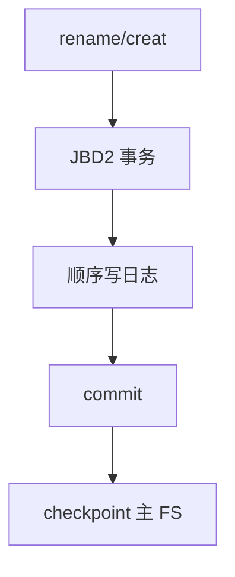

# ext4 日志

日志把元数据更新先顺序写入专用区，提交后再写主文件系统；崩溃后重放日志，不必对整盘 fsck。

<footer>—— 据 Mathur et al., The new ext4 filesystem, OLS 2007；Linux ext4 文档对 data= 模式的整理</footer>

[上一课](/cs/fsync)能等待某些块到达，但不能把「目录项与 inode 分配」收成一笔事务。[缓冲](/cs/buffer-dirty) 已暴露崩溃窗口。缺口是 **JBD2 日志**：ext4 的三种数据模式如何捆更新，以及它不是数据库栏的 [WAL](/cs/wal) 副本——对象是文件系统元数据（及可选数据）。

## 问题

无日志的 FFS 类布局崩溃后，块位图、inode、目录可能互指错误，必须扫描。日志：先写描述「即将做的元数据块」的日志记录，commit，再写原地。重放使元数据回到一致切面。缺口：`data=ordered`（先数据后元数据，默认）、`data=writeback`（数据可不排在元数据前）、`data=journal`（数据也进日志，最慢最严）。本课不发明论文编号。

ordered：避免「inode 已指向新块但块是旧内容」的泄露。writeback 更快，崩溃可能读到垃圾。journal 模式把数据也当事务，性能差，少用。

## 方法

事务在内存中收集脏元数据；提交时写入 journal inode 或单独日志设备，打 commit 块，然后允许 checkpoint 把块写回主区域并回收日志空间。[fsync](/cs/fsync) 往往迫使当前事务提交。与 VFS 的接头：ext4 的 `write_inode`/`rename` 参加事务，而不是各写各的。

## 机制

日志把随机元数据写换成顺序日志写，崩溃恢复时间与日志大小相关，不与盘容量相关。它不替代页 Cache：数据仍可延迟。不要把 ext4 扩展成 btrfs/XFS 的百科；本课以 ext4 为真实实例，说明「文件系统事务」这一课序。与关系库 WAL 对照：这里没有元组与 REDO 字节语义，只有块映像或描述符。

## 边界

本课不引入 extents、延迟分配的全部性能故事，只承认它们改变何时进事务。不保证 USB 盘拔出等于干净 umount。下一课把「一致」从 ext4 机制升成一般问题：先提交什么、fsck 还剩什么。

后课默认：元数据可以有日志切面。崩溃后系统保证什么、不保证什么，下一课崩溃一致性。

## 小结

- ext4 用 JBD2 先记日志再 checkpoint；默认 ordered。
- 三种 data= 模式权衡泄露与吞吐。
- 一般崩溃语义是下一课。
- 出处：Mathur et al., OLS 2007；Linux `Documentation/filesystems/ext4/`；McKusick 对日志 FS 的背景。
