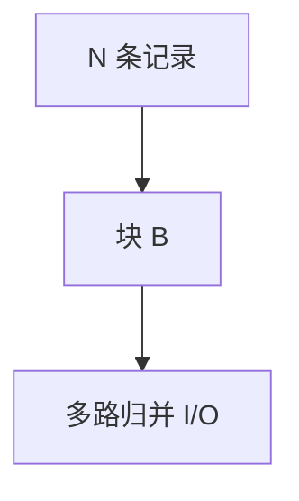

# 外存算法与 I/O 模型

内存 $M$、块 $B$，代价是块传输次数；排序 $\Theta(\frac{N}{B}\log_{M/B}\frac{N}{B})$ 次 I/O，不是 RAM 的 $n\log n$ 比较。

<footer>—— 据 Aggarwal and Vitter, The Input/Output Complexity of Sorting and Related Problems, 1988；Vitter 外存算法综述整理</footer>

上一课[Misra–Gries](/cs/misra-gries)假定流过 CPU。数据在盘上：随机访问一次块与扫一块同量级贵。缺口是 I/O 模型：扫描 $O(N/B)$，排序多路归并。不重写 RAM 快排。后课 PRAM 是并行，不是盘。

## 问题

参数 $N,M,B$，常 $M\gg B$。扫描顺序文件最优。排序：$\Theta(M/B)$ 路归并，I/O 如题记。B 树、外存优先队列、缓存无关模型（[cache-oblivious](/cs/cache-oblivious) 若已写则引用）点名。图外存更难（边定向）。

缺口是计数 I/O，不是 CPU 比较下界（后课对手）。

### 不是「内存不够就虚拟内存」

OS 分页是 LRU 在线；算法应显式扫块。虚拟内存可能抖动。外存算法自己安排传输。

Aggarwal–Vitter 1988。Vitter 综述。后课 PRAM 前缀和。

## 方法

顺序扫描、多路归并、分块矩阵乘（块 $B^{1/2}$）。图：扫描边列表多次，避免随机点。

缓存无关：不把 $B$ 写入代码，用递归分治。

## 机制

传输一次 $B$ 个元素均摊。比较在内存免费（相对 I/O）。与流：流 $B=1$ 或单次扫描；外存可多遍但要少遍。与 CH：路网可外存预处理。

## 边界

本课不写并行盘阵列全文。不写具体文件系统。后课默认：大数据排序用 I/O 公式。下一课 PRAM 与前缀和。

## 小结

- 代价是块 I/O；$M,B$ 是参数。
- 外存排序多路归并。
- 随机访问按块计，极贵。
- 出处：Aggarwal and Vitter, 1988。
