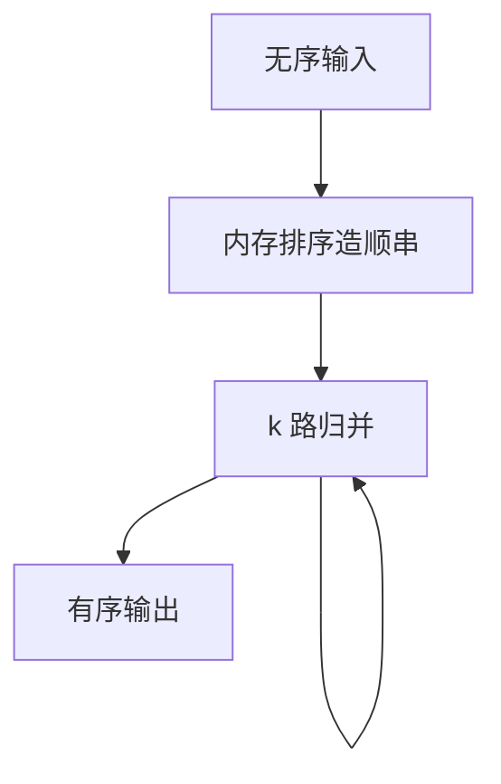

# 外部排序

内存装不下时，先跑生成初始顺串，再多路归并；I/O 次数由顺串长度与归并路数决定，不是由 n log n 的比较公式单独决定。

<footer>—— 据 Knuth, The Art of Computer Programming, Vol. 3；Graefe 外部排序；Ramakrishnan and Gehrke</footer>

[上一课](/cs/query-compilation)可把比较器编进机器码。本课不 JIT。缺口是阻塞算子的磁盘算法：`ORDER BY`、归并连接、排序聚合、重复消除，当输入大于工作内存。主干排序归并连接假设「有序输入」；进阶写如何从无序变成有序。

## 问题

内排序：快速排序或堆，工作集必须在内存。外部：替换选择或块内排序产生初始 run，写入临时文件；再 $k$ 路归并。缺口是**工作内存 B、页大小、run 数**如何决定遍数。路数太高，每路缓冲变窄，随机 I/O 变差；路数太低，遍数增加。

选择替换可产生长于内存的 run（数据有序时更长），减少归并层。本课不把 Knuth 全章搬来，只钉两阶段：造 run、归并。

Knuth TAOCP 卷三。数据库实现还要处理变长、NULL 序、稳定性（若 SQL 要求）。临时文件走同一缓冲池或专用盘，与 WAL 不是同一日志。

## 方法

分配 $B$ 页。造 run：填满内存 → 排序 → 写 run。归并：每次从至多 $k \approx B-1$ 个 run 读一页到输入缓冲，输出写新 run，直到一个 run。优化：最后一遍直接交给父算子流水，不必再写盘（若父能吃）。

并行：各线程造 run，再并行归并；exchange 后课。溢出与配置的 `work_mem` 是合同：估小了会盘，估大了会挤缓冲池。

## 机制

代价：遍数 × 输入页数的读写。校准课的顺序 I/O 权重在这里主导。向量化：比较仍按批解码键。编译：内循环是比较与归并指针。

`LIMIT k` 可改成堆顶 $k$，不必全排——改写应在优化器完成，执行器实现 top-k 算子。本课全排序。

## 边界

本课不讲哈希聚合何时优于排序聚合——下一课。也不把在线索引构建的排序当另一套理论。归并连接吃的有序流可以来自本课，也可以来自有序扫描。

后课默认：排序在内存不够时外部化；路数与 run 长度决定 I/O。哈希聚合用分区避免排序。

外部排序的正确性是全序与稳定性合同，性能是 I/O 遍数。

## 小结

- 造 run 再 k 路归并；工作内存决定路数与遍数。
- 最后一遍可流水给父算子。
- 哈希聚合下一课：等值分组常可不排序。
- 出处：Knuth Vol. 3；Graefe；Ramakrishnan and Gehrke。
