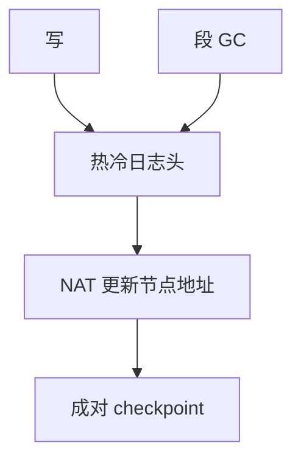

# F2FS

F2FS 把 LFS 的追加写接到闪存友好的多头日志上：节点地址表钉住 inode，热冷数据走不同段。

<footer>—— 据 Lee et al., F2FS: A New File System for Flash Storage, FAST 2015</footer>

[上一课](/cs/log-structured-fs)给出单头日志与 imap。闪存上还有 FTL：文件系统若再随机写，会与 FTL 的垃圾回收叠两层税。缺口是 **F2FS**：把「日志结构」做成 Linux 上可挂载的闪存文件系统，而不是 1992 年的 Sprite 实验。

## 问题

NAND 以擦除块为回收单位；随机更新 inode 会迫使 FTL 搬整块。LFS 的单日志头把热 inode 与冷数据搅在同一段，cleaner 效率差。缺口：节点地址表（NAT）扮演稳定的 imap——inode 号到节点块地址；段按热度分日志头（热/温/冷节点与数据）；checkpoint 区成对，崩溃时选有效的那份。本课不把 UFS/ext4 的块组再画一遍。

SSA（段摘要）记下段内每块是谁的，便于 GC。与 FTL 的分工：F2FS 尽量顺序写，减少 FTL 的随机更新；不能取消 FTL。

## 方法

写数据：按文件热度选日志头，追加数据块，更新内存里的节点（inode/indirect），节点也追加，NAT 记下新地址。fsync 推动 checkpoint：把 NAT/SIT 的脏条目与有效标志写入 checkpoint 包。GC：选有效块少的段，搬活块到当前日志头。读：NAT → 节点 → 数据块 → [页缓存](/cs/page-cache)。

## 机制

F2FS 把 Rosenblum 的 imap 收成可 checkpoint 的 NAT，把 cleaner 收成分段 GC，并把「不要原地改闪存页」写成默认路径。相对 [ext4 extent](/cs/ext4-extents)：extent 仍假设块可原地覆盖（在 FTL 下面那是假象）；F2FS 在 FS 层就承认覆盖等于新地址。不要把本课写成 eMMC 控制器手册：对象是 Linux 文件系统布局。

与 VFS：文件仍是 inode 号；NAT 对用户不可见。fsck 在 checkpoint 有效时主要验证表，而不是扫全部簇链。

实现上：NAT 是有限大小的地址表，节点地址更新比改整棵 B 树便宜，但表本身要 checkpoint。与 FTL 叠两层 GC 时，若文件系统随机写，闪存仍会痛，所以多头日志要尽量顺序。 读法上只引用[上一课](/cs/log-structured-fs)的结论，不把对象换成训练推理或限价簿。

本课在操作系统进阶的「文件系统实现 / 布局与日志」课序里，对象是 **F2FS**。

- 先修只引用，不重导：上一课的结论当公理，本课只补差。
- 五栏不吞并：不把本课写成大模型训练/推理，也不写成限价簿或权重量化。
- 文献用 OSTEP、McKusick、内核文档与具名会议论文；不发明 arXiv 编号。

## 边界

本课不引入 zoned namespace 的全部 zone 复位语义（f2fs 后来可对接 zoned 设备，那是附录级）。不保证手机厂商的私有补丁与上游一致。下一课把「追加新版本」从日志结构扩成通用的写时复制整棵树：btrfs / ZFS。

版本字段会变，课序钉的是机制对象「F2FS」，不是某一主线内核的结构体名。
后课默认：闪存上可用多头 LFS。整棵元数据树 COW、校验和与池，下一课 btrfs/ZFS。

## 小结

- F2FS 用 NAT + 多头日志 + checkpoint 落地 LFS。
- 热冷分离服务闪存 GC，不取消 FTL。
- 整树 COW 是下一课的缺口。
- 出处：Lee et al., FAST 2015；Linux f2fs 文档；Rosenblum LFS 为先修。
